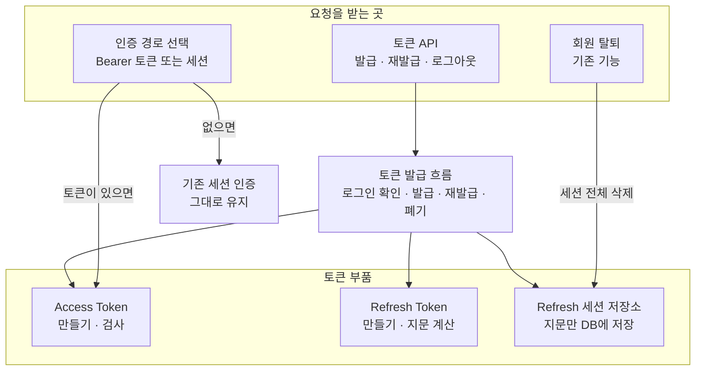
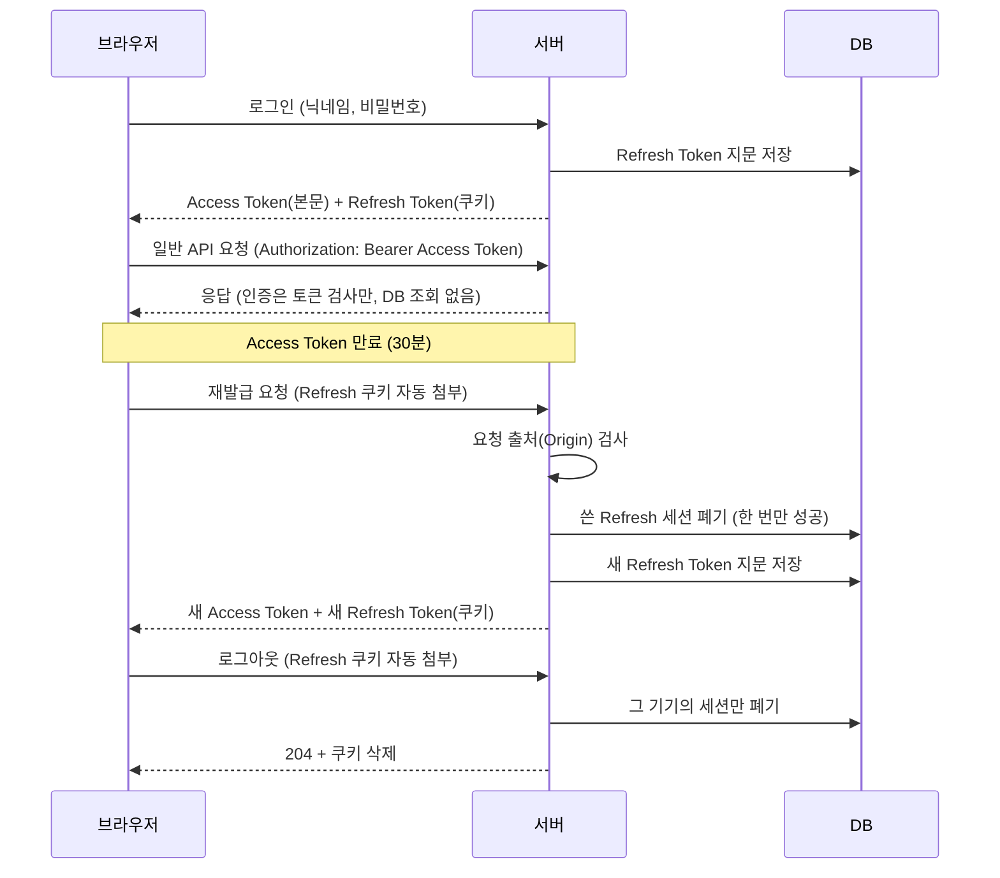
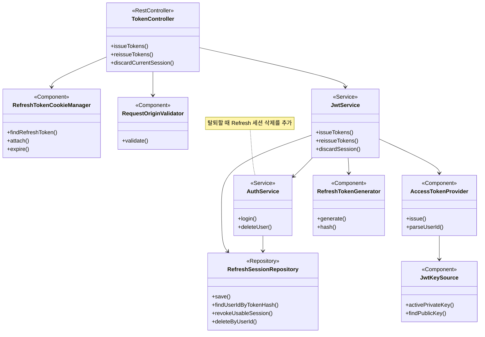
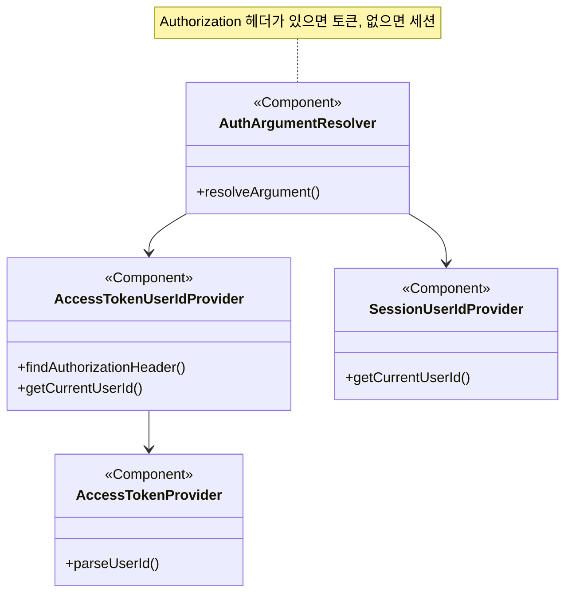
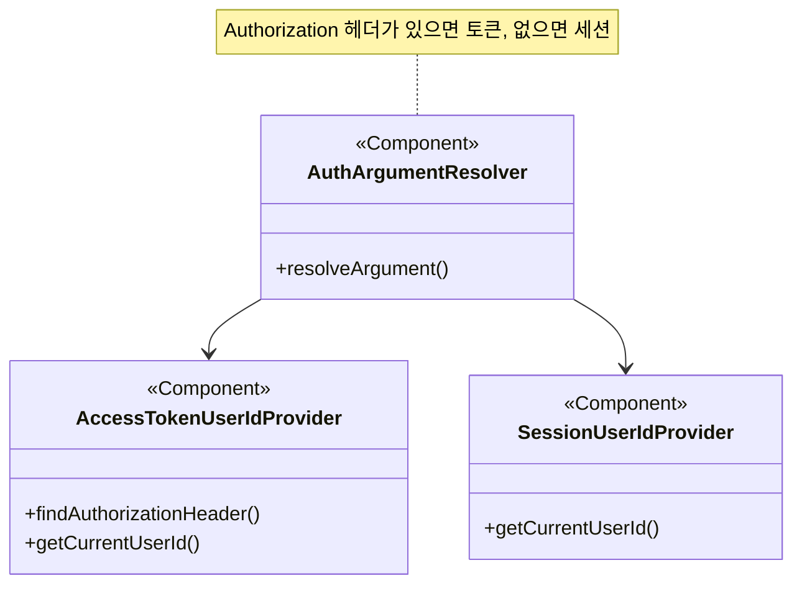

# 작업 대화 기록

Issue #216 구현 과정에서 오간 대화 전문이다. Development Logger의 hook이 Node 24를 요구해
로컬 Node 20으로는 실행되지 않아 `events.jsonl`을 남기지 못했다. 그래서 기록을 Claude와 Codex 세션 transcript에서
사람과 Claude·Codex의 발화만 뽑아 남긴다. 도구 호출과 그 결과는 뺐다.

이 저장소는 공개 저장소다. 팀원 지칭, 로컬 경로, 이메일, 회원 수는 `[비공개]`, `~`, `N명` 같은 표시로 가린다.
설계 판단의 근거는 그대로 둔다.

기록 범위: 2026-09-21T11:55:49.519Z ~ 2026-09-21T18:44:46.759Z (UTC)

- Claude 세션 `c2355152`: 발화 46개, 2026-09-21T11:55:49.519Z ~ 2026-09-21T14:03:35.167Z
- Claude 세션 `7d4ef3b0`: 발화 86개, 2026-09-21T14:52:58.363Z ~ 2026-09-21T18:44:46.759Z
- Codex 세션 `37f79630`: 발화 28개, 2026-09-21T12:25:11.632Z ~ 2026-09-21T13:53:55.591Z

## 1. 사용자 · 2026-09-21T11:55:49.519Z

215은 pr 올 때까지 기다리고

다음 작업 진행하자

인터뷰를 하든 뭘 하든 

어떤 요구사항이고 뭘 해야하는지 알려줘 명명백백히

## 2. Claude · 2026-09-21T11:58:41.146Z

확인 결과 다음 작업은 **Issue #216 [BE] 비비디 JWT Access·Refresh 인증 도입** 입니다. 지금 브랜치(#215)는 PR [#224](https://github.com/woowacourse-teams/2026-bibbidi/pull/224)로 올라가 있고(리뷰 4건, mergeable), #216이 그 바로 다음 순서입니다.

---

## 1. 왜 이게 다음이냐

```
#208 WEB APP 도입 및 인증 방식 변경
└─ #210 소셜 OIDC 및 JWT 인증 API 구체화·구현
   ├─ #215 닉네임 유일 제약 제거        ← PR #224 리뷰 중
   ├─ #216 JWT Access·Refresh 도입      ← 다음
   ├─ #217 카카오 OIDC + 가입용 ticket
   ├─ #218 약관 동의 후 소셜 회원가입
   └─ #219 기존 계정에 카카오 연결
```

순서 근거는 이슈 본문에 적혀 있습니다. 카카오 인증이 끝난 다음에 클라이언트에 줄 물건이 **비비디 Access·Refresh Token**이라서, 토큰 체계가 먼저 서 있어야 #217에서 응답 계약을 두 번 맞추지 않습니다.

## 2. 지금 코드 상태 (직접 확인한 것)

| 항목 | 현재 |
|---|---|
| 인증 수단 | JSESSIONID 세션 **하나뿐** |
| 로그인 | [AuthController.java:47](BE/src/main/java/com/bibbidi/wedding/auth/controller/AuthController.java:47) → `AuthSessionManager.replaceWithAuthenticatedSession` → `HttpSession` 애트리뷰트 |
| 사용자 식별 | `@Auth Long` → [AuthArgumentResolver](BE/src/main/java/com/bibbidi/wedding/auth/session/AuthArgumentResolver.java) → [SessionUserIdProvider](BE/src/main/java/com/bibbidi/wedding/auth/session/SessionUserIdProvider.java) (세션만 봄) |
| 로그아웃 | `session.invalidate()` + 쿠키 만료 |
| JWT 라이브러리 | **없음**. `spring-security-crypto` + `bouncycastle`만 (Argon2용) |
| `refresh_sessions` 테이블 | **없음**. 마이그레이션은 `002`까지 |
| 인증 에러코드 | `201 AUTHENTICATION_REQUIRED`, `202 AUTHENTICATION_FAILED`, `203` (체크리스트 권한) |

즉 **JWT 쪽은 백지에서 시작**합니다. 기존 코드에서 참고할 선례가 없습니다.

## 3. #216이 요구하는 것 (완료조건 12개를 4덩어리로)

**A. Access Token — JWT**
- `RS256` 고정, 유효기간 **30분**
- 허용 알고리즘을 서버가 못 박아서 `none` / `HS256`으로 바꾼 토큰은 거부
- 검증 항목: 서명, 알고리즘, `iss`, `aud`, `exp`, 사용자 ID
- 헤더의 `kid`로 검증 공개키 선택
- 서명 개인키는 저장소에 커밋 금지, GitHub Environment Secret으로 주입

**B. Refresh Token — 불투명 난수**
- 서버가 만든 난수, 유효기간 **30일**
- **원본 저장 안 함.** 해시만 `refresh_sessions` 테이블에 보관
- 재발급 API 추가: 성공 시 새 Refresh 발급 + 만료를 *재발급 성공 시각* 기준 30일로 재계산 + 이전 토큰 즉시 무효화 (rotation)
- 동시 요청 중 **한 건만 성공**해야 함 (행 잠금 또는 원자적 갱신)

**C. 전환 기간 병행 운영**
- `@Auth Long`이 **기존 세션과 Bearer JWT를 둘 다** 처리
- 기존 회원 N명이 쓰는 JSESSIONID 로그인이 그대로 동작
- 로그아웃은 **해당 Refresh 세션만** 폐기. 같은 사용자의 다른 기기 세션은 살아 있음

**D. 거부 규칙과 로그 위생**
- Refresh Token이나 가입용 ticket(#217에서 생김)을 Access Token 자리에 넣으면 거부 → **토큰 타입 구분이 토큰 안에 들어가야 함**
- 서버 로그·오류 메시지에 Access/Refresh Token과 서명키가 남지 않음

**검증 방법 (이슈에 명시)**
- `./BE/gradlew -p BE test`
- 만료·위조·알고리즘 변조 토큰 경계 테스트
- 같은 Refresh Token으로 동시 재발급 요청 시 한 건만 성공하는 테스트

## 4. 범위에서 빠지는 것 (이슈가 명시적으로 뺀 것)

- Access Token 블랙리스트 없음 → 로그아웃·탈퇴 직후에도 이미 발급된 Access Token은 최대 30분 살아 있음
- 네이티브 앱 전용 엔드포인트 분리 없음 → 이번 전환 대상은 **웹**
- 카카오 연동 자체는 #217

## 5. 그래서 실제로 만들 물건 (제 예상, 아직 합의 전)

- `refresh_sessions` 테이블 + 마이그레이션 `003_*.sql` + mvp 스키마 반영
- JWT 발급기 / 검증기 (키 로딩, `kid` 선택, 클레임 검증)
- Refresh 세션 도메인 + Entity + Mapper + Repository 래퍼 (user 패키지와 같은 구조)
- 재발급 엔드포인트, 로그아웃 동작 변경
- `SessionUserIdProvider` 옆에 Bearer 토큰 해석 경로 추가하고 `AuthArgumentResolver`가 둘을 순서대로 시도
- 새 인증 에러코드 몇 개
- 키 주입용 설정(`application.yaml` + GitHub Environment Secret) 및 로컬/테스트용 키 전략

## 6. 아직 안 정해진 것 — 여기부터 인터뷰 대상

1. **브랜치 base**: `release-be` vs `feature/215` (#215가 선행 작업으로 걸려 있음)
2. **JWT 라이브러리**: jjwt / nimbus-jose-jwt / spring-security-oauth2-jose
3. **토큰 발급 진입점**: 기존 `POST /api/login`이 JWT도 같이 주나, 새 엔드포인트를 파나
4. **Refresh 전달 방식**: #210은 "웹은 Refresh를 Secure·HttpOnly 쿠키로"라고 했는데 **#216 완료조건에는 그 말이 없습니다.** 이번에 쿠키까지 갈지 body로 갈지
5. **`refresh_sessions` 스키마**: 컬럼 구성, device family를 이번에 넣을지
6. **reuse detection**: #210은 "이전 토큰 재사용 시 device family 폐기"를 요구하는데 #216은 "이전 토큰 즉시 무효화"까지만 적혀 있습니다. 이번 범위인지
7. **해시 방식**: SHA-256 vs Argon2
8. **패키지·계층 구조**: `auth/token` 하위? 도메인+Mapper+Repository 래퍼 풀세트를 둘지
9. **에러 코드**: 토큰 만료 / 토큰 타입 불일치에 새 번호를 줄지, 201·202를 재사용할지

---

여기서부터 `grill-me`로 하나씩 물어서 코드 수준까지 정하겠습니다. 첫 질문입니다.

**Q1. 브랜치를 어디서 따요?**

#215는 [UserRepository](BE/src/main/java/com/bibbidi/wedding/user/repository/UserRepository.java)와 [UserService](BE/src/main/java/com/bibbidi/wedding/user/service/UserService.java)만 건드렸고, #216은 `auth` 패키지 중심이라 파일이 거의 안 겹칩니다. 다만 `AuthService.login()`이 #215에서 바뀐 `userService.findAuthenticationInfo(nickname)`을 부르고 있어서, `release-be`에서 따면 "비밀번호 로그인 회원만 닉네임으로 찾는다"가 빠진 상태 위에서 작업하게 됩니다.

- **(a) `feature/215`에서 딴다** — 추천. 선행 작업이 실제로 반영된 상태에서 시작하고, PR #224가 머지되면 base를 `release-be`로 바꾸면 됩니다. 단점은 #224에 리뷰 수정이 들어가면 리베이스가 한 번 필요합니다.
- **(b) `release-be`에서 딴다** — PR #224 머지를 기다릴 필요가 없고 독립적입니다. 단점은 위에 적은 대로 선행 변경이 빠진 상태이고, 나중에 머지 순서에 따라 `AuthService` 주변에서 충돌이 날 수 있습니다.
- **(c) #224가 머지될 때까지 대기** — 가장 깨끗하지만 리뷰 4건이 아직 열려 있어서 언제 끝날지 모릅니다.

어느 쪽으로 갈까요?

## 3. 사용자 · 2026-09-21T12:04:27.738Z

release-be
JWT 라이브러리: jjwt / nimbus-jose-jwt / spring-security-oauth2-jose 이거 차이 알려줘 adr 쓰게
토큰 발급 진입점: 기존 POST /api/login이 JWT도 같이 주나, 새 엔드포인트를 파나 새 엔드포인트
Refresh 전달 방식: #210은 "웹은 Refresh를 Secure·HttpOnly 쿠키로"라고 했는데 #216 완료조건에는 그 말이 없습니다. 이번에 쿠키까지 갈지 body로 갈지 httpOnly까지 다 포함

[비공개] 코드 확인해줘 jwt 토큰(전반적인 흐름이나 구조는 참고해줘)

## 4. Claude · 2026-09-21T12:08:30.714Z

## 결정 3개 반영

| 항목 | 결정 |
|---|---|
| 브랜치 base | `release-be` → `feature/216` |
| 토큰 발급 진입점 | 기존 `POST /api/login`은 그대로 두고 **새 엔드포인트** |
| Refresh 전달 | **Secure · HttpOnly 쿠키** |

쿠키로 정하면서 새로 생긴 갈래가 셋 있습니다. 뒤에서 따로 물을게요.
- 쿠키 Path를 `/`로 둘지 재발급 엔드포인트로 좁힐지
- SameSite 값. BE에 CORS 설정이 아예 없고 JSESSIONID가 `same-site: lax`로 도는 걸 보면 FE와 BE가 같은 사이트입니다. 그러면 `Lax`로 충분하고 CSRF 대비가 따로 안 듭니다.
- Access Token은 응답 body로 주는지 (#210 본문은 "웹은 access만 body"라고 적고 있습니다)

쿠키를 만드는 코드는 [AuthSessionCookieManager.java](BE/src/main/java/com/bibbidi/wedding/auth/session/AuthSessionCookieManager.java)에 선례가 있습니다. `ResponseCookie` + `ServerProperties`를 쓰고 있어서 그 형태를 따라가면 됩니다.

---

## JWT 라이브러리 3종 비교 (ADR 재료)

#216 요구사항이 라이브러리에 거는 조건은 넷입니다.

- **(a)** RS256 고정, `none`·`HS256`으로 바꾼 토큰 거부
- **(b)** 헤더 `kid`로 검증 공개키 선택
- **(c)** `iss` · `aud` · `exp` 클레임 검증
- **(d)** *(#216 범위 밖, #217 미리보기)* 카카오 JWKS 원격 로딩과 캐싱

| | **jjwt** `0.12.6` | **nimbus-jose-jwt** `10.x` | **spring-security-oauth2-jose** |
|---|---|---|---|
| 정체 | JWT 전용 라이브러리 | JOSE 전체(JWS·JWE·JWK) 구현체 | Spring Security가 nimbus를 감싼 추상화 |
| 의존성 무게 | `jjwt-api` + `impl` + `jackson` 3개, 외부 의존 거의 없음 | 단일 jar | `spring-security-core`, `oauth2-core`까지 끌고 옴 |
| 버전 관리 | 직접 명시 | 직접 명시 | Boot BOM이 관리 |
| (a) 알고리즘 고정 | 파서가 unsecured(`none`)를 기본 거부. 키 타입이 안 맞아도 거부. **다만 alg 화이트리스트는 직접 확인해야 함** | `JWSVerificationKeySelector(RS256, …)`에 알고리즘을 인자로 못 박음 | `NimbusJwtDecoder`에 서명 알고리즘 지정 |
| (b) `kid` 선택 | `Locator<Key>`를 직접 구현 | `JWKSource` + 키 셀렉터가 `kid` 매칭 기본 제공 | `JWKSource` 주입 |
| (c) 클레임 검증 | `parser.require("iss", …)` 체이닝, `exp`는 자동 | `DefaultJWTClaimsVerifier` | `OAuth2TokenValidator` 조립 |
| (d) JWKS 원격+캐시 | JWK 파서는 있고 fetch·캐시는 직접 | `RemoteJWKSet`이 fetch + 캐시 + `kid` 미스 재조회까지 | `withJwkSetUri()`에 캐싱 내장 |
| 발급(서명) | `Jwts.builder()` | `JWSSigner` | `JwtEncoder` |
| 팀 선례 | [비공개] `imhere`에서 사용 | 없음 | 없음 |

### 추천: jjwt

**이유**
1. (a)(b)(c)를 전부 커버하고, 발급·검증 코드가 셋 중 가장 짧습니다.
2. 지금 BE는 Spring Security 필터체인을 **안 씁니다.** `@Auth` ArgumentResolver + 세션으로 갑니다. `oauth2-jose`를 넣으면 `spring-security-core`가 딸려오는데, 정작 그 모듈의 값어치인 리소스 서버 필터체인은 안 쓰게 됩니다. 의존성 대비 이득이 적습니다.
3. (d)는 #216 범위 밖이고, #217에서 [비공개]가 `imhere`에서 이미 밟아본 경로(jjwt + 공개키 캐시 직접 관리)가 있습니다.

**반대 근거도 같이 적어둘 것**
nimbus를 고르면 #217 카카오 JWKS에서 `RemoteJWKSet` 덕을 봅니다. **#217까지 내다보고 한 번만 고르고 싶다면 nimbus가 낫습니다.** ADR에서 진짜 갈리는 지점은 "라이브러리를 #216만 보고 고르느냐, #217까지 보고 고르느냐"입니다.

참고로 ADR은 Issue 본문 맨 아래 `## ADR` 밑에 `### 결정` / `### 이유` / `### 근거` / `### 검증`으로 쓰는 게 이 저장소 규칙입니다.

---

## [비공개] JWT 코드 확인 결과

**bibbidi 저장소에는 JWT 코드가 없습니다.** `release-be`, `main` 다 봤고 [비공개] 것 포함해서 없습니다.

우테코 미션 `spring-roomescape-waiting`은 `build.gradle`에 jjwt 0.11.2가 들어 있지만, 실제 인증은 `Authorization` 헤더에 **이름 문자열을 그대로 싣는** 방식이고 JWT 클래스가 없습니다. 미션 템플릿 잔재로 보입니다.

실제 구현은 개인 프로젝트 **`imhere`** (Kotlin, 헥사고날, 카카오 OIDC + JWT)에 있습니다.

```
auth/
  adapter/in/web/AuthController.kt              POST /api/v1/auth/login, /reissue
  adapter/out/jjwt/JjwtParserAdapter.kt         카카오 ID Token 파싱
  adapter/out/redis/PublicKeyAdapter.kt         카카오 공개키 캐시
  application/service/jwt/
    JwtProperties.kt          @ConfigurationProperties(prefix = "jwt")
    JwtTokenIssuer.kt         토큰 만들기 (access / refresh)
    JwtTokenUtil.kt           토큰 읽기·검증
    JwtTokenProvider.kt       인터페이스 (issue / reissue)
    SelfSignedTokenProvider.kt 구현. Redis에 refresh 저장, 재발급
  application/service/JwtAuthenticationFilter.kt  Bearer 파싱 → SecurityContext
```

### 가져올 것

1. **만드는 쪽(`JwtTokenIssuer`)과 읽는 쪽(`JwtTokenUtil`)을 클래스로 분리.** 서명 키를 쥔 책임과 검증하는 책임이 갈립니다.
2. **`category` 클레임으로 access/refresh를 구분.** `.claim("category", "access")` / `"refresh"`. #216의 "Refresh를 Access 자리에 넣으면 거부"가 정확히 이 패턴입니다. 우리는 여기에 #217의 ticket까지 세 값이 됩니다.
3. **재발급이 검증 후 발급을 그대로 호출.** `reissueJwtToken()`이 검증만 하고 `issueJwtAuth()`를 부르니 회전이 자연스럽게 따라옵니다.
4. **`@ConfigurationProperties(prefix = "jwt")`로 만료·키를 외부화.** 30분·30일·키를 코드에 박지 않습니다.
5. **엔드포인트 이름** `/login`, `/reissue`.

### 따라가면 안 되는 것 (요구사항이 정반대)

| imhere | #216 |
|---|---|
| `Keys.hmacShaKeyFor(secret)` = **HS256 대칭키** | **RS256 비대칭키** 필수. 키 주입 방식부터 다름 |
| refresh도 **JWT** | refresh는 **불투명 난수** |
| refresh **원본을 Redis에 그대로** 저장 | 원본 저장 금지, **해시만** DB에 |
| 키가 `refresh:$email` → **사용자당 1개.** 다른 기기로 로그인하면 앞 기기가 죽음 | **기기별 세션 분리.** 로그아웃이 해당 세션만 폐기 |
| Spring Security 필터체인 + `SecurityContext` | Security 필터체인 없음. `@Auth` ArgumentResolver 확장이 맞음 |
| 헥사고날 port/adapter | controller / service / domain / repository / persistence |
| 동시 재발급 보호 없음 (Redis 비교 후 덮어쓰기) | **행 잠금 또는 원자적 갱신** 필수 |

한 줄로 줄이면, [비공개] 코드에서 가져올 것은 **클래스 쪼개는 방식, `category` 클레임, 프로퍼티 외부화** 정도이고 **키 알고리즘·refresh 저장 방식·세션 단위는 요구사항이 반대라 따라가면 안 됩니다.**

---

**Q2. 라이브러리를 무엇으로 정할까요?**

- **(a) jjwt 0.12.6** — 추천. #216만 놓고 보면 가장 가볍고 코드가 짧습니다. #217 카카오 JWKS의 fetch·캐시는 직접 짜야 합니다. [비공개]가 `imhere`에서 그렇게 했습니다.
- **(b) nimbus-jose-jwt 10.x** — #217까지 한 번에 봅니다. `RemoteJWKSet`이 카카오 공개키 캐싱을 대신해 줍니다. 대신 #216 구간에서는 jjwt보다 보일러플레이트가 많습니다.
- **(c) spring-security-oauth2-jose** — 검증기 조립이 가장 편하지만 `spring-security-core`가 딸려옵니다. 지금 구조에서는 그 값을 못 씁니다. 추천하지 않습니다.

## 5. 사용자 · 2026-09-21T12:11:09.591Z

[비공개]의 개인 레포의 코드에 jwt 있는 거 아냐?

구조를 [비공개]의 코드로 해줘

## 6. Claude · 2026-09-21T12:14:37.127Z

맞습니다. 그리고 **imhere보다 #216에 훨씬 가까운 코드를 찾았습니다.**

## [비공개] JWT 코드는 두 군데 있습니다

| 레포 | 언어 | Refresh 저장 | 구조 | #216 적합도 |
|---|---|---|---|---|
| `imhere` | Kotlin | Redis | 헥사고날 (port/adapter) | 낮음 |
| **`Moon_Light_Hackathon2025-HalfMoon`** | **Java** | **DB (JPA)** | **계층형** | **높음** |

HalfMoon의 `security` 패키지는 커밋 작성자가 `[비공개]`로 확인됩니다 (`feat(auth) : add auth logic`). **Java + DB 저장 + 계층형**이라 bibbidi에 그대로 얹힙니다. 이쪽을 기준으로 잡았습니다.

```
security/
├── application/
│   ├── JwtService.java          issueJwtAuth / reissueJwtToken / validateAccessToken  @Transactional
│   └── JwtRefreshCleaner.java   @Scheduled 만료 토큰 정리
├── domain/
│   ├── JwtEntity.java           JPA Entity
│   ├── JwtRepository.java       인터페이스
│   └── JwtResult.java           중첩 결과 DTO (Issue)
├── global/util/
│   ├── JwtUtil.java             토큰 만들기·읽기 + refresh 쿠키 만들기
│   └── JwtProperties.java       @ConfigurationProperties(prefix = "jwt")
└── infra/
    ├── JwtJpaRepository.java    Spring Data JPA
    └── JwtRepositoryImpl.java   래퍼 구현
```

두 레포에 **공통으로** 나오는 건 확실한 [비공개] 패턴입니다.
- `category` 클레임으로 access/refresh 구분 (`.claim("category", "access")`)
- `@ConfigurationProperties(prefix = "jwt")`로 만료·키 외부화
- `createAccessToken` / `createRefreshToken` / `parseClaims`를 한 클래스에
- `issueJwtAuth` / `reissueJwtToken` 메서드 이름
- 재발급이 검증 후 발급을 그대로 호출

HalfMoon `JwtProperties`에는 `refreshCookieName`까지 있습니다. 우리 쿠키 결정과 맞아떨어집니다.

---

## [비공개] 구조를 얹은 bibbidi 파일 트리

```
BE/src/main/java/com/bibbidi/wedding/auth/
├── controller/
│   ├── AuthController.java              기존 그대로
│   ├── TokenController.java             신규  POST /api/auth/token, /reissue, /logout
│   └── dto/
│       ├── IssueTokenRequest.java       신규
│       └── IssueTokenResponse.java      신규  accessToken만 (refresh는 쿠키)
├── service/
│   ├── AuthService.java                 기존. 비밀번호 검증 재사용
│   ├── JwtService.java            ← [비공개] JwtService
│   ├── JwtResult.java             ← [비공개] JwtResult.Issue
│   └── RefreshSessionCleaner.java ← [비공개] JwtRefreshCleaner
├── token/                         ← [비공개] security/global/util
│   ├── JwtProperties.java         ← [비공개] JwtProperties
│   ├── JwtUtil.java               ← [비공개] JwtUtil
│   ├── TokenCategory.java         ← [비공개] "category" 문자열을 enum으로
│   └── RefreshTokenCookieManager.java ← [비공개] JwtUtil.createRefreshCookie / createLogoutCookie
├── domain/
│   └── RefreshSession.java              신규
├── persistence/
│   ├── JpaRefreshSessionEntity.java     ← [비공개] JwtEntity
│   └── JpaRefreshSessionRepository.java ← [비공개] JwtJpaRepository
├── repository/
│   ├── RefreshSessionRepository.java    ← [비공개] JwtRepository + JwtRepositoryImpl
│   └── RefreshSessionMapper.java        신규
├── session/
│   ├── AuthArgumentResolver.java        기존. Bearer 경로 추가
│   ├── BearerTokenUserIdProvider.java   ← [비공개] JwtFilter의 헤더 파싱·검증
│   └── SessionUserIdProvider.java       기존 그대로
├── password/                            기존 그대로
└── config/AuthWebConfig.java            기존
```

### 흐름 ([비공개] 메서드 이름 유지)

**발급**
```
TokenController.issue(request)
 → AuthService.login(nickname, password)          기존 재사용
 → JwtService.issueJwtAuth(userId)                @Transactional
     JwtUtil.createAccessToken(userId)             RS256, 30분, category=ACCESS
     JwtUtil.createRefreshToken()                  난수 (JWT 아님)
     RefreshSessionRepository.save(세션)            해시·만료 저장
   → JwtResult(accessToken, refreshToken)
 → body: accessToken / Set-Cookie: refreshToken
```

**재발급**
```
TokenController.reissue(쿠키)
 → JwtService.reissueJwtToken(refreshToken)       @Transactional
     해시 계산
     RefreshSessionRepository 행 잠금 조회          ← [비공개]에 없는 부분
     만료·폐기 확인 → 기존 세션 폐기 → 새 난수·새 세션
   → JwtResult
```

**검증**
```
AuthArgumentResolver
 → BearerTokenUserIdProvider     Authorization: Bearer 가 있으면
     kid로 공개키 → RS256 고정 → iss/aud/exp → category==ACCESS → sub
 → 없으면 SessionUserIdProvider   기존 세션 (전환 기간 병행)
```

---

## [비공개] 코드에서 못 가져오는 것

요구사항이 반대라서 그대로 옮기면 완료 조건을 깹니다.

| [비공개] HalfMoon | #216 |
|---|---|
| `HS256` 대칭키 (`SecretKeySpec`) | `RS256` 비대칭키. `kid`로 공개키 선택 |
| refresh **원본을 DB에** 저장 | 원본 저장 금지, **해시만** |
| **access도 DB에 저장하고 매 요청 조회** (`validateAccessToken`) | access는 무상태. 블랙리스트 만들지 않음 |
| 한 행에 access+refresh 같이, `findJwtByEmail` = 사용자당 1행 | **기기별 세션 행.** 로그아웃이 해당 세션만 폐기 |
| 재발급이 새 행을 저장만 함 (이전 행 안 지움) | 이전 토큰 **즉시 무효화** + 동시 요청 중 한 건만 성공 |
| Spring Security 필터체인 (`JwtFilter`, `SecurityConfig`) | Security 필터체인 없음. `@Auth` ArgumentResolver |
| Lombok `@Getter` `@RequiredArgsConstructor` `@Slf4j` | bibbidi는 명시적 생성자. Lombok은 2개 파일에만 |
| `Cookie` 직접 생성 (SameSite 지정 불가) | `ResponseCookie`. [AuthSessionCookieManager](BE/src/main/java/com/bibbidi/wedding/auth/session/AuthSessionCookieManager.java) 선례 |
| `log.info("... accessToken: {}", accessToken)` | **로그에 토큰이 남으면 안 됨** |

마지막 줄이 특히 중요합니다. [비공개] 코드는 `JwtService`와 `JwtRepositoryImpl`에서 토큰 값을 그대로 로그에 찍는데, #216 완료 조건이 이걸 금지합니다.

---

**Q3. [비공개] 코드를 어디까지 그대로 가져올까요?**

한 군데가 부딪힙니다. [비공개]는 `JwtEntity`(JPA 애노테이션 붙은 클래스)를 `domain/`에 두고 `JwtRepository` **인터페이스** + `JwtRepositoryImpl` + `JwtJpaRepository` 3단으로 갑니다. bibbidi는 도메인과 JPA Entity를 나누고, Repository는 인터페이스 없이 **래퍼 클래스 하나**입니다 ([FeedbackRepository](BE/src/main/java/com/bibbidi/wedding/feedback/repository/FeedbackRepository.java), [UserRepository](BE/src/main/java/com/bibbidi/wedding/user/repository/UserRepository.java)).

- **(a) 클래스 이름과 책임 분해는 [비공개]대로, 폴더와 계층 규칙은 bibbidi대로** — 추천. 위 트리가 이겁니다. `JwtService` / `JwtUtil` / `JwtProperties` / `JwtResult` / `issueJwtAuth` / `reissueJwtToken` / `category` 클레임을 그대로 쓰되, Entity·도메인 분리와 Repository 래퍼는 bibbidi를 따릅니다. auth 패키지가 user·feedback과 같은 모양이 됩니다.
- **(b) [비공개] 폴더 구조까지 그대로** — `auth/domain/`에 JPA Entity를 두고 `JwtRepository` 인터페이스 + `Impl`, `auth/global/util/` 신설. [비공개] 코드와 1:1로 대조하기 쉽습니다. 대신 auth 패키지만 나머지 네 패키지와 모양이 달라지고, 인터페이스 구현체가 하나뿐이라 AGENTS.md의 "계층을 맞추려고 인터페이스를 추가하지 않는다"와 부딪힙니다.
- **(c) [비공개]는 참고만 하고 bibbidi 규칙으로 새로 짠다** — 이름도 `TokenService` / `RefreshSessionRepository` 식으로 갑니다.

어느 쪽으로 갈까요?

## 7. 사용자 · 2026-09-21T12:15:38.546Z

b

내가 더 정해야할 게 있니?

## 8. Claude · 2026-09-21T12:17:21.007Z

## (b) 확정. 그러면 트리는 이렇게 됩니다

```
BE/src/main/java/com/bibbidi/wedding/auth/
├── application/                      ← [비공개] security/application
│   ├── JwtService.java                   issueJwtAuth / reissueJwtToken / 로그아웃
│   └── JwtRefreshCleaner.java            @Scheduled 만료 세션 정리
├── domain/                           ← [비공개] security/domain
│   ├── JwtEntity.java                    JPA 애노테이션 붙은 채로 domain에
│   ├── JwtRepository.java                인터페이스
│   └── JwtResult.java                    중첩 결과 DTO (Issue)
├── global/
│   └── util/                         ← [비공개] security/global/util
│       ├── JwtUtil.java                  토큰 만들기·읽기 + refresh 쿠키
│       └── JwtProperties.java            @ConfigurationProperties(prefix = "jwt")
├── infra/                            ← [비공개] security/infra
│   ├── JwtJpaRepository.java             Spring Data JPA
│   └── JwtRepositoryImpl.java            래퍼 구현
├── controller/                       기존 + TokenController 추가
├── service/                          기존 AuthService (안 건드림)
├── session/                          기존 + BearerTokenUserIdProvider 추가
├── password/                         기존
└── config/                           기존
```

**옮기면서 부딪히는 데가 두 곳 있습니다. [비공개] 쪽을 그대로 살렸습니다.**

- `auth/service/AuthService.java`(기존)와 `auth/application/JwtService.java`([비공개])가 **같은 계층인데 폴더가 둘**이 됩니다. 기존 `service/`는 안 건드리고 JWT 것만 `application/`에 둡니다.
- [비공개]의 `security/global/`은 `security`가 최상위 모듈이라 붙은 이름입니다. bibbidi에서 global 자리는 `common/`이라, `auth/global/`이 되면 이름이 한 번 뒤집힙니다. 그래도 [비공개] 트리를 유지합니다.

[비공개]는 `JwtFilter`로 Spring Security 필터체인에 얹지만 bibbidi에는 그 필터체인이 없습니다. 이 한 조각만 `session/BearerTokenUserIdProvider`로 갑니다. 필터를 쓰려면 `spring-boot-starter-security`를 새로 들여야 해서 #216 범위를 넘습니다.

---

## 네가 정해야 할 것

### A. 기술 선택 (ADR 대상)

| | 내용 |
|---|---|
| **1. JWT 라이브러리** | Q2를 아직 안 답했습니다. [비공개]는 두 레포 다 **jjwt**입니다. (b)를 택했으니 jjwt로 굳히는 게 자연스럽지만, ADR에 "왜 nimbus가 아닌가"를 적어야 하니 확인이 필요합니다. |

### B. API 계약

| | 내용 | 내 추천 |
|---|---|---|
| **2. 엔드포인트 경로** | 발급·재발급·로그아웃 3개 | [비공개] 이름 살려서 `POST /api/auth/token`, `POST /api/auth/reissue`, `DELETE /api/auth/token` |
| **3. 로그아웃 중복** | 기존 `DELETE /api/logout`은 세션용입니다. 토큰용을 따로 팔지, 하나가 둘 다 처리할지 | 따로. 전환 기간이라 둘이 지우는 대상이 다릅니다 |
| **4. 발급 입력** | 새 엔드포인트가 nickname·password를 받나요? 기존 회원 N명이 토큰을 받을 길이 그것뿐입니다. 아니면 #217 카카오가 붙기 전까지 발급 경로를 비워두나요 | 받습니다. 안 그러면 #216을 끝내도 토큰을 실제로 받아볼 방법이 없습니다 |
| **5. 새 에러 코드** | 토큰 만료 / 토큰 종류 불일치 / 재발급 실패. 200번대는 203까지 찼습니다 | 204·205·206 신설. 기존 201·202 재사용은 FE가 구분을 못 합니다 |

### C. 데이터

| | 내용 | 내 추천 |
|---|---|---|
| **6. `JwtEntity` 컬럼** | [비공개]는 `accessToken`·`refreshToken`·`email`·만료 2개입니다. 우리는 access를 저장하지 않고 refresh는 해시만입니다 | `id`, `userId`, `refreshTokenHash`, `expiresAt`, `revokedAt`, `createdAt` |
| **7. device family** | #210은 요구하고 #216 완료조건에는 없습니다 | 컬럼만 넣고 로직은 #217 이후로 미루기 |
| **8. reuse detection** | 이전 토큰 재사용 감지 → 연관 세션 폐기. 이것도 #210에만 있습니다 | 이번엔 뺍니다. 완료조건은 "이전 토큰 즉시 무효화"까지입니다 |

### D. 키 운영

| | 내용 |
|---|---|
| **9. 키 쌍 개수** | `kid` 하나로 시작할지, 처음부터 여러 개를 골라 쓰는 구조로 갈지 |
| **10. `iss`·`aud` 실제 값** | 검증 대상이라 문자열을 확정해야 합니다 |
| **11. 로컬·테스트 키** | 운영 키는 GitHub Environment Secret입니다. 로컬과 테스트는 무엇을 쓸지 (기동 때 생성 / 고정 테스트 키 파일) |

### E. 범위

| | 내용 | 내 추천 |
|---|---|---|
| **12. `JwtRefreshCleaner`** | [비공개]에 있는 `@Scheduled` 만료 정리기를 이번에 넣을지 | 넣습니다. 안 넣으면 만료 행이 계속 쌓입니다 |
| **13. 동시 재발급 막는 법** | 비관적 잠금(`@Lock(PESSIMISTIC_WRITE)`) vs 조건부 `UPDATE ... WHERE revoked_at IS NULL` | 조건부 UPDATE. 테스트 DB가 H2라 잠금 동작이 MySQL과 달라 검증이 번거롭습니다 |

### F. 진행

| | 내용 |
|---|---|
| **14. 커밋 쪼개는 단위** | |
| **15. ADR 작성 여부** | 질문이 끝날 때 확정 (저장소 규칙상 Issue 본문 맨 아래 `## ADR`) |

---

## 내가 정하고 넘어갈 것 (근거만 남깁니다)

- **해시는 SHA-256.** Argon2는 salt 때문에 같은 토큰이 매번 다른 해시가 나와서 조회 키로 못 씁니다. 재발급이 해시로 행을 찾아야 하니 결정적 해시여야 합니다. 비밀번호와 달리 refresh는 서버가 만든 고엔트로피 난수라 느린 해시가 필요 없습니다.
- **쿠키는 `Secure` + `HttpOnly` + `SameSite=Lax`.** BE에 CORS 설정이 아예 없고 JSESSIONID가 `same-site: lax`로 도는 걸 보면 FE와 BE가 같은 사이트입니다. Lax면 크로스사이트 POST에 쿠키가 안 붙어서 CSRF 대비가 따로 안 듭니다. Path는 재발급·로그아웃 경로로 좁힙니다.
- **쿠키는 `ResponseCookie`로.** [비공개]는 `Cookie`를 쓰는데 그걸로는 SameSite를 못 정합니다. [AuthSessionCookieManager](BE/src/main/java/com/bibbidi/wedding/auth/session/AuthSessionCookieManager.java) 선례를 따릅니다.
- **Lombok 안 씁니다.** [비공개] 코드는 `@Getter`·`@RequiredArgsConstructor`·`@Slf4j` 범벅인데, bibbidi는 명시적 생성자를 쓰고 Lombok이 두 파일에만 있습니다. 폴더 구조와 달리 이건 코드 규칙이라 bibbidi 쪽을 따릅니다.
- **로그에 토큰을 안 찍습니다.** [비공개] `JwtService`·`JwtRepositoryImpl`이 토큰 값을 그대로 로그에 남기는데 #216 완료조건이 이걸 금지합니다.
- **Access Token `sub`에 userId.** [비공개]는 email을 넣는데 우리 도메인 식별자는 `users.id`입니다.

---

**Q4. JWT 라이브러리를 jjwt로 굳힐까요?**

[비공개]가 `imhere`와 `HalfMoon` 두 곳 다 jjwt를 씁니다. 구조를 [비공개] 코드로 가져가기로 한 이상 `Jwts.builder()` / `Jwts.parser()` 호출 모양이 그대로 옮겨지는 jjwt가 자연스럽습니다.

- **(a) jjwt `0.12.6`** — 추천. [비공개] 코드가 그대로 붙습니다. `HS256` → `RS256`만 바꾸면 되고, `category` 클레임도 그대로입니다. #217 카카오 JWKS의 fetch·캐시는 직접 짜야 하는데, [비공개]가 `imhere`에서 그 경로를 이미 밟았습니다.
- **(b) nimbus-jose-jwt** — #217 카카오 공개키 캐싱을 `RemoteJWKSet`이 대신해 줍니다. 대신 [비공개] 코드의 `JwtUtil` 내부를 전부 다시 써야 해서, 구조를 [비공개] 것으로 가져가는 의미가 절반 줄어듭니다.

ADR에는 어느 쪽이든 "#216만 보고 골랐는지, #217까지 보고 골랐는지"를 근거로 적으면 됩니다.

## 9. 사용자 · 2026-09-21T12:20:16.527Z

응응 그리고

가능하면 

기존의 [비공개] 코드 싹 갈어엎고 이 쪽으로 전환해도 되니깐

기존의 사용자만 남겨두는 거 말고는 

그리고 jjwt로 해줘

## 10. Claude · 2026-09-21T12:22:14.644Z

## jjwt 확정

ADR 근거는 "#216만 보고 골랐다 + [비공개] 선례(`imhere`, `HalfMoon` 둘 다 jjwt)"로 적으면 됩니다. #217 카카오 JWKS의 fetch·캐시를 직접 짜야 하는 건 알고 감수한 비용으로 남깁니다.

---

## "[비공개] 코드 갈아엎기"는 잠깐 멈추고 볼 게 있습니다

먼저 **[비공개] = Sumin Kim = @[비공개]** 맞습니다. auth 패키지 17개 중 13개가 [비공개] 코드입니다.

| [비공개] (13) | [비공개] (3) | 나 (1) |
|---|---|---|
| `AuthService` `AuthResult` `AuthSessionManager` `AuthSessionCookieManager` `AuthSession` `AuthWebConfig` `password/` 3개 `LoginRequest` `LoginResponse` `CreateUserRequest` `ChangePasswordRequest` | `AuthController` `AuthArgumentResolver` `SessionUserIdProvider` | `CreateUserResponse` |

지금 걷어내면 부딪히는 데가 넷입니다.

**1. #216 완료 조건 네 개를 못 지킵니다**
- "`@Auth Long`이 전환 기간 동안 기존 세션과 Bearer JWT를 **모두** 처리합니다"
- "기존 회원 N명이 쓰는 JSESSIONID 세션 로그인이 **그대로 동작합니다.** 새 토큰 인증과 나란히 둡니다"

그리고 #210 본문이 이미 이렇게 적고 있습니다. "새 인증 API를 기존 세션 API와 짧게 병행한 뒤 FE·KMP 검증 후 기존 로그인·세션·password_hash를 제거할 수 있게 합니다." **제거는 이미 별도 작업으로 잡혀 있습니다.**

**2. FE가 지금 그 위에서 돕니다**

```
FE/src/features/login/api/login.ts          → /api/login
FE/src/features/auth/api/logout.ts          → /api/logout
FE/src/features/auth/api/getCurrentUser.ts  → /api/users/me
FE/src/features/signup/api/createUser.ts    → /api/users
FE/src/features/auth/AuthProvider.tsx, PlannerAccessGuard.tsx
```

`credentials: "include"`가 app-header·home·auth·signup 전반에 깔려 있습니다. FE의 JWT 전환은 **#212**인데 아직 Issue만 있고 PR이 없습니다. BE가 먼저 걷어내면 #212가 머지될 때까지 웹 로그인이 멈춥니다.

**3. 토큰을 받을 입구가 없어집니다**

비밀번호 로그인을 지우면 #217 카카오가 붙기 전까지 Access Token을 발급받을 경로가 하나도 없습니다. #216을 다 짜고도 실제로 동작하는 걸 못 봅니다.

**4. 사흘 전에 반대로 결정하셨습니다**

`d3f25d3` 커밋 메시지입니다. "문제가 생겼을 때 돌아갈 자리를 남겨 두려고 엔드포인트는 지우지 않고 REST Docs 기록만 걷어낸다."

덧붙여 `users.password_hash`가 아직 `NOT NULL`입니다. 비밀번호를 걷어내려면 이 컬럼부터 nullable로 바꿔야 하는데 그건 #218(소셜 회원가입) 몫이고, 지금 리뷰 중인 PR #224의 전제이기도 합니다.

---

**Q5. 기존 세션·비밀번호 인증을 이번에 어디까지 걷어낼까요?**

- **(a) 안 걷어냅니다. 대신 제거용 Issue를 지금 만들어 둡니다.** 추천. #216은 이슈대로 병행으로 끝내고, "기존 세션·비밀번호 인증 제거"를 별도 Issue로 올려서 #212·#213 검증이 끝나는 즉시 실행합니다. 지금 짜는 병행 코드가 버려질 코드라는 게 눈에 보이니, 그 이슈에 미리 "지울 파일 목록"을 적어두면 됩니다.
- **(b) 회원가입·닉네임 중복확인만 지웁니다.** 로그인·세션은 남깁니다. 이미 API 문서에서 내린 것들이라 FE 로그인은 안 깨집니다. 다만 FE `features/signup/`이 그 두 API를 아직 부르고 있어서 [비공개]·[비공개]에게 알려야 합니다.
- **(c) 전부 걷어냅니다.** 완료 조건 네 개를 못 지키고 웹 로그인이 #212까지 멈춥니다. 하겠다고 하시면 그대로 진행하되, [비공개]·[비공개] 합의와 #216 Issue 본문 수정이 먼저입니다.

어느 쪽으로 갈까요? (a)로 가면 제거용 Issue 초안까지 이어서 잡아두겠습니다.

## 11. 사용자 · 2026-09-21T12:22:17.131Z

너가 하려고 하는 거, 결정이 필요한 거 전부 다 해서 정리해서 줄래?

코덱스에게 판단을 좀 위임하게 하려고

## 12. 사용자 · 2026-09-21T12:25:11.632Z

최근 클로드 .jsonl 읽고

215은 pr 올 때까지 기다리고 이렇게 시작해\
분석해줘

어떻게 하는 게 좋을지

## 13. Codex · 2026-09-21T12:25:17.155Z

최근 Claude 대화 기록에서 215번과 “PR 올 때까지 기다린다”는 맥락을 찾아보고, 현재 저장소 상태와 연결해 진행 방법을 정리하겠습니다.

기록에서 #216의 요구사항과 이미 정한 선택을 확인했습니다. 특히 기존 세션 인증을 제거할지에 대해 대화가 멈춰 있어, 이슈 조건과 현재 코드 기준으로 그 판단을 검토하고 있습니다.

## 14. Claude · 2026-09-21T12:26:23.730Z

[.claude/bibbidi/216-briefing.md](.claude/bibbidi/216-briefing.md)에 정리했습니다. `.claude/`는 `.git/info/exclude`에 걸려 있어서 커밋에 안 들어갑니다.

## 문서 구성

| 장 | 내용 |
|---|---|
| 0 | 읽는 사람이 할 일 (6장 15개 판단) |
| 1 | 작업 개요, 이슈 체인, 브랜치 |
| 2 | **지금 코드 상태** (조사로 확인한 사실) |
| 3 | 요구사항 원문 (완료 조건 11개 + 검증 + 범위 밖 + #210이 추가로 말하는 것) |
| 4 | **확정된 결정 5개** (사용자가 답한 것) |
| 5 | **직권으로 정한 것 6개** (근거 포함, 뒤집어도 됨) |
| 6 | **판단이 필요한 항목 15개** |
| 7 | [비공개] 참고 코드 (경로·발췌·가져올 것/못 가져올 것) |
| 8 | 확정된 파일 트리 + 흐름 4개 |
| 9 | 지켜야 하는 프로젝트 규칙 |
| 10 | 산출물 목록 (새 파일 / 고칠 파일 / 저장소 밖) |
| 11 | 미확인·추정 표시 |

## 코덱스가 판단할 15개

- **O1 기존 세션·비밀번호 인증을 어디까지 걷어낼지** ← 제일 큼. 나머지가 여기 딸려 옵니다
- O2 엔드포인트 경로 / O3 로그아웃 중복 / O4 발급 입력 / O5 새 에러 코드
- O6 테이블 컬럼 / O7 device_family / O8 reuse detection
- O9 키 쌍 개수와 kid / O10 iss·aud 값 / O11 로컬·테스트 키
- O12 @Scheduled 정리기 / O13 동시 재발급 차단 방식
- O14 커밋 단위 / O15 ADR 내용

각 항목에 배경, 선택지, **각 선택의 결과**, 현재 추천을 붙여서 근거를 보고 뒤집을 수 있게 했습니다.

## 쓰면서 고친 것

AGENTS.md가 계층 기준 예시로 지목한 `appointment` 패키지를 "없다"고 적었다가 확인해 보니 `checklist/` 밑으로 들어가 있었습니다. 문서에 정확한 파일 경로로 넣어 뒀습니다.

## 남은 미확인 3개

- `users.password_hash`의 nullable 전환이 #218 몫인지는 **추정**입니다. #218 본문에 명시가 없습니다.
- `iss`·`aud`에 넣을 실제 도메인 문자열을 못 찾았습니다.
- FE #212, APP #213은 Issue만 있고 PR이 없습니다. 일정은 확인 못 했습니다.

O1이 O4와 묶여 있다는 점은 코덱스에도 명시해 뒀습니다. O1을 "전부 걷어낸다"로 정하면 O4의 "nickname·password로 토큰 발급"이 불가능해져서, #216을 끝내도 토큰을 실제로 받아볼 경로가 없어집니다.

한 단락 끝났으니 원하면 `/compact`로 컨텍스트 정리하고 코덱스 답변 받은 뒤 이어가도 됩니다.

## 15. Codex · 2026-09-21T12:26:32.091Z

이전 제안의 폴더 구조를 그대로 옮기면 이 저장소의 계층 규칙과 충돌할 수 있습니다. `reasoned-code` 스킬을 적용해, [비공개] 코드에서 가져올 동작과 이 저장소에 맞게 바꿀 구조를 구분해서 판단하겠습니다.

#216 이슈 본문과 현재 FE 호출 코드를 대조했습니다. 기존 웹은 아직 `/api/login`과 세션 쿠키를 사용하므로, #216에서 그 경로를 제거하면 명시된 병행 운영 조건과 충돌합니다. 또 [비공개]의 `domain/JwtEntity` 구조는 이 저장소의 Entity·도메인 분리 규칙과 맞지 않습니다.

최근 [Claude 대화 기록](~/.claude/projects/-Users-john-park-Desktop-2026-bibbidi/c2355152-a669-4f02-82e1-e1e4a8dd37ce.jsonl)을 읽고, #216 이슈 본문이 담긴 기록과 현재 코드를 대조했습니다. **#215는 PR 검토에 맡겨두고 #216 설계를 진행하는 방향이 좋습니다.** 아직 코드는 변경하지 않았습니다.

이미 정한 선택은 `release-be` 기반 작업, **jjwt**, 기존 `/api/login`과 별도의 토큰 발급 API, 웹 Refresh Token의 `Secure·HttpOnly` 쿠키 전달입니다. 이 선택들은 유지하겠습니다.

제가 수정하고 싶은 판단은 두 가지입니다.

1. **기존 로그인·세션 코드는 #216에서 제거하지 않는 게 맞습니다.** #216 완료 조건이 JSESSIONID와 Bearer 인증의 병행을 명시합니다. 현재 FE도 [/api/login](~/Desktop/2026-bibbidi/FE/src/features/login/api/login.ts)과 [/api/logout](~/Desktop/2026-bibbidi/FE/src/features/auth/api/logout.ts)을 사용합니다. “기존 코드를 갈아엎어도 된다”는 말씀은 이해했지만, 실제 제거는 FE·앱 전환과 기존 사용자 계정 연결을 확인한 뒤 별도 작업으로 두는 편이 안전합니다.
2. **[비공개] 코드의 책임 분담은 참고하되, 선택했던 폴더 구조 `(b)`는 다시 잡는 게 좋습니다.** `domain/JwtEntity`, `application`과 `service`의 병존, 구현체 하나를 위한 Repository 인터페이스는 [이 저장소의 계층 규칙](~/Desktop/2026-bibbidi/docs/convention/code-convention.md)과 충돌합니다. [비공개] 코드의 JWT 발급·재발급 흐름은 참고하고, Entity와 도메인 분리 및 패키지는 bibbidi 방식으로 구성하겠습니다. 특히 [비공개] 코드의 HS256, Refresh 원본 저장, 토큰 로깅은 #216 요구사항에 맞지 않아 가져오면 안 됩니다.

**#216 구현 순서**는 다음이 적절합니다.

- 최신 `origin/release-be`에서 `feature/216`을 시작합니다. 로컬 `release-be`는 원격보다 뒤처져 있습니다. #215가 병합되면 그 변경을 반영해 최종 검증합니다.
- 먼저 API 계약을 확정합니다. 새 비밀번호 기반 발급 API는 기존 `AuthService.login()`을 재사용하고, Access Token은 응답 본문으로, Refresh Token은 쿠키로 전달합니다. 재발급·토큰 로그아웃 경로는 같은 `/api/auth` 아래에 둬 쿠키 `Path`가 두 요청을 모두 포함하게 합니다.
- RS256 Access JWT는 `kid`, `iss`, `aud`, `exp`, 사용자 ID와 **Access 용도**를 검증합니다. Refresh는 불투명 난수로 만들고 DB에는 해시만 저장합니다. 재발급은 조건부 갱신으로 한 요청만 성공하게 한 뒤 새 토큰의 30일 만료를 계산합니다. 알고리즘 고정과 토큰 용도별 검증은 [JWT 보안 권고](https://www.rfc-editor.org/rfc/rfc8725.html)에도 부합합니다.
- 기존 [AuthArgumentResolver](~/Desktop/2026-bibbidi/BE/src/main/java/com/bibbidi/wedding/auth/session/AuthArgumentResolver.java)에 Bearer 경로를 추가합니다. Bearer 헤더가 **있는데 유효하지 않으면** 세션으로 우회하지 않고 거부해야 합니다.
- 개인키는 배포 Secret에서 주입하고, 공개키는 `kid`로 선택합니다. 테스트 키 전략, 실제 FE·BE 주소에 따른 쿠키 속성, 오류 코드는 배포 설정과 팀 오류 계약을 확인한 뒤 확정합니다. Claude가 제안한 `204·205·206`을 바로 신설하거나 `SameSite=Lax`만으로 CSRF 검토가 끝났다고 보지는 않겠습니다.

한 가지 범위 차이는 기록해 둬야 합니다. **#216은 이전 Refresh Token 무효화까지 요구하지만, 상위 #210은 재사용 감지와 device family 폐기까지 요구합니다.** #216에 조용히 끼워 넣거나 잊어버리지 말고, 후속 구현 대상으로 명시해야 합니다. 만료 행 정리기 역시 #216 완료 조건은 아니므로 핵심 인증 흐름보다 뒤에 두겠습니다.

현재 로컬 `feature/215` 작업 트리는 깨끗합니다. Claude 기록에는 #215가 PR #224로 올라갔다고 나오지만, 이번에는 GitHub 연결이 실패해 **PR의 최신 상태는 확인하지 못했습니다.**

원하면 다음 단계에서 이 판단을 기준으로 #216의 API 계약과 구현 범위를 먼저 짧게 확정하고 작업을 시작하겠습니다. 맥락을 이어갈 예정이라면 `/compact`로 정리해도 좋습니다.

## 16. 사용자 · 2026-09-21T12:30:52.281Z

완전히 [비공개] 패키지 구조까진 아니더라도

[비공개]의 패키지 구조와 비비디의 구조를 잘 섞어서 

클로드에게 전할 말을 해줘

그리고 내가 정해야할 것들도 너가 판단해서 뭐가 적절할 지 선택해주고

## 17. Codex · 2026-09-21T12:30:58.798Z

Claude에게 그대로 전달할 수 있도록 패키지 배치와 남은 선택을 한 문안으로 정리하겠습니다. 현재 저장소의 Repository·Entity 배치와 인증 오류 계약을 확인한 뒤, 제가 고른 기본값과 그 근거를 함께 적겠습니다.

아래 문안을 Claude에게 그대로 전달하면 됩니다. **[비공개]의 JWT 흐름과 이름은 참고하고, 패키지 경계는 비비디의 규칙에 맞추는 방향**으로 결정했습니다.

> #215는 PR 검토를 기다리고, #216 JWT Access·Refresh 인증 작업을 진행해줘. 브랜치는 최신 `origin/release-be`에서 `feature/216`으로 시작하고, #215가 병합되면 반영해 다시 검증해줘. 커밋·푸시는 내가 별도로 요청할 때만 해줘.
>
> 앞서 내가 고른 “[비공개] 패키지 구조 그대로”는 수정할게. [비공개] HalfMoon의 **발급 → 검증 → 재발급 흐름과 `JwtService`, `JwtProperties`, `category` 클레임**은 참고하되, 비비디의 패키지·계층 규칙에 맞춰 배치해줘.
>
> - `auth/controller`: 새 `TokenController`, 요청·응답 DTO, Refresh 쿠키 설정
> - `auth/service`: `JwtService`와 필요한 서비스 결과 DTO. 기존 `AuthService.login()`으로 비밀번호를 검증
> - `auth/token`: RS256 JWT 발급·검증, 불투명 Refresh Token 생성·해시, `JwtProperties`
> - `auth/persistence`: `JpaRefreshSessionEntity`, `JpaRefreshSessionRepository`
> - `auth/repository`: `RefreshSessionRepository`. Mapper는 변환 책임이 실제로 필요할 때만 추가
> - `auth/session`: 기존 `AuthArgumentResolver`와 세션 경로를 유지하면서 Bearer 검증 경로 추가
>
> `auth/application`, `auth/global/util`, `auth/infra`를 따로 만들지 말아줘. JPA Entity를 `domain`에 두거나, 구현체가 하나인 Repository 인터페이스를 [비공개] 코드에 있다는 이유만으로 추가하지 말아줘. RefreshSession 도메인 객체도 실제 도메인 동작이 필요할 때만 만들어줘. [비공개] 코드의 HS256, Refresh 원본 저장, Access Token DB 조회, 토큰 값 로깅은 가져오면 안 돼.
>
> **남은 설계 선택은 다음처럼 결정할게.**
>
> 1. JWT 라이브러리는 **jjwt**. Access Token은 RS256, 30분. `iss=https://api.bibbidi.kr`, `aud=bibbidi-api`, `sub=양수 사용자 ID`, `category=access`로 발급하고 모두 검증해줘. `alg`는 RS256만 허용하고 `kid`에 해당하는 공개키로 서명을 검증해줘.
> 2. 키는 **활성 서명키 한 쌍**으로 시작하되 검증 쪽은 `kid → 공개키` 여러 개를 받을 수 있게 해줘. 운영 개인키는 저장소에 넣지 말고 배포 Secret에서 주입해줘. 현재 배포가 `BIBBIDI_SPRING_ENV`를 `.env.spring`으로 전달하므로, 실제 GitHub Environment Secret 연결 여부도 확인해줘. 로컬 키는 미추적 환경 파일, 테스트 키는 테스트 실행 중 생성하는 방식으로 해줘. 운영 키가 없으면 기동에 실패해야 해.
> 3. 웹 API는 `POST /api/auth/tokens`(닉네임·비밀번호로 발급), `POST /api/auth/tokens/reissue`(쿠키로 회전), `DELETE /api/auth/tokens/current`(해당 Refresh 세션 로그아웃)로 해줘. 발급·재발급 응답 본문은 `{"accessToken":"..."}`만 사용해줘. 상태는 각각 201, 200, 204로 해줘.
> 4. Refresh Token은 충분한 난수로 만들고 **SHA-256 해시만** DB에 저장해줘. 유효기간은 30일이며 재발급 성공 시각부터 다시 계산해줘. 같은 토큰으로 동시 재발급하면 조건부 갱신을 통해 **한 요청만 성공**하게 해줘. 로그아웃은 해당 Refresh 세션만 폐기하고, 쿠키가 이미 무효여도 쿠키를 지운 뒤 204로 끝내줘.
> 5. 쿠키는 `Secure`, `HttpOnly`, `SameSite=Lax`, host-only, `Path=/api/auth/tokens`로 해줘. 발급·삭제 시 Path를 일치시켜줘. 실제 FE·BE 출처와 Nginx CORS 설정을 확인하고, 쿠키로 상태를 바꾸는 재발급·로그아웃 요청에는 허용된 `Origin` 검증도 넣어줘. **CORS나 SameSite만으로 CSRF 검토가 끝났다고 가정하지 말아줘.**
> 6. `@Auth Long`은 Bearer 헤더가 있으면 그 토큰을 검증하고, 헤더가 없으면 기존 JSESSIONID를 사용해줘. **유효하지 않은 Bearer가 있을 때 세션으로 되돌아가면 안 돼.** 기존 `/api/login`, `/api/logout`, 비밀번호 로그인과 세션 코드는 #216에서 유지해줘. 기존 회원과 현재 FE가 사용 중이고, #216 완료 조건도 병행 운영을 요구해.
> 7. 인증 정보가 없으면 기존 오류 코드 201, 잘못됐거나 만료된 토큰은 202를 우선 사용해줘. 204~206을 관성적으로 신설하지 말고, 구현 전 Notion 오류 계약을 확인해줘. 토큰·키 원문은 예외 메시지와 로그에도 넣지 말아줘.
> 8. `refresh_sessions`는 새 DB용 스키마와 기존 DB용 `003` 마이그레이션을 함께 작성해줘. 이번에는 device family 폐기와 재사용 감지, 예약 정리기를 넣지 말아줘. 다만 **상위 #210에는 재사용 감지 요구가 남아 있으므로**, #216 PR 설명에 미완료 범위와 후속 작업 필요성을 분명히 적어줘. 조용히 완료된 것으로 처리하면 안 돼.
>
> 먼저 최종 API JSON·쿠키 계약과 `책임 / 선택 / 근거 / 보류 사항`을 보여준 다음 구현해줘. 만료·위조·알고리즘 변경·`kid` 불일치·토큰 용도 불일치·Bearer/세션 우선순위·동시 재발급·다른 기기 로그아웃 유지 테스트를 작성하고 `./BE/gradlew -p BE test`를 실행해줘. 구현 후에는 #216 완료 조건별 결과와 남은 #210 요구를 구분해 보고해줘.

한 가지는 의도적으로 남겼습니다. **실제 운영 키 값과 GitHub Environment 이름은 설계 선택이 아니라 배포 환경의 사실**이라서, Claude가 확인해야 합니다. 없는 값을 추측해 설정하게 하지는 않는 게 맞습니다.

## 18. 사용자 · 2026-09-21T12:33:53.374Z

이거 그대로 클로드에게 전해줄래

## 19. Codex · 2026-09-21T12:34:01.911Z

방금 작성한 문안을 최근 Claude 대화에 전달하겠습니다. 먼저 해당 세션에 이어 보낼 수 있는 방법을 확인하겠습니다.

## 20. 사용자 · 2026-09-21T12:36:16.827Z

#215는 PR 검토를 기다리고, #216 JWT Access·Refresh 인증 작업을 진행해줘. 브랜치는 최신 origin/release-be에서 feature/216으로 시작하고, #215가 병합되면 반영해 다시 검증해줘. 커밋·푸시는 내가 별도로 요청할 때만 해줘.

앞서 내가 고른 “[비공개] 패키지 구조 그대로”는 수정할게. [비공개] HalfMoon의 발급 → 검증 → 재발급 흐름과 JwtService, JwtProperties, category 클레임은 참고하되, 비비디의 패키지·계층 규칙에 맞춰 배치해줘.

- auth/controller: 새 TokenController, 요청·응답 DTO, Refresh 쿠키 설정
- auth/service: JwtService와 필요한 서비스 결과 DTO. 기존 AuthService.login()으로 비밀번호를 검증
- auth/token: RS256 JWT 발급·검증, 불투명 Refresh Token 생성·해시, JwtProperties
- auth/persistence: JpaRefreshSessionEntity, JpaRefreshSessionRepository
- auth/repository: RefreshSessionRepository. Mapper는 변환 책임이 실제로 필요할 때만 추가
- auth/session: 기존 AuthArgumentResolver와 세션 경로를 유지하면서 Bearer 검증 경로 추가

auth/application, auth/global/util, auth/infra를 따로 만들지 말아줘. JPA Entity를 domain에 두거나, 구현체가 하나인 Repository 인터페이스를 [비공개] 코드에 있다는 이유만으로 추가하지 말아줘. RefreshSession 도메인 객체도 실제 도메인 동작이 필요할 때만 만들어줘. [비공개] 코드의 HS256, Refresh 원본 저장, Access Token DB 조회, 토큰 값 로깅은 가져오면 안 돼.

남은 설계 선택은 다음처럼 결정할게.

1. JWT 라이브러리는 jjwt. Access Token은 RS256, 30분. iss=https://api.bibbidi.kr, aud=bibbidi-api, sub=양수 사용자 ID, category=access로 발급하고 모두 검증해줘. alg는 RS256만 허용하고 kid에 해당하는 공개키로 서명을 검증해줘.
2. 키는 활성 서명키 한 쌍으로 시작하되 검증 쪽은 kid → 공개키 여러 개를 받을 수 있게 해줘. 운영 개인키는 저장소에 넣지 말고 배포 Secret에서 주입해줘. 현재 배포가 BIBBIDI_SPRING_ENV를 .env.spring으로 전달하므로, 실제 GitHub Environment Secret 연결 여부도 확인해줘. 로컬 키는 미추적 환경 파일, 테스트 키는 테스트 실행 중 생성하는 방식으로 해줘. 운영 키가 없으면 기동에 실패해야 해.
3. 웹 API는 POST /api/auth/tokens(닉네임·비밀번호로 발급), POST /api/auth/tokens/reissue(쿠키로 회전), DELETE /api/auth/tokens/current(해당 Refresh 세션 로그아웃)로 해줘. 발급·재발급 응답 본문은 {"accessToken":"..."}만 사용해줘. 상태는 각각 201, 200, 204로 해줘.
4. Refresh Token은 충분한 난수로 만들고 SHA-256 해시만 DB에 저장해줘. 유효기간은 30일이며 재발급 성공 시각부터 다시 계산해줘. 같은 토큰으로 동시 재발급하면 조건부 갱신을 통해 한 요청만 성공하게 해줘. 로그아웃은 해당 Refresh 세션만 폐기하고, 쿠키가 이미 무효여도 쿠키를 지운 뒤 204로 끝내줘.
5. 쿠키는 Secure, HttpOnly, SameSite=Lax, host-only, Path=/api/auth/tokens로 해줘. 발급·삭제 시 Path를 일치시켜줘. 실제 FE·BE 출처와 Nginx CORS 설정을 확인하고, 쿠키로 상태를 바꾸는 재발급·로그아웃 요청에는 허용된 Origin 검증도 넣어줘. CORS나 SameSite만으로 CSRF 검토가 끝났다고 가정하지 말아줘.
6. @Auth Long은 Bearer 헤더가 있으면 그 토큰을 검증하고, 헤더가 없으면 기존 JSESSIONID를 사용해줘. 유효하지 않은 Bearer가 있을 때 세션으로 되돌아가면 안 돼. 기존 /api/login, /api/logout, 비밀번호 로그인과 세션 코드는 #216에서 유지해줘. 기존 회원과 현재 FE가 사용 중이고, #216 완료 조건도 병행 운영을 요구해.
7. 인증 정보가 없으면 기존 오류 코드 201, 잘못됐거나 만료된 토큰은 202를 우선 사용해줘. 204~206을 관성적으로 신설하지 말고, 구현 전 Notion 오류 계약을 확인해줘. 토큰·키 원문은 예외 메시지와 로그에도 넣지 말아줘.
8. refresh_sessions는 새 DB용 스키마와 기존 DB용 003 마이그레이션을 함께 작성해줘. 이번에는 device family 폐기와 재사용 감지, 예약 정리기를 넣지 말아줘. 다만 상위 #210에는 재사용 감지 요구가 남아 있으므로, #216 PR 설명에 미완료 범위와 후속 작업 필요성을 분명히 적어줘. 조용히 완료된 것으로 처리하면 안 돼.

먼저 최종 API JSON·쿠키 계약과 책임 / 선택 / 근거 / 보류 사항을 보여준 다음 구현해줘. 만료·위조·알고리즘 변경·kid 불일치·토큰 용도 불일치·Bearer/세션 우선순위·동시 재발급·다른 기기 로그아웃 유지 테스트를 작성하고 ./BE/gradlew -p BE test를 실행해줘. 구현 후에는 #216 완료 조건별 결과와 남은 #210 요구를 구분해 보고해줘.

## 21. Codex · 2026-09-21T12:36:51.693Z

방금 작성한 문안을 Claude의 **「요구사항 명확화」** 대화에 그대로 전송했습니다. Claude가 #216 작업을 시작했습니다.

## 22. Claude · 2026-09-21T12:43:16.381Z

확인 끝났습니다. 브랜치는 `feature/216`으로 `origin/release-be`(5615191)에서 땄습니다. 구현 전 계약과 정리부터 보여드립니다.

## 최종 API 계약

### 1. 발급 `POST /api/auth/tokens` → 201

```json
// 요청
{ "nickname": "bibbidi", "password": "wish" }
```
```json
// 201 Created
{ "accessToken": "eyJraWQiOiJrMSIsImFsZyI6IlJTMjU2In0.eyJpc3MiOi..." }
```
```
Set-Cookie: BIBBIDI_REFRESH=<불투명 난수>; Path=/api/auth/tokens; Max-Age=2592000;
            Expires=...; Secure; HttpOnly; SameSite=Lax
```
실패: 닉네임·비밀번호 불일치 → `401 {"errorCode":202,...}` / 요청 형식 오류 → `400 {"errorCode":101,...}`

### 2. 재발급 `POST /api/auth/tokens/reissue` → 200

요청 본문 없음. `Cookie: BIBBIDI_REFRESH=...` 만 보냅니다.
```json
// 200 OK
{ "accessToken": "..." }
```
`Set-Cookie`로 새 Refresh 쿠키를 같은 속성으로 다시 내려줍니다.

실패: 쿠키 없음 → `401 {"errorCode":201}` / 세션 없음·만료·이미 회전됨·허용되지 않은 Origin → `401 {"errorCode":202}`

### 3. 로그아웃 `DELETE /api/auth/tokens/current` → 204

```
Set-Cookie: BIBBIDI_REFRESH=; Path=/api/auth/tokens; Max-Age=0; Secure; HttpOnly; SameSite=Lax
```
쿠키가 없거나 이미 무효여도 **204**. 허용되지 않은 Origin만 `401 {"errorCode":202}`.

### 4. Access Token 구조

```json
// header
{ "kid": "k1", "alg": "RS256" }
// payload
{ "iss": "https://api.bibbidi.kr", "aud": "bibbidi-api",
  "sub": "1", "category": "access", "iat": 1758..., "exp": 1758... }
```
보호된 API는 `Authorization: Bearer <accessToken>`.

## 책임

| 패키지 | 클래스 | 맡는 일 |
|---|---|---|
| `auth/controller` | `TokenController` | HTTP 입출력, 상태 코드 |
| | `RefreshTokenCookieManager` | Refresh 쿠키 생성·추출·만료 |
| | `RequestOriginValidator` | 상태를 바꾸는 요청의 Origin 검증 |
| | `AuthWebProperties` | 쿠키 속성, 허용 Origin |
| `auth/service` | `JwtService` | 발급·재발급·폐기 흐름, 트랜잭션 |
| | `IssuedTokens` | 서비스 결과 DTO |
| `auth/token` | `JwtProperties` | iss·aud·만료·키 |
| | `JwtKeySource` | 활성 개인키, kid → 공개키 |
| | `AccessTokenProvider` | RS256 발급·검증 |
| | `RefreshTokenGenerator` | 난수 생성, SHA-256 해시 |
| | `TokenCategory` | `access` / `refresh` 구분 |
| `auth/persistence` | `JpaRefreshSessionEntity`, `JpaRefreshSessionRepository` | 영속성, 조건부 폐기 쿼리 |
| `auth/repository` | `RefreshSessionRepository` | 래퍼 |
| `auth/session` | `AccessTokenUserIdProvider` | Bearer 해석 |
| | `AuthArgumentResolver` (수정) | Bearer 우선, 없으면 세션 |

## 선택과 근거

- **JSON 직렬화는 `jjwt-gson`.** 런타임 클래스패스에 Jackson 3(`tools.jackson`)만 있고 `com.fasterxml.jackson.databind` 2.x가 없습니다. `jjwt-jackson`은 런타임에 깨집니다. [비공개]도 roomescape에서 `jjwt-gson`을 썼습니다.
- **키는 Base64 한 줄.** 배포가 `BIBBIDI_SPRING_ENV` → `.env.spring` → compose `env_file`로 흐르는데 `.env`는 여러 줄 값을 못 담습니다. PEM 대신 Base64(PKCS#8 DER) 한 줄로 받습니다.
- **공개키는 개인키에서 유도.** RSA 개인키(CRT)에 모듈러스와 공개 지수가 들어 있습니다. 활성 키는 따로 안 넣고, 교체용 과거 공개키만 `kid:base64` 목록으로 받습니다.
- **도메인 객체·Mapper 없음.** "쓸 수 있는 세션인가"는 조건부 UPDATE의 `WHERE`가 판정합니다. 엔티티 밖으로 꺼낼 도메인 동작이 없어서 `RefreshSession`과 Mapper를 만들지 않았습니다.
- **에러 코드 신설 없음.** Notion 200번대 DB에 201·202·203뿐입니다. 인증 정보 없음은 201, 토큰이 잘못됐거나 만료됐으면 202를 씁니다.

## 보류 사항

- **`BIBBIDI_SPRING_ENV`는 Environment Secret이 아닙니다.** Environment는 `backend-prod`, `backend-dev`, `android-release`가 만들어져 있는데 `backend-prod-cd.yml`의 `deploy` job에 `environment:` 키가 없어서 repository secret으로 해석됩니다. 완료 조건 10을 지키려면 job에 `environment: backend-prod`를 붙이고 secret을 옮겨야 하는데, 인프라 소유 영역이라 PR에 적고 따로 합의하겠습니다.
- **허용 Origin 실제 값을 저장소에서 확인할 수 없습니다.** nginx가 `NGINX_ALLOWED_ORIGIN`/`_ALT` secret으로 CORS를 하고 FE는 CodeBuild 환경변수 `BIBBIDI_API_BASE_URL`을 씁니다. 둘 다 저장소 밖입니다. 설정값으로 빼고 기동 시 비어 있으면 실패하게 합니다.
- **Origin 거부에 202를 재사용합니다.** 403이 더 맞지만 403 계약은 체크리스트 전용 203뿐이라 코드를 안 늘렸습니다.
- **Origin 헤더가 없으면 통과시킵니다.** 브라우저는 cross-site POST에 항상 Origin을 붙입니다. 헤더가 없는 건 브라우저 밖 호출이라 쿠키 기반 CSRF 대상이 아닙니다.

이제 구현하겠습니다.

구현과 검증을 마쳤습니다. 커밋·푸시는 하지 않았습니다.

## 검증 결과

```
./BE/gradlew -p BE test
BUILD SUCCESSFUL — 436 tests, 0 failures, 0 errors, 0 skipped (auth 패키지 68개)
```

## #216 완료 조건별 결과

| # | 완료 조건 | 결과 | 근거 |
|---|---|---|---|
| 1 | RS256 30분, `none`·`HS256` 거부 | ✅ | `shouldRejectTokenSignedWithHmac`, `shouldRejectUnsecuredToken` |
| 2 | 서명·알고리즘·`iss`·`aud`·`exp`·사용자 ID 검증 | ✅ | `shouldRejectDifferentIssuer`, `shouldRejectDifferentAudience`, `shouldRejectExpiredToken`, `shouldRejectNonPositiveUserId`, `shouldRejectTokenSignedWithAnotherKey` |
| 3 | 불투명 난수 30일, 해시만 저장 | ✅ | `RefreshTokenGenerator`(32바이트 SecureRandom), `shouldStoreOnlyHashedRefreshToken` |
| 4 | 재발급 API, 만료 재계산, 이전 토큰 즉시 무효화 | ✅ | `shouldReissueTokensWithRefreshCookie`, `shouldRejectAlreadyRotatedRefreshToken` |
| 5 | 동시 요청 중 하나만 성공 | ✅ | `JwtReissueConcurrencyIntegrationTest` (조건부 UPDATE, 영향 행 0이면 실패) |
| 6 | 로그아웃은 해당 세션만 폐기 | ✅ | `shouldKeepOtherDeviceSessionAliveAfterLogout` |
| 7 | `@Auth Long`이 세션과 Bearer 둘 다 | ✅ | `BearerAndSessionPriorityIntegrationTest` 5건 |
| 8 | 기존 JSESSIONID 로그인 그대로 동작 | ✅ | 기존 `AuthControllerIntegrationTest`·`AuthSessionIntegrationTest` 무수정 통과 |
| 9 | Refresh·ticket을 Access 자리에 넣으면 거부 | ✅ | `shouldRejectRefreshCategoryToken`. `category != access`면 전부 거부하므로 #217의 ticket도 걸립니다. 우리 Refresh는 JWT가 아니라 파싱 단계에서 먼저 떨어집니다 |
| 10 | 개인키 미커밋 + `kid`로 공개키 선택 | ⚠️ **부분** | 키 미커밋·`kid` 선택은 됨(`shouldRejectUnknownKeyId`). **Environment Secret 연결은 안 됨** |
| 11 | 로그·오류에 토큰·키 안 남음 | ✅ | `shouldNotExposeTokenValueInFailureMessage`, REST Docs는 `preprocessResponse`로 쿠키 값 치환 |

**10번이 미완인 이유:** Environment는 `backend-prod`·`backend-dev`·`android-release`가 만들어져 있는데, `backend-prod-cd.yml`의 `deploy` job에 `environment:` 키가 없어서 `secrets.BIBBIDI_SPRING_ENV`가 **repository secret**으로 해석됩니다. 워크플로에 `environment: backend-prod`를 붙이고 secret을 옮겨야 하는데 인프라 소유 영역이라 손대지 않았습니다.

## 남은 #210 요구 (이번에 안 넣은 것)

- **refresh 재사용 감지 → device family 폐기.** 사용자 지시대로 뺐습니다. #216 완료 조건은 "이전 토큰 즉시 무효화"까지라 조건은 충족하지만, 상위 요구는 남아 있습니다.
- **네이티브·웹 분리** (네이티브는 refresh를 body로). 이번 대상은 웹입니다.
- **WebView handoff code**, Apple·Google OIDC, 탈퇴 시 Apple refresh revoke.
- **기존 세션·비밀번호 인증 제거.** #212·#213 검증 후 별도 작업입니다.

조용히 넘어가지 않도록 PR 본문에 적을 문구를 handoff에 남겨 뒀습니다.

## 만든 것

```
auth/controller   TokenController, AuthWebProperties, RefreshTokenCookieManager,
                  RequestOriginValidator, dto/IssueTokenRequest, dto/AccessTokenResponse
auth/service      JwtService, IssuedTokens
auth/token        JwtProperties, JwtKeySource, AccessTokenProvider,
                  RefreshTokenGenerator, TokenCategory
auth/persistence  JpaRefreshSessionEntity, JpaRefreshSessionRepository
auth/repository   RefreshSessionRepository
auth/session      AccessTokenUserIdProvider  (+ AuthArgumentResolver 수정)
database/mysql    003_add_refresh_sessions.sql, bibbidi_mvp_schema.sql
```

`RefreshSession` 도메인 객체와 Mapper는 만들지 않았습니다. "쓸 수 있는 세션인가"를 조건부 UPDATE의 `WHERE`가 판정해서 엔티티 밖으로 꺼낼 도메인 동작이 없었습니다.

## 알아야 할 것 세 가지

**1. 남의 테스트 파일 3개를 고쳤습니다.**
`CatalogControllerTest`, `ChecklistControllerTest`, `AppointmentControllerTest`의 `@Import`에 `AccessTokenUserIdProvider`·`AccessTokenProvider`·`JwtKeySource`를 추가했습니다. `AuthArgumentResolver`가 새 협력자를 갖게 되면서 `@WebMvcTest` 슬라이스가 컨텍스트를 못 띄웠습니다(처음 전체 돌렸을 때 28개 실패). 배선만 바꿨고 검증 로직은 안 건드렸습니다. [비공개]·[비공개]에게 알려야 합니다.

**2. `jjwt-jackson`이 아니라 `jjwt-gson`입니다.**
런타임 클래스패스에 Jackson 3(`tools.jackson`)만 있고 `com.fasterxml.jackson.databind` 2.x가 없습니다. `jjwt-jackson`은 런타임에 깨집니다. [비공개]도 roomescape에서 `jjwt-gson`을 썼습니다.

**3. 배포 전에 `.env.spring`에 세 값을 넣어야 기동합니다.**
```
BIBBIDI_JWT_ACTIVE_KEY_ID=<kid>
BIBBIDI_JWT_ACTIVE_PRIVATE_KEY=<base64 PKCS#8 한 줄>
BIBBIDI_ALLOWED_ORIGINS=<nginx의 NGINX_ALLOWED_ORIGIN과 같은 값>
```
비어 있으면 `@Validated`가 걸려 기동이 실패합니다(요청하신 동작). 허용 Origin 실제 값은 nginx secret과 FE CodeBuild 환경변수에 있어서 저장소에서 확인하지 못했습니다.

인계 내용은 [.claude/bibbidi/handoff.md](.claude/bibbidi/handoff.md)에 갱신해 뒀습니다. 커밋 단위를 정하시면 그때 쪼개겠습니다. 한 단락 끝났으니 원하면 `/compact`로 컨텍스트 정리하고 이어가도 됩니다.

## 23. 사용자 · 2026-09-21T12:57:02.020Z

시크릿은 깃허브로 넣을 생각이고

어떻게 써야할지 알라주고

그리고 주석 다 없애줘

커밋 얼마나 나뉠꺼 같아?

쉽게 읽을 수 있을만큼 나눠줘

## 24. Claude · 2026-09-21T13:03:20.749Z

세 가지 다 정리했습니다. 커밋·푸시는 아직 안 했습니다.

## 1. GitHub Secret 어떻게 쓰나

지금 배포는 이 경로로 흐릅니다.

```
secrets.BIBBIDI_SPRING_ENV  →  /opt/bibbidi/app/.env.spring  →  compose env_file  →  컨테이너 환경변수
```

그래서 **시크릿 내용에 줄을 세 개 더 넣으면** 끝입니다. 새 시크릿을 만들 필요가 없습니다.

### 키 만들기

```bash
openssl genpkey -algorithm RSA -pkeyopt rsa_keygen_bits:2048 | openssl pkcs8 -topk8 -nocrypt -outform DER | base64 | tr -d '\n'
```

1628자짜리 한 줄이 나옵니다. 방금 이 명령으로 만든 키를 JDK `PKCS8EncodedKeySpec`으로 읽어 공개키 유도까지 되는 걸 확인했습니다. `.env` 파일은 여러 줄 값을 못 담아서 PEM이 아니라 이 한 줄 형식이어야 합니다. **공개키는 개인키에서 유도하므로 따로 안 넣습니다.**

### `BIBBIDI_SPRING_ENV`에 추가할 줄

```
BIBBIDI_JWT_ACTIVE_KEY_ID=k1
BIBBIDI_JWT_ACTIVE_PRIVATE_KEY=<위 명령이 뱉은 한 줄>
BIBBIDI_ALLOWED_ORIGINS=https://bibbidi.kr,https://www.bibbidi.kr
```

`BIBBIDI_ALLOWED_ORIGINS`는 `.env.nginx`의 `NGINX_ALLOWED_ORIGIN`, `NGINX_ALLOWED_ORIGIN_ALT`와 **같은 값**이어야 합니다. 값이 저장소 밖에 있어서 제가 확인 못 한 부분입니다. 셋 중 하나라도 비면 기동이 실패합니다.

키 교체할 때만 한 줄 더 씁니다. `BIBBIDI_JWT_RETIRED_PUBLIC_KEYS=k0:<base64>,k1:<base64>` 형식입니다.

### 시크릿 갱신

```bash
gh secret set BIBBIDI_SPRING_ENV --repo woowacourse-teams/2026-bibbidi < env.spring.txt
```

시크릿은 읽기가 안 되니 현재 내용을 먼저 확보해야 합니다. 서버의 `/opt/bibbidi/app/.env.spring`이 원본입니다. 작업 끝나면 로컬 파일은 지우세요.

### 완료 조건 10을 지키려면 (Environment Secret)

이슈가 요구하는 건 **Environment Secret**인데 지금은 repository secret입니다. `backend-prod` Environment는 이미 있으니 두 가지만 하면 됩니다.

```yaml
# .github/workflows/backend-prod-cd.yml
  deploy:
    needs: build-and-push
    runs-on: [self-hosted, linux, ARM64, prod]
    environment: backend-prod
```
```bash
gh secret set BIBBIDI_SPRING_ENV --repo woowacourse-teams/2026-bibbidi --env backend-prod < env.spring.txt
gh secret delete BIBBIDI_SPRING_ENV --repo woowacourse-teams/2026-bibbidi
```

`BIBBIDI_NGINX_ENV`·`BIBBIDI_ALLOY_ENV`·`DOCKERHUB_*`는 안 옮겨도 됩니다. `environment:`가 붙은 job은 repository secret과 그 Environment secret을 **둘 다** 봅니다. 다만 `backend-prod`에 승인자 같은 보호 규칙이 걸려 있으면 배포가 멈춰 서니 먼저 확인하세요. 이건 인프라 소유라 제가 손대지 않았습니다.

### 로컬 실행

`.gitignore`에 `.env*`가 이미 있으니 `BE/.env`를 만들어 같은 세 줄을 넣으면 됩니다. Spring Boot가 `.env`를 자동으로 읽지는 않아서 셸에 올려야 합니다.

```bash
set -a; . BE/.env; set +a; ./BE/gradlew -p BE bootRun
```

## 2. 주석

제가 쓴 자바 15개 파일, `application.yaml`, `003` 마이그레이션에서 전부 뺐습니다. 테스트 437개 그대로 통과합니다.

작업하다 `CatalogControllerTest`와 `ChecklistControllerTest`의 기존 `// given`, `// when, then`까지 같이 지웠습니다. 남의 파일이라 되돌리고 `@Import` 변경만 다시 넣었습니다. 지금 그 두 파일 diff는 import 3줄 + `@Import` 한 줄뿐입니다.

## 3. 커밋 분할 — 6개

전체가 34개 파일, 약 1600줄입니다. 계층 하나씩 쌓이도록 나눴습니다. 각 커밋은 단독으로 빌드되고 테스트가 통과합니다.

| # | 메시지 | 파일 | 줄 |
|---|---|---|---|
| 1 | `chore: JWT 의존성과 토큰 설정을 추가한다` | 8 | ~127 |
| 2 | `feat: RS256 Access Token을 발급하고 검증한다` | 4 | ~469 |
| 3 | `feat: Refresh 세션을 해시로만 저장한다` | 7 | ~252 |
| 4 | `feat: 토큰 발급과 회전 흐름을 만든다` | 3 | ~164 |
| 5 | `feat: 토큰 발급·재발급·로그아웃 API를 추가한다` | 6 | ~430 |
| 6 | `feat: 인증에 Bearer 토큰 경로를 더한다` | 6 | ~151 |

<details>
<summary>커밋별 파일</summary>

**1 설정** — `build.gradle`(jjwt), `application.yaml`, `JwtProperties`, `AuthWebProperties`, `AuthWebConfig`(수정), 테스트 키 3개(`JwtTestKeys`, listener, `META-INF/services`)

**2 Access Token** — `TokenCategory`, `JwtKeySource`, `AccessTokenProvider`, `AccessTokenProviderTest`

**3 Refresh 세션** — `RefreshTokenGenerator`, `JpaRefreshSessionEntity`, `JpaRefreshSessionRepository`, `RefreshSessionRepository`, mvp 스키마, `003` 마이그레이션, `RefreshSessionRepositoryTest`

**4 발급·회전 흐름** — `IssuedTokens`, `JwtService`, `JwtReissueConcurrencyIntegrationTest`

**5 API** — `TokenController`, `RefreshTokenCookieManager`, `RequestOriginValidator`, DTO 2개, `TokenControllerIntegrationTest`

**6 Bearer 인증** — `AccessTokenUserIdProvider`, `AuthArgumentResolver`(수정), `BearerAndSessionPriorityIntegrationTest`, 슬라이스 테스트 3개 `@Import` 수정

</details>

2번과 5번이 큰 건 테스트가 각각 230줄, 240줄이라 그렇습니다. 프로덕션 코드만 보면 둘 다 200줄대입니다.

4번과 5번은 같은 기능의 서비스·HTTP 계층이라 묶어서 5개로 가도 됩니다. 슬라이스 테스트 3개는 `AuthArgumentResolver`가 협력자를 갖게 돼서 깨진 것이라 6번에 같이 두는 게 맞습니다.

이대로 갈까요, 아니면 더 쪼개거나 합칠까요? 말씀하시면 그 단위로 커밋하겠습니다.

## 25. 사용자 · 2026-09-21T13:05:26.778Z

gui에서 할게

## 26. 사용자 · 2026-09-21T13:05:49.746Z

아니 // given 이런건 뺴고 설명 있는 주석만

## 27. Claude · 2026-09-21T13:06:16.405Z

지금 상태가 이미 그렇습니다.

- **설명 주석**: 제가 쓴 자바 15개 파일, `application.yaml`, `003` 마이그레이션에서 전부 제거됐습니다. 남은 주석 0개.
- **`// given` / `// when, then`**: 원래 있던 `CatalogControllerTest` 2개, `ChecklistControllerTest` 25개 그대로 살아 있습니다. 아까 같이 지웠다가 되돌려 놨습니다.

남의 파일 3개 diff는 import 3줄 + `@Import` 한 줄, 각각 `+6 -1`뿐입니다. `AppointmentControllerTest`는 원래 given/when 주석이 없던 파일이라 0개가 맞습니다.

제가 새로 쓴 테스트에도 given/when 마커를 안 넣었습니다. 기존 테스트 중 `ChecklistControllerTest`는 쓰고 `AppointmentControllerTest`·`AuthControllerIntegrationTest`는 안 쓰는 식으로 갈려 있어서 필수 컨벤션은 아닌 걸로 봤습니다. 넣는 쪽으로 맞추길 원하시면 말씀해 주세요.

테스트는 437개 전부 통과합니다. 커밋은 GUI에서 하신다고 하셨으니 그대로 두겠습니다. 커밋별 파일 목록이 필요하면 다시 뽑아드릴게요.

## 28. 사용자 · 2026-09-21T13:07:11.082Z

ㅇㅏ니 깃허브 시크릿 gui에서 할꺼니깐 하는 법 알려줘

## 29. Claude · 2026-09-21T13:07:42.997Z

GUI(github.com)에서 하는 순서입니다.

## 먼저: 지금 값을 확보해야 합니다

`BIBBIDI_SPRING_ENV`는 **기존에 있는 시크릿**이고, GitHub은 저장된 값을 다시 보여주지 않습니다. 웹 UI에서 수정하면 **전체를 새로 입력**하게 되므로, 기존 내용(DB 접속 정보 등)이 빠지면 배포가 깨집니다.

원본은 운영 서버에 있습니다.

```bash
ssh <운영서버> 'cat /opt/bibbidi/app/.env.spring'
```

이 내용을 에디터에 붙여두고, 아래 세 줄을 **덧붙입니다.**

## 1. 키 만들기

```bash
openssl genpkey -algorithm RSA -pkeyopt rsa_keygen_bits:2048 | openssl pkcs8 -topk8 -nocrypt -outform DER | base64 | tr -d '\n'
```

1628자 한 줄이 나옵니다. 줄바꿈이 섞이면 안 됩니다.

## 2. 덧붙일 세 줄

```
BIBBIDI_JWT_ACTIVE_KEY_ID=k1
BIBBIDI_JWT_ACTIVE_PRIVATE_KEY=<1번 출력 한 줄>
BIBBIDI_ALLOWED_ORIGINS=https://bibbidi.kr,https://www.bibbidi.kr
```

`BIBBIDI_ALLOWED_ORIGINS`는 `.env.nginx`의 `NGINX_ALLOWED_ORIGIN`, `NGINX_ALLOWED_ORIGIN_ALT`와 같은 값이어야 합니다. 그 파일도 서버 `/opt/bibbidi/app/.env.nginx`에 있습니다. 셋 중 하나라도 비면 기동이 실패합니다.

## 3-A. 지금 방식 그대로 (Repository secret 수정)

워크플로를 안 건드려도 바로 동작합니다.

1. `https://github.com/woowacourse-teams/2026-bibbidi` 열기
2. 상단 **Settings** 탭
3. 왼쪽 사이드바 **Secrets and variables** → **Actions**
4. **Repository secrets** 목록에서 `BIBBIDI_SPRING_ENV` 오른쪽 **연필 아이콘**
5. **Value** 칸을 비우고, 위에서 만든 전체 내용(기존 + 새 3줄)을 붙여넣기
6. **Update secret**

## 3-B. 완료 조건 10까지 지키려면 (Environment secret)

이슈가 요구하는 건 Environment Secret입니다. `backend-prod` Environment는 이미 만들어져 있습니다.

1. **Settings** → 왼쪽 사이드바 **Environments**
2. **backend-prod** 클릭
3. **Environment secrets** 항목의 **Add environment secret**
4. Name: `BIBBIDI_SPRING_ENV`, Value: 위 전체 내용 → **Add secret**
5. 그다음 **Settings → Secrets and variables → Actions**에서 기존 Repository secret `BIBBIDI_SPRING_ENV`를 **휴지통 아이콘**으로 삭제

여기에 워크플로 한 줄이 같이 들어가야 합니다. 이 줄이 없으면 job이 Environment를 안 보고, Environment secret도 안 읽힙니다.

```yaml
# .github/workflows/backend-prod-cd.yml
  deploy:
    needs: build-and-push
    runs-on: [self-hosted, linux, ARM64, prod]
    environment: backend-prod
```

`BIBBIDI_NGINX_ENV`, `BIBBIDI_ALLOY_ENV`, `DOCKERHUB_*`는 안 옮겨도 됩니다. `environment:`가 붙은 job은 Repository secret과 그 Environment secret을 둘 다 읽습니다.

## 주의할 것

- **Settings 탭은 저장소 admin만 보입니다.** 안 보이면 [비공개]나 [비공개]에게 요청하세요.
- `backend-prod`에 **Required reviewers** 같은 보호 규칙이 걸려 있으면 배포가 승인 대기로 멈춥니다. 3-B 2번 화면에서 같이 확인할 수 있습니다.
- 개인키를 디스코드·슬랙·이 대화에 붙여넣지 마세요. 로컬 임시 파일도 작업 끝나면 지우세요.
- 3-A와 3-B 중 하나만 하세요. 둘 다 두면 Environment 쪽이 이기는데, 나중에 한쪽만 갱신했을 때 헷갈립니다.

## 넣고 나서 확인

배포가 돌면 서버에서 컨테이너가 떴는지 봅니다. 키나 허용 출처가 비어 있으면 `Binding to target ... failed` 로 기동 단계에서 죽습니다.

```bash
ssh <운영서버> 'docker logs --tail 50 bibbidi-backend'
```

`/actuator`는 nginx가 404로 막고 있어서 밖에서는 확인이 안 됩니다.

## 30. 사용자 · 2026-09-21T13:09:30.852Z

여기 뭘 넣으면 되는지 알려줘

[이미지 첨부]

## 31. Claude · 2026-09-21T13:10:12.722Z

그 화면은 **새 시크릿 만들기**입니다. 기존 `BIBBIDI_SPRING_ENV`를 건드리지 않아도 되는 방법이라 오히려 이쪽이 낫습니다. 기존 시크릿을 수정하려면 지금 들어 있는 DB 접속 정보까지 전부 다시 입력해야 하는데, 그럴 필요가 없어집니다.

## Name 칸

```
BIBBIDI_JWT_ENV
```

## Secret 칸

세 줄을 그대로 넣습니다. (여러 줄 가능합니다)

```
BIBBIDI_JWT_ACTIVE_KEY_ID=k1
BIBBIDI_JWT_ACTIVE_PRIVATE_KEY=여기에_1628자_한줄
BIBBIDI_ALLOWED_ORIGINS=https://bibbidi.kr,https://www.bibbidi.kr
```

**두 번째 줄 값**은 이 명령으로 만듭니다. 줄바꿈 없는 한 줄이 나와야 합니다.

```bash
openssl genpkey -algorithm RSA -pkeyopt rsa_keygen_bits:2048 | openssl pkcs8 -topk8 -nocrypt -outform DER | base64 | tr -d '\n'
```

**세 번째 줄 값**은 지어내면 안 되고 nginx가 쓰는 값과 같아야 합니다. 서버에서 확인하세요.

```bash
ssh <운영서버> 'grep NGINX_ALLOWED_ORIGIN /opt/bibbidi/app/.env.nginx'
```

거기 나온 `NGINX_ALLOWED_ORIGIN`과 `NGINX_ALLOWED_ORIGIN_ALT` 두 값을 쉼표로 이어 붙이면 됩니다.

넣었으면 **Add secret**.

## 그다음 워크플로 한 군데

새 시크릿을 만들기만 하면 아무 데서도 안 읽힙니다. `.github/workflows/backend-prod-cd.yml`의 `Install deployment configuration` 단계를 세 줄 고쳐야 합니다.

```yaml
        env:
          SPRING_ENV_CONTENT: ${{ secrets.BIBBIDI_SPRING_ENV }}
          JWT_ENV_CONTENT: ${{ secrets.BIBBIDI_JWT_ENV }}
          NGINX_ENV_CONTENT: ${{ secrets.BIBBIDI_NGINX_ENV }}
          ALLOY_ENV_CONTENT: ${{ secrets.BIBBIDI_ALLOY_ENV }}
        run: |
          test -n "$SPRING_ENV_CONTENT"
          test -n "$JWT_ENV_CONTENT"
```

그리고 기존의 이 줄을

```bash
          printf '%s\n' "$SPRING_ENV_CONTENT" > /opt/bibbidi/app/.env.spring
```

이렇게 바꿉니다.

```bash
          printf '%s\n%s\n' "$SPRING_ENV_CONTENT" "$JWT_ENV_CONTENT" > /opt/bibbidi/app/.env.spring
```

## 알아둘 것

- 지금 있는 페이지는 **Actions secrets**이라 repository secret이 됩니다. 이슈 완료 조건 10의 "Environment Secret"까지 맞추려면 **Settings → Environments → backend-prod → Add environment secret**에서 같은 이름·같은 값으로 넣고, `deploy` job에 `environment: backend-prod` 한 줄을 추가해야 합니다. 이름이 같으면 Environment 쪽이 우선합니다.
- `k1`은 키 식별자라 아무 문자열이나 됩니다. 나중에 키를 바꿀 때 `k2`로 올리면 됩니다.
- 개인키는 이 대화나 디스코드에 붙여넣지 마세요.

워크플로 수정은 제가 지금 `feature/216`에 넣어둘까요? 배포 쪽 파일이라 손대지 않고 뒀습니다.

## 32. 사용자 · 2026-09-21T13:10:31.218Z

3번째꺼 어디서 확인할 수 있는데?

## 33. Claude · 2026-09-21T13:11:14.830Z

확인했습니다. **서버에 들어갈 필요 없이** API에 직접 물어보면 됩니다.

nginx가 허용 목록에 있는 Origin만 응답 헤더로 되돌려주도록 되어 있어서, 프리플라이트를 쏴 보면 답이 나옵니다.

```bash
for o in "https://www.bibbidi.kr" "https://bibbidi.kr" "https://dev.bibbidi.kr"; do printf "%-26s → " "$o"; curl -s -m 10 -o /dev/null -D - -X OPTIONS -H "Origin: $o" -H "Access-Control-Request-Method: GET" https://api.bibbidi.kr/api/catalog | grep -i "^access-control-allow-origin" || echo "허용 안 됨"; done
```

방금 돌린 결과입니다.

| Origin | 응답 |
|---|---|
| `https://www.bibbidi.kr` | `Access-Control-Allow-Origin: https://www.bibbidi.kr` → **허용** |
| `https://bibbidi.kr` | `Access-Control-Allow-Origin: https://bibbidi.kr` → **허용** |
| `https://dev.bibbidi.kr` | 헤더 없음 → 허용 안 됨 |

`NGINX_ALLOWED_ORIGIN`과 `NGINX_ALLOWED_ORIGIN_ALT`가 저 두 개입니다. 그래서 세 번째 줄은 이겁니다.

```
BIBBIDI_ALLOWED_ORIGINS=https://bibbidi.kr,https://www.bibbidi.kr
```

교차 확인으로, 운영 카탈로그 시드([load_catalog.sql](BE/database/mysql/load_catalog.sql))의 아이콘 URL 43개가 전부 `https://www.bibbidi.kr` 호스트입니다. FE가 거기 떠 있는 게 맞습니다.

앞으로 도메인이 늘면 같은 명령으로 확인하면 됩니다. nginx 쪽을 먼저 바꾸고 이 값도 같이 맞춰야 합니다. 둘이 어긋나면 브라우저는 CORS를 통과했는데 서버가 Origin 검증에서 막는 상황이 생깁니다.

## 34. 사용자 · 2026-09-21T13:13:53.238Z

저 파란색 글자만 넣으면 되니? 2번

[이미지 첨부]

## 35. Claude · 2026-09-21T13:14:35.786Z

네, **파란 밑줄 친 글자만** 맞습니다. 다만 두 가지를 조심하세요.

- 위에 깔린 `.+.+..+...++++++` 줄들은 키가 아니라 키 생성 진행 표시(stderr)입니다. 넣으면 안 됩니다.
- 마지막 줄 끝에 줄바꿈이 없어서 `...[생략]` 바로 뒤에 `[비공개] ...` 프롬프트가 붙어 있습니다. **그 프롬프트 글자는 빼야 합니다.**

터미널에서 손으로 긁으면 실수하기 쉬우니 클립보드로 바로 받는 게 안전합니다.

```bash
openssl genpkey -algorithm RSA -pkeyopt rsa_keygen_bits:2048 2>/dev/null | openssl pkcs8 -topk8 -nocrypt -outform DER | base64 | tr -d '\n' | pbcopy
```

화면에 아무것도 안 찍히고 클립보드에만 들어갑니다. GitHub의 Secret 칸에 그대로 `Cmd+V` 하면 됩니다.

붙여넣기 전에 확인하려면:

```bash
pbpaste | wc -c
```

**1624** 안팎이면 정상입니다. `MIIEvQIBADANBgkqhkiG9w0BAQEF`로 시작하고 공백이나 줄바꿈이 없어야 합니다.

방금 화면에 찍은 키는 터미널 스크롤백에 남아 있으니, 위 명령으로 새로 만들어 쓰는 걸 권합니다. 어차피 아직 아무 데도 안 넣었으면 버려도 손해가 없습니다.

---

참고로 맨 위 `zsh: parse error near 'done'`은 제가 드린 Origin 확인용 for 루프가 깨진 겁니다. 그건 제가 이미 돌려서 답을 확인했으니 다시 안 돌려도 됩니다. 세 번째 줄 값은 이겁니다.

```
BIBBIDI_ALLOWED_ORIGINS=https://bibbidi.kr,https://www.bibbidi.kr
```

## 36. 사용자 · 2026-09-21T13:16:18.554Z

근데 뭐 저건 띄어쓰기나 , 이런거 없이

그대로 넣어도 되니?

저기 설명처럼

[이미지 첨부]

## 37. Claude · 2026-09-21T13:18:25.623Z

네, **그대로** 넣으면 됩니다. 띄어쓰기도 따옴표도 넣지 마세요.

```
BIBBIDI_JWT_ACTIVE_KEY_ID=k1
BIBBIDI_JWT_ACTIVE_PRIVATE_KEY=MIIEvQIBADANBgkqhkiG9w0BAQEFAASC...
BIBBIDI_ALLOWED_ORIGINS=https://bibbidi.kr,https://www.bibbidi.kr
```

두 번째 줄의 `여기에_1628자_한줄` 자리에만 `pbcopy`로 받은 실제 키를 붙여넣으면 됩니다.

## 지켜야 하는 형식

| 규칙 | 이유 |
|---|---|
| `=` 양쪽에 공백 없음 | `KEY = value`로 쓰면 키 이름이 `KEY `, 값이 ` value`가 됩니다 |
| 따옴표 안 붙임 | `"..."`를 쓰면 따옴표가 값에 섞일 수 있습니다 |
| `export` 안 붙임 | 셸 스크립트가 아니라 `.env` 파일입니다 |
| 줄 끝 공백 없음 | 공백까지 값에 들어갑니다 |
| 줄바꿈으로만 구분 | 세미콜론이나 쉼표로 줄을 잇지 않습니다 |

이 내용이 서버의 `/opt/bibbidi/app/.env.spring`에 그대로 써지고, docker compose가 `env_file`로 읽습니다. `.env` 파서는 `KEY=VALUE` 한 줄 형식만 이해합니다.

## 세 번째 줄의 쉼표는 값의 일부입니다

`https://bibbidi.kr,https://www.bibbidi.kr` 전체가 하나의 값이고, 서버가 쉼표로 쪼개서 두 개의 허용 출처로 읽습니다. 쉼표 앞뒤에 공백을 넣지 마세요.

이게 실제로 되는지 테스트로 고정해 뒀습니다. 테스트 환경 허용 출처를 쉼표로 이어 적은 두 개로 바꾸고, 두 번째 출처에서 온 재발급이 통과하는지 확인하는 테스트를 추가했습니다.

```
shouldAcceptEveryConfiguredOrigin  통과
shouldRejectReissueFromDisallowedOrigin  통과 (evil.example.com은 여전히 거절)
./BE/gradlew -p BE test → 438 tests, 0 failures
```

## 38. 사용자 · 2026-09-21T13:19:08.392Z

넣었어

이거 테스트도 있니?

잘 붙어있는지 로컬에서 확인할 수 있도록

## 39. Claude · 2026-09-21T13:21:33.700Z

만들어서 돌려봤습니다.

## 쓰는 법

`BE/.env`에 GitHub에 넣은 것과 **같은 세 줄**을 그대로 넣습니다. (`.gitignore`에 `.env*`가 있어서 커밋 안 됩니다)

```bash
bash .claude/bibbidi/scripts/smoke-auth-tokens.sh BE/.env
```

앱을 8080에 띄우고 실제 흐름을 한 번 돌린 뒤 알아서 내립니다. 방금 돌린 결과입니다.

```
[1/6] 환경 파일 읽기
  ✓ BIBBIDI_JWT_ACTIVE_KEY_ID 있음
  ✓ BIBBIDI_JWT_ACTIVE_PRIVATE_KEY 있음
  ✓ BIBBIDI_ALLOWED_ORIGINS 있음
  ✓ 개인키에 공백이나 줄바꿈 없음
[2/6] 개인키 형식 확인
  ✓ base64 PKCS#8 개인키로 읽힘 (1624자)
[3/6] 애플리케이션 기동
  ✓ 기동 완료
[4/6] 회원 만들고 토큰 발급
  ✓ 회원 생성
  ✓ Access Token 발급 (537자)
  ✓ Refresh 쿠키 발급
  ✓ HttpOnly 붙음
  ✓ SameSite=Lax 붙음
  ✓ Path 좁혀짐
[5/6] Bearer 토큰으로 보호 API 호출
  ✓ Bearer 인증 통과
  ✓ 잘못된 토큰 거절
[6/6] 재발급과 로그아웃
  ✓ 허용 출처에서 재발급 성공 (https://bibbidi.kr)
  ✓ 허용 안 된 출처 거절
  ✓ 쓴 Refresh 재사용 거절

전부 통과했습니다.
```

DB는 H2 메모리라 MySQL 없이 돕니다.

## 틀리면 잡히는지도 확인했습니다

통과만 보면 의미가 없어서 일부러 깨뜨려 봤습니다.

| 넣은 값 | 결과 |
|---|---|
| 키 중간에 공백 한 칸 | `✗ 개인키에 base64가 아닌 문자(공백 등)가 섞여 있습니다` |
| 키 줄을 아예 뺌 | `✗ BIBBIDI_JWT_ACTIVE_PRIVATE_KEY 가 비어 있습니다` |

터미널에서 긁다가 줄바꿈이 섞이는 게 제일 흔한 실수인데 그게 1~2단계에서 걸립니다.

## 한계 하나

이건 **파일에 적은 값**을 검사하는 거지, GitHub에 저장된 값을 읽는 게 아닙니다. 시크릿은 저장 후 다시 못 읽습니다. 그러니 `BE/.env`에 넣는 값이 GitHub에 붙여넣은 것과 같아야 의미가 있습니다. 같은 클립보드에서 양쪽에 붙여넣으셨으면 됩니다.

## 아직 남은 것

새로 만든 `BIBBIDI_JWT_ENV` 시크릿을 **읽는 쪽이 없습니다.** `.github/workflows/backend-prod-cd.yml`에 다음 세 군데를 넣어야 배포 때 `.env.spring`에 합쳐집니다.

```yaml
          JWT_ENV_CONTENT: ${{ secrets.BIBBIDI_JWT_ENV }}
```
```bash
          test -n "$JWT_ENV_CONTENT"
          printf '%s\n%s\n' "$SPRING_ENV_CONTENT" "$JWT_ENV_CONTENT" > /opt/bibbidi/app/.env.spring
```

배포 파일이라 아직 손대지 않았습니다. `feature/216`에 넣어둘까요?

스크립트는 `.claude/` 밑이라 커밋에 안 잡힙니다. 팀도 쓰게 하려면 `BE/scripts/`로 옮겨서 PR에 포함시키면 됩니다.

## 40. 사용자 · 2026-09-21T13:24:38.940Z

응 워크플로도 넣어줘

## 41. Claude · 2026-09-21T13:26:06.158Z

워크플로 넣었습니다.

## 바뀐 곳 3군데

[.github/workflows/backend-prod-cd.yml](.github/workflows/backend-prod-cd.yml)의 `Install deployment configuration` 단계입니다.

```diff
         env:
           SPRING_ENV_CONTENT: ${{ secrets.BIBBIDI_SPRING_ENV }}
+          JWT_ENV_CONTENT: ${{ secrets.BIBBIDI_JWT_ENV }}
           NGINX_ENV_CONTENT: ${{ secrets.BIBBIDI_NGINX_ENV }}
           ALLOY_ENV_CONTENT: ${{ secrets.BIBBIDI_ALLOY_ENV }}
         run: |
           test -n "$SPRING_ENV_CONTENT"
+          test -n "$JWT_ENV_CONTENT"
           test -n "$NGINX_ENV_CONTENT"
...
-          printf '%s\n' "$SPRING_ENV_CONTENT" > /opt/bibbidi/app/.env.spring
+          printf '%s\n%s\n' "$SPRING_ENV_CONTENT" "$JWT_ENV_CONTENT" > /opt/bibbidi/app/.env.spring
```

기존 `BIBBIDI_SPRING_ENV`는 손대지 않고, 새 시크릿을 **뒤에 이어 붙이는** 방식입니다. 서버에 써지는 `.env.spring`은 이렇게 됩니다.

```
DB_HOST=...
DB_PASSWORD=...
BIBBIDI_JWT_ACTIVE_KEY_ID=k1
BIBBIDI_JWT_ACTIVE_PRIVATE_KEY=MIIEv...
BIBBIDI_ALLOWED_ORIGINS=https://bibbidi.kr,https://www.bibbidi.kr
```

확인한 것입니다.

- YAML 파싱 통과, `env` 키 4개로 늘어남, `${{ secrets.BIBBIDI_JWT_ENV }}` 참조 정상
- `printf` 합치기를 실제로 돌려서 5줄이 나오는 것 확인
- `test -n "$JWT_ENV_CONTENT"`가 들어가서, 시크릿이 비면 **배포가 그 자리에서 멈춥니다.** 키 없이 기동했다가 컨테이너가 죽는 것보다 낫습니다

## `environment: backend-prod`는 일부러 안 붙였습니다

시크릿을 **Actions secrets(= repository secret)** 에 넣으셨으니 지금 상태로 바로 동작합니다. `environment:`를 붙이면 `backend-prod`에 승인자 같은 보호 규칙이 걸려 있을 경우 배포가 대기로 멈춥니다. 그건 제가 확인할 수 없어서 건드리지 않았습니다.

완료 조건 10의 "Environment Secret" 항목은 그래서 **아직 미완**입니다. 나중에 맞추려면 시크릿을 Environments → backend-prod로 옮기고 `deploy` job에 한 줄 추가하면 됩니다. PR 본문에 적을 내용으로 handoff에 남겨 뒀습니다.

## 커밋은 7개가 됩니다

기존 6개에 하나가 붙습니다.

| # | 메시지 | 파일 |
|---|---|---|
| 1~6 | (앞서 드린 그대로) | BE 코드·테스트·스키마 |
| **7** | `chore: 배포에 JWT 서명키 시크릿을 전달한다` | `.github/workflows/backend-prod-cd.yml` |

배포 파일 하나만 따로 떼어 두면 인프라 쪽 리뷰가 쉽고, 문제가 생겼을 때 그 커밋만 되돌릴 수 있습니다.

테스트는 마지막 전체 실행 438개 통과 그대로입니다. 이번에 바뀐 건 워크플로 YAML뿐이라 재실행하지 않았습니다.

## 42. 사용자 · 2026-09-21T13:26:49.757Z

Actions secrets(= repository secret)

이 걸 로컬에서 확인하는 방법은 아예 없냐고

내가 직접 넣는 거 말고는

pr을 올리면 확인할 수 있어?

## 43. Claude · 2026-09-21T13:27:54.115Z

**로컬에서 값을 읽는 방법은 없습니다.** 설계상 막혀 있습니다.

GitHub API도 이것만 돌려줍니다.

```json
{"name":"BIBBIDI_JWT_ENV","created_at":"2026-09-21T13:19:01Z","updated_at":"2026-09-21T13:19:01Z"}
```

**존재한다는 것과 언제 넣었는지는 확인됩니다.** 방금 확인했고, 오늘 13:19에 들어가 있습니다. 값은 어떤 경로로도 안 나옵니다. Actions 로그에 찍어도 `***`로 가려집니다.

## PR 올리면 확인되냐 — 지금은 안 됩니다

| 워크플로 | 언제 도나 | 그 시크릿을 읽나 |
|---|---|---|
| `bibbidi-dev-ci.yml` | **PR (→ release-be, `BE/**` 변경 시)** | ❌ 안 읽음. `./gradlew test`만 함 |
| `backend-prod-cd.yml` | `release-be`에 **push된 뒤** = 머지 후 | ✅ 읽음 (`test -n`) |

즉 지금 구조에서는 **머지하고 배포가 돌아야** 비로소 알게 됩니다. 시크릿이 비었으면 거기서 배포가 멈춥니다. 값이 깨졌으면 컨테이너가 기동에 실패합니다. 둘 다 늦습니다.

## PR에서 확인되게 하려면

`bibbidi-dev-ci.yml`에 스텝 하나만 붙이면 됩니다. 같은 저장소 브랜치 PR이라 시크릿이 내려옵니다. (포크에서 온 PR이면 안 내려오는데, 우리 팀은 같은 저장소를 씁니다)

```yaml
            - name: Verify JWT secret
              env:
                  JWT_ENV: ${{ secrets.BIBBIDI_JWT_ENV }}
              run: |
                  test -n "$JWT_ENV" || { echo "BIBBIDI_JWT_ENV 가 비어 있습니다"; exit 1; }
                  key=$(printf '%s\n' "$JWT_ENV" | sed -n 's/^BIBBIDI_JWT_ACTIVE_PRIVATE_KEY=//p')
                  test -n "$key" || { echo "개인키 줄이 없습니다"; exit 1; }
                  case "$key" in *[!A-Za-z0-9+/=]*) echo "개인키에 공백이나 줄바꿈이 섞였습니다"; exit 1;; esac
                  printf '%s' "$key" | base64 -d | openssl pkcs8 -inform DER -nocrypt -topk8 -outform PEM >/dev/null \
                    || { echo "개인키를 PKCS#8 로 읽을 수 없습니다"; exit 1; }
                  printf '%s\n' "$JWT_ENV" | grep -q '^BIBBIDI_JWT_ACTIVE_KEY_ID=' || { echo "key id 줄이 없습니다"; exit 1; }
                  printf '%s\n' "$JWT_ENV" | grep -q '^BIBBIDI_ALLOWED_ORIGINS=https' || { echo "허용 출처 줄이 없습니다"; exit 1; }
                  echo "지문(로컬과 대조용): $(printf '%s' "$key" | shasum -a 256 | cut -c1-16)"
```

값은 한 글자도 안 찍고 **통과 여부만** 나옵니다. 마지막 줄의 지문으로 로컬 값과 같은지까지 맞춰볼 수 있습니다. 로컬에서는 이렇게 뽑습니다.

```bash
grep '^BIBBIDI_JWT_ACTIVE_PRIVATE_KEY=' BE/.env | cut -d= -f2- | shasum -a 256 | cut -c1-16
```

두 값이 같으면 GitHub에 들어간 키와 로컬 키가 **바이트 단위로 같다**는 뜻입니다. 해시는 원문으로 되돌릴 수 없어서 로그에 남아도 안전합니다.

## 정리하면

- 값 읽기: **불가능** (GitHub 설계)
- 존재·시각 확인: 가능 (방금 확인함)
- 형식이 올바른지: 위 스텝을 넣으면 **PR 단계에서** 확인 가능
- 로컬 값과 같은지: 지문 비교로 확인 가능
- 실제로 앱이 뜨는지: `smoke-auth-tokens.sh`로 로컬에서 이미 확인 가능

이 스텝을 `bibbidi-dev-ci.yml`에 넣을까요? BE PR마다 돌게 되는 팀 공용 CI라 먼저 물어봅니다. 넣으면 앞으로 키를 교체할 때도 PR에서 바로 걸립니다.

## 44. 사용자 · 2026-09-21T13:28:53.492Z

bibbidi-dev-ci.yml 얘는 왜 안 넣어주는 거야?

이거 로그는 찍지마

개인키 노출하고 싶지 않으니깐

## 45. Claude · 2026-09-21T13:30:22.821Z

넣었습니다. 지문 출력은 뺐습니다.

## [bibbidi-dev-ci.yml](.github/workflows/bibbidi-dev-ci.yml)에 추가한 스텝

`checkout` 바로 다음에 들어가서, 테스트 돌리기 전에 먼저 걸립니다.

```yaml
            - name: Verify JWT secret
              env:
                  JWT_ENV: ${{ secrets.BIBBIDI_JWT_ENV }}
              run: |
                  test -n "$JWT_ENV" || { echo "BIBBIDI_JWT_ENV 가 비어 있습니다"; exit 1; }
                  key=$(printf '%s\n' "$JWT_ENV" | sed -n 's/^BIBBIDI_JWT_ACTIVE_PRIVATE_KEY=//p')
                  test -n "$key" || { echo "개인키 줄이 없습니다"; exit 1; }
                  case "$key" in
                      *[!A-Za-z0-9+/=]*) echo "개인키에 공백이나 줄바꿈이 섞였습니다"; exit 1 ;;
                  esac
                  printf '%s' "$key" | base64 -d 2>/dev/null \
                      | openssl pkcs8 -inform DER -nocrypt -topk8 -outform PEM >/dev/null 2>&1 \
                      || { echo "개인키를 PKCS#8 로 읽을 수 없습니다"; exit 1; }
                  printf '%s\n' "$JWT_ENV" | grep -q '^BIBBIDI_JWT_ACTIVE_KEY_ID=..*' \
                      || { echo "BIBBIDI_JWT_ACTIVE_KEY_ID 줄이 없습니다"; exit 1; }
                  printf '%s\n' "$JWT_ENV" | grep -q '^BIBBIDI_ALLOWED_ORIGINS=https://' \
                      || { echo "BIBBIDI_ALLOWED_ORIGINS 줄이 없습니다"; exit 1; }
                  echo "JWT 시크릿 형식 확인 완료"
```

키 값이 나갈 수 있는 경로를 전부 막았습니다.

- `$key`를 `echo`하는 줄이 **없습니다.** 파싱된 run 블록을 기계로 훑어서 확인했습니다
- `base64 -d`와 `openssl`의 stderr를 `2>/dev/null`로 버립니다
- 성공했을 때 나가는 건 `JWT 시크릿 형식 확인 완료` 한 줄뿐입니다

## 실제로 돌려서 확인했습니다

run 블록을 그대로 뽑아 7가지 입력으로 실행했습니다. 매번 출력에 키 앞 40자가 들어갔는지도 같이 검사했는데 한 번도 안 걸렸습니다.

| 입력 | exit | 출력 |
|---|---|---|
| 정상 | 0 | `JWT 시크릿 형식 확인 완료` |
| 시크릿 자체가 빔 | 1 | `BIBBIDI_JWT_ENV 가 비어 있습니다` |
| 개인키 줄 없음 | 1 | `개인키 줄이 없습니다` |
| 키에 공백 섞임 | 1 | `개인키에 공백이나 줄바꿈이 섞였습니다` |
| 키가 잘림 | 1 | `개인키를 PKCS#8 로 읽을 수 없습니다` |
| key id 값이 빔 | 1 | `BIBBIDI_JWT_ACTIVE_KEY_ID 줄이 없습니다` |
| 허용 출처 줄 없음 | 1 | `BIBBIDI_ALLOWED_ORIGINS 줄이 없습니다` |

YAML도 파싱 확인했고 스텝 순서는 이렇게 됩니다.

```
checkout → Verify JWT secret → JDK 25 → Gradle → 캐시 → Build(test) → 리포트 업로드
```

## PR 올리면 이제 이렇게 됩니다

`feature/216` → `release-be` PR을 올리면 `BE/**`가 바뀌었으니 이 CI가 돌고, 시크릿이 잘못 들어갔으면 **테스트 시작 전에** 빨간불이 뜹니다. 지문 비교는 없으니 "형식이 맞다"까지만 확인되고, "내 로컬 값과 같은 값이냐"는 여전히 확인이 안 됩니다. 그건 `smoke-auth-tokens.sh`로 로컬에서 보는 걸로 남습니다.

포크에서 온 PR에는 시크릿이 안 내려가서 이 스텝이 실패합니다. 팀은 같은 저장소 브랜치를 쓰고 있어서 지금은 문제가 없습니다.

## 커밋 수는 7개 그대로

워크플로 두 파일은 같은 관심사라 한 커밋으로 묶습니다.

**7** `chore: JWT 서명키 시크릿을 배포에 전달하고 PR에서 검증한다` — `backend-prod-cd.yml`, `bibbidi-dev-ci.yml`

## 46. 사용자 · 2026-09-21T13:31:10.745Z

아니 그냥 실패 이유를 나열하는게 아니라 여기서 실패가 되는지 안되는지만 러프하게 확인할 수 있도록

## 47. Claude · 2026-09-21T13:32:46.648Z

간소화했습니다. 메시지 없이 통과냐 실패냐만 남습니다.

```yaml
            - name: Verify JWT secret
              env:
                  JWT_ENV: ${{ secrets.BIBBIDI_JWT_ENV }}
              run: |
                  set -e
                  printf '%s\n' "$JWT_ENV" | grep -q '^BIBBIDI_JWT_ACTIVE_KEY_ID=..*'
                  printf '%s\n' "$JWT_ENV" | grep -q '^BIBBIDI_ALLOWED_ORIGINS=https://'
                  printf '%s\n' "$JWT_ENV" | grep -qE '^BIBBIDI_JWT_ACTIVE_PRIVATE_KEY=[A-Za-z0-9+/]+=*$'
                  printf '%s\n' "$JWT_ENV" | sed -n 's/^BIBBIDI_JWT_ACTIVE_PRIVATE_KEY=//p' \
                      | base64 -d 2>/dev/null | openssl pkcs8 -inform DER -nocrypt -topk8 >/dev/null 2>&1
```

Actions 화면에서는 `Verify JWT secret` 스텝에 초록 체크 아니면 빨간 X만 뜹니다. 출력이 한 줄도 없습니다.

## 돌려본 결과

| 입력 | 결과 | 출력 |
|---|---|---|
| 정상 | 통과 | 없음 |
| 시크릿 자체가 빔 | 실패 | 없음 |
| 개인키 줄 없음 | 실패 | 없음 |
| 키에 공백 섞임 | 실패 | 없음 |
| 키 잘림 | 실패 | 없음 |
| key id 값 빔 | 실패 | 없음 |
| 허용 출처 줄 없음 | 실패 | 없음 |

매번 출력에 키 앞 40자가 들어갔는지 같이 검사했고 한 번도 안 걸렸습니다.

## 줄이는 과정에서 한 번 구멍이 났습니다

처음 간소화했을 때 **"키에 공백 섞임"이 통과**해 버렸습니다. `base64 -d`는 입력 중간의 공백을 그냥 건너뛰는데, 자바 `Base64.getDecoder()`는 공백을 만나면 예외를 던집니다. CI는 초록인데 앱은 기동에 실패하는 상태가 됐을 겁니다.

그래서 `grep -qE '^BIBBIDI_JWT_ACTIVE_PRIVATE_KEY=[A-Za-z0-9+/]+=*$'` 한 줄을 다시 넣었습니다. 키 줄 전체가 base64 문자로만 이뤄져야 통과합니다. 지금은 7개 케이스가 전부 기대대로 나옵니다.

## 남은 것

커밋 7개, 테스트 438개 통과 그대로입니다. 커밋은 GUI에서 하신다고 하셨으니 그대로 두겠습니다. 커밋별 파일 목록이 필요하면 뽑아드릴게요.

## 48. 사용자 · 2026-09-21T13:32:57.476Z

클로드가 개발 잘 했는지 분석하고 나한테 설명해줘

어떤 구조이고 어떤 책임과 역할이 있고

어떤 과정으로 처리가 되는지

## 49. Codex · 2026-09-21T13:33:07.131Z

현재 변경사항과 Claude의 최근 작업 기록을 확인하겠습니다. 먼저 실제 코드와 테스트 결과를 기준으로 검토한 뒤, 구조·책임·요청 처리 흐름을 연결해서 설명하겠습니다.

코드의 큰 흐름은 확인했습니다. `Controller → Service → Repository/JPA`로 토큰 발급·회전을 나누고, 기존 `@Auth`에 Bearer 경로를 추가했습니다. 이제 테스트가 실제로 보장하는 범위와 인증 경계에서 빠진 검증이 없는지 확인하고 있습니다.

## 50. 사용자 · 2026-09-21T13:34:13.571Z

이슈 최신화해서 초안 줘

## 51. Codex · 2026-09-21T13:36:51.482Z

핵심 발급·재발급 흐름은 코드와 테스트로 확인했습니다. 지금은 배포 설정과 계정 삭제 시 토큰이 어떻게 되는지 확인 중입니다. 이 두 부분이 PR을 올려도 되는지 판단하는 데 중요합니다.

현재 `feature/216`의 미커밋 변경사항을 기준으로 보면, **토큰 발급과 재발급의 중심 설계는 잘 되어 있습니다.** 기존 세션 로그인도 유지하면서 새 JWT 경로를 추가했고, Refresh Token을 DB에 원문으로 저장하지 않습니다. 다만 **계정 삭제와 배포 준비에서 막히는 문제가 있어, 지금 상태로는 PR 전에 수정하는 편이 좋겠습니다.**

## 구조와 책임

| 영역 | 맡은 일 |
|---|---|
| [TokenController](~/Desktop/2026-bibbidi/BE/src/main/java/com/bibbidi/wedding/auth/controller/TokenController.java:21) | 발급·재발급·로그아웃 HTTP 요청과 응답 |
| [JwtService](~/Desktop/2026-bibbidi/BE/src/main/java/com/bibbidi/wedding/auth/service/JwtService.java:14) | 로그인 확인, 토큰 발급·회전, Refresh 세션 폐기 |
| [AccessTokenProvider](~/Desktop/2026-bibbidi/BE/src/main/java/com/bibbidi/wedding/auth/token/AccessTokenProvider.java:16) | RS256 Access Token 서명과 검증 |
| [RefreshTokenGenerator](~/Desktop/2026-bibbidi/BE/src/main/java/com/bibbidi/wedding/auth/token/RefreshTokenGenerator.java:11) | 임의 Refresh Token 생성과 SHA-256 해시 |
| [RefreshSessionRepository](~/Desktop/2026-bibbidi/BE/src/main/java/com/bibbidi/wedding/auth/repository/RefreshSessionRepository.java:9)와 JPA | 해시·만료·폐기 상태 저장, 재발급 시 조건부 갱신 |
| [AuthArgumentResolver](~/Desktop/2026-bibbidi/BE/src/main/java/com/bibbidi/wedding/auth/session/AuthArgumentResolver.java:13) | `@Auth`에서 Bearer 토큰 또는 기존 세션으로 사용자 ID 결정 |

구조는 비비디의 기존 `auth` 기능 패키지 안에서 역할별 하위 패키지를 둔 형태입니다. Refresh 세션을 별도 도메인 객체로 억지로 만들지 않은 판단도 현재 동작의 크기에는 적절합니다.

## 요청 처리 과정

1. **로그인·발급:** `POST /api/auth/tokens`가 비밀번호를 기존 `AuthService.login()`으로 확인합니다. 이후 30분짜리 Access JWT를 만들고, 30일짜리 Refresh Token의 **해시만** DB에 저장합니다. 응답 본문은 `{"accessToken":"..."}`이고 Refresh Token은 `Secure`, `HttpOnly`, `SameSite=Lax` 쿠키로 전달합니다.
2. **인증된 API 호출:** `@Auth`가 붙은 API는 `Authorization: Bearer ...`가 있으면 서명·발급자·대상·용도를 검증합니다. 헤더가 없으면 기존 `JSESSIONID` 세션을 사용합니다.
3. **재발급:** `POST /api/auth/tokens/reissue`가 쿠키를 읽어 기존 Refresh 세션을 조건부로 폐기한 다음 새 Access·Refresh 쌍을 발급합니다. 같은 토큰으로 동시에 두 번 요청해도 DB 갱신은 한 건만 성공하도록 만든 점이 좋습니다.
4. **로그아웃:** `DELETE /api/auth/tokens/current`는 **해당 Refresh 세션 하나만** 폐기하고 쿠키를 지웁니다. 이미 발급된 Access Token은 설계대로 최대 30분간 남습니다.

## PR 전에 고칠 부분

1. **계정 삭제 후에도 Refresh Token을 계속 재발급할 수 있습니다.** [계정 삭제](~/Desktop/2026-bibbidi/BE/src/main/java/com/bibbidi/wedding/auth/service/AuthService.java:62)는 사용자를 지우지만 Refresh 세션은 지우지 않습니다. [재발급](~/Desktop/2026-bibbidi/BE/src/main/java/com/bibbidi/wedding/auth/service/JwtService.java:44)은 저장된 `userId`가 여전히 존재하는지 확인하지 않고 새 세션을 만듭니다. 따라서 “삭제 전에 받은 Access Token이 30분 남는다”는 범위를 넘어, Refresh Token이 살아 있는 동안 새 토큰을 계속 받을 수 있습니다. 삭제 트랜잭션에서 해당 사용자의 Refresh 세션을 전부 폐기하고 재발급에서도 사용자 존재를 확인해야 합니다.

2. **운영 DB에 테이블을 만드는 절차가 없습니다.** [마이그레이션 SQL](~/Desktop/2026-bibbidi/BE/database/mysql/migration/003_add_refresh_sessions.sql:1)은 작성됐지만, 저장소의 배포 흐름에는 이를 실행하는 단계가 보이지 않습니다. 운영 설정은 [JPA `validate`](~/Desktop/2026-bibbidi/BE/src/main/resources/application.yaml:91)를 사용하므로, 테이블이 먼저 생성되지 않으면 새 서버가 시작되지 않습니다. 자동 적용 절차를 추가하거나, 배포 전에 수동 적용하는 순서를 명확히 정해야 합니다.

3. **운영 서명 개인키의 CI 노출 범위가 넓습니다.** [PR CI](~/Desktop/2026-bibbidi/.github/workflows/bibbidi-dev-ci.yml:28)가 실제 `BIBBIDI_JWT_ENV`를 받아 형식을 검사합니다. 현재 코드에서 키가 출력된 흔적은 확인되지 않았지만, PR 작업에서 운영 개인키를 다룰 필요는 없습니다. PR에는 테스트 키를 쓰고, 실제 키 검사는 배포 단계에 한정하는 것이 적절합니다. 또한 현재 [배포 job](~/Desktop/2026-bibbidi/.github/workflows/backend-prod-cd.yml:61)은 Environment를 지정하지 않아, 앞서 정한 Environment secret 방식도 충족하지 않습니다. GitHub 문서상 Environment secret은 해당 Environment를 지정한 job에만 제공됩니다. [GitHub 공식 문서](https://docs.github.com/en/actions/how-tos/deploy/configure-and-manage-deployments/manage-environments)

4. **검증 경계에 작은 누락이 있습니다.** 유효하게 서명됐지만 `exp`가 없는 토큰을 [검증 코드](~/Desktop/2026-bibbidi/BE/src/main/java/com/bibbidi/wedding/auth/token/AccessTokenProvider.java:48)가 명시적으로 거부하지 않습니다. JJWT는 만료 시각이 *있는* 토큰의 만료를 검사하므로, 필수 claim 존재 여부도 확인해야 합니다. [JJWT 문서](https://github.com/jwtk/jjwt/blob/main/api/src/main/java/io/jsonwebtoken/JwtParserBuilder.java) 또 [빈 Authorization 헤더](~/Desktop/2026-bibbidi/BE/src/main/java/com/bibbidi/wedding/auth/session/AccessTokenUserIdProvider.java:22)는 세션으로 넘어가고, [Origin 없는 재발급 요청](~/Desktop/2026-bibbidi/BE/src/main/java/com/bibbidi/wedding/auth/controller/RequestOriginValidator.java:18)은 허용됩니다. 앞서 정한 “헤더가 있으면 Bearer 우선”, “쿠키 변경 요청의 Origin 확인” 정책에 맞춰 보완하는 게 좋습니다.

팀 규칙 관점에서는 설정 객체 두 개가 `record`이고 `IssuedTokens`가 `service/dto` 밖에 있는 점도 정리 대상입니다. 기능 오류보다는 패키지·표현 규칙 문제입니다.

**검증 범위:** 테스트 결과 XML은 **438건, 실패 0건**입니다. 제가 실행한 `./BE/gradlew -p BE test`도 성공했지만 모든 작업이 `UP-TO-DATE`여서 이번 검토에서 테스트를 새로 실행한 결과는 아닙니다. 동시 재발급 테스트는 H2 기반이며, 운영 MySQL 마이그레이션 적용까지 검증한 것은 아닙니다.

제 판단은 **토큰 설계는 유지하고, 계정 삭제·마이그레이션·운영 키 범위를 먼저 고친 뒤 PR을 올리는 것**입니다. 다음 수정 작업으로 넘어가기 전 원하면 `/compact`로 이 검토 내용을 정리할 수 있습니다.

## 52. Claude · 2026-09-21T13:39:49.253Z

[.claude/bibbidi/216-issue-draft.md](.claude/bibbidi/216-issue-draft.md)에 담았습니다. 원문 구조는 그대로 두고 네 가지를 더했습니다.

## 1. 완료 조건 체크

11개 중 **10개 체크, 1개 미체크**입니다.

미체크는 열 번째입니다. 개인키를 저장소에 안 두는 것과 `kid`로 공개키 고르는 건 됐지만, 주입 경로가 Environment Secret이 아니라 repository secret이라 절반만 됐습니다. 체크 표 바로 아래에 왜 절반인지 한 문단으로 적어 뒀습니다.

## 2. `## 확정한 API 계약` (신규)

#210이 "이 Issue에 확정해 공유한다"고 요구한 내용입니다. FE·APP이 이것만 보고 구현할 수 있게 썼습니다.

- 엔드포인트 3개의 요청·응답 JSON과 상태 코드
- **실패 응답 표** (상황 → 상태 → errorCode). 새 코드를 안 만들고 101·201·202만 씁니다
- Access Token 클레임 전문
- 쿠키 속성 표와 각각의 이유

`Set-Cookie` 헤더는 지어내지 않고 앱을 띄워서 실제로 받은 값을 넣었습니다.

```
Set-Cookie: BIBBIDI_REFRESH=<불투명 난수>; Path=/api/auth/tokens; Max-Age=2592000;
            Expires=Wed, 21 Oct 2026 13:39:16 GMT; Secure; HttpOnly; SameSite=Lax
```

## 3. `## 남은 일` (신규)

조용히 넘어가지 않게 세 가지를 적었습니다.

- Environment Secret 전환 (완료 조건 10의 나머지 절반)
- Refresh 재사용 감지와 device family 폐기 (#210 요구, 이번 범위 밖)
- 만료 세션 정리 작업 없음

## 4. `## ADR`

저장소 규칙대로 본문 맨 아래에 `### 결정` / `### 이유` / `### 근거` / `### 검증`으로 넣었습니다. 결정은 jjwt 0.12.6이고, 기각한 nimbus·oauth2-jose의 장단점과 "#216 범위만 보고 골랐다"는 것을 근거에 적었습니다.

---

## 초안 쓰다가 코드 한 곳을 고쳤습니다

실제 헤더를 찍어 보니 `Max-Age=2591999`가 나왔습니다. 쿠키 만료를 `Duration.between(지금, 만료시각)`으로 다시 계산하느라 1초가 깎인 겁니다. 동작에는 문제가 없지만 계약 문서에 `2591999`가 박히는 게 이상해서 고쳤습니다.

`IssuedTokens`가 만료 시각 대신 **TTL을 들고** 가고, 컨트롤러가 그 값을 그대로 `Max-Age`에 씁니다. 변환이 한 단계 줄었고 값은 `2592000`으로 딱 떨어집니다.

```
tests=438 failures=0 errors=0
```

로그아웃 헤더도 확인했습니다. `Max-Age=0; Expires=Thu, 01 Jan 1970 00:00:00 GMT`.

---

`gh issue edit 216 --body-file .claude/bibbidi/216-issue-draft.md`로 바로 넣을 수 있는데, 이슈 본문은 팀이 보는 거라 확인하시고 직접 올리시는 게 나을 것 같습니다. 고칠 부분 말씀해 주시면 반영하겠습니다.

## 53. 사용자 · 2026-09-21T13:41:54.973Z

3번 깃허브 시크릿으로 하는데 문제가 있니?

## 54. Codex · 2026-09-21T13:42:08.839Z

제가 3번에서 “GitHub Secret을 쓰는 것”과 “PR CI가 운영 개인키를 읽는 것”을 한데 묶어 설명했습니다. 현재 워크플로에서 키가 어느 단계에 전달되는지 다시 확인하고 정확히 구분해 답할게요.

**GitHub Repository Secret에 개인키를 저장하는 것 자체는 문제없습니다.** 제가 3번에서 Environment Secret을 쓰지 않은 것을 배포 차단 사유처럼 말한 건 과했습니다. 현재 [배포 워크플로](~/Desktop/2026-bibbidi/.github/workflows/backend-prod-cd.yml:102)는 Secret을 받아 권한 `600`인 파일에 쓰며, 확인한 코드에는 키를 로그로 출력하는 부분이 없습니다.

제가 우려한 부분은 [PR CI](~/Desktop/2026-bibbidi/.github/workflows/bibbidi-dev-ci.yml:28)에서도 **실제 운영 개인키를 읽어 형식을 검사한다는 점**입니다. Repository Secret은 저장소의 워크플로에서 사용할 수 있고, 같은 저장소의 브랜치에서 만든 PR은 Secret에 접근할 수 있습니다. 반면 포크 PR에는 Secret이 전달되지 않아 현재 검사 단계가 실패합니다. [GitHub Secret 범위](https://docs.github.com/en/code-security/reference/secret-security/secret-types), [PR 실행 시 보안 설명](https://docs.github.com/en/actions/concepts/security/compromised-runners)

제 권장은 **Repository Secret은 그대로 두고, PR CI의 `Verify JWT secret` 단계만 제거**하는 것입니다. 운영 키는 배포 때만 사용하면 됩니다. 실제 유출을 발견한 것은 아니며, 이 항목은 앞서 말한 계정 삭제 후 재발급 문제나 DB 마이그레이션 문제와 같은 기능상 차단 사유로 보지 않겠습니다.

## 55. 사용자 · 2026-09-21T13:43:56.686Z

3번은 jwt이 잘 들어갔는지 확인을 위한 건데 필요 없을까?

2번은 사람이 직접 할꺼야

1번은 추가해주면 될꺼 같고

4번도 너가 말한 대로 추가해주면 될꺼 같고

커밋은 몇 개로 나누면 되겠니?

## 56. Codex · 2026-09-21T13:44:14.172Z

3번 검증은 실제 Secret 설정 오류를 배포 전에 잡는 용도라 유지할 가치가 있습니다. 이번에는 그 단계를 건드리지 않겠습니다. 2번은 수동 적용을 전제로 두고, 제가 1번 계정 삭제 처리와 4번의 세 가지 검증 누락을 코드·테스트에 반영하겠습니다. 현재 변경사항이 모두 미커밋이므로, 작업을 마친 뒤 전체를 몇 개의 커밋으로 나누면 좋은지도 제안하겠습니다.

이번 수정에는 `bibbidi-conventions`와 `reasoned-code` 기준을 적용하겠습니다. 계정 삭제 시 Refresh 세션을 정리하는 책임은 인증 서비스와 저장소에 두고, 토큰·헤더·Origin 검증은 각각 기존 검증 위치에서 고치겠습니다. 수동 DB 적용과 PR의 Secret 검증은 이번 코드 변경 범위에서 제외합니다.

계정 삭제 시 해당 사용자의 Refresh 세션을 모두 지우도록 연결했고, `exp` 누락·빈 Authorization 헤더·Origin 누락을 각각 거부하도록 바꿨습니다. 이제 관련 통합 테스트를 먼저 실행해 기존 세션과 다른 사용자의 Refresh 세션이 유지되는지도 확인하겠습니다.

관련 테스트는 통과했습니다. 삭제 시 세션을 지우는 것에 더해, 이미 사용자와 연결이 끊긴 Refresh 세션도 재발급에 쓰이지 않도록 확인을 추가하겠습니다. 수동 적용할 SQL에도 사용자 삭제 시 세션이 남지 않도록 제약을 넣겠습니다.

전체 백엔드 테스트가 444건 모두 통과했습니다. PR 검증 단계는 유지했고, 수동 실행할 `003` SQL에는 사용자 삭제 시 Refresh 세션도 정리되도록 외래 키를 추가했습니다. 이제 변경 diff와 문서를 확인한 뒤 커밋 경계를 정리하겠습니다.

수정한 파일이 여러 개라 `diff-review` 기준으로 변경 내용을 묶어 확인하겠습니다. 전체 작업 분량이 커서 핵심 변경과 파일 범위를 요약하고, 원래 Claude 작업까지 포함해 커밋을 나눌 기준을 제안하겠습니다.

3번 검증은 **유지하는 게 맞습니다.** 현재 PR CI는 `BIBBIDI_JWT_ENV`가 등록돼 있고 개인키가 PKCS#8 형식으로 읽히는지 확인합니다. 다만 서버에 주입된 뒤 앱이 정상 기동하는지까지 확인하는 검사는 아닙니다. 포크 PR에는 Secret이 전달되지 않아 이 검사가 실패한다는 점은 알아두면 됩니다.

요청한 1번과 4번은 반영했습니다.

- [계정 삭제](~/Desktop/2026-bibbidi/BE/src/main/java/com/bibbidi/wedding/auth/service/AuthService.java:75) 시 해당 사용자의 Refresh 세션을 모두 삭제합니다. [재발급](~/Desktop/2026-bibbidi/BE/src/main/java/com/bibbidi/wedding/auth/service/JwtService.java:48)에서도 사용자 존재를 확인합니다.
- 수동 적용할 [003 마이그레이션](~/Desktop/2026-bibbidi/BE/database/mysql/migration/003_add_refresh_sessions.sql:11)에 사용자 삭제 시 세션이 남지 않도록 외래 키를 추가했습니다.
- [Access Token의 `exp` 누락](~/Desktop/2026-bibbidi/BE/src/main/java/com/bibbidi/wedding/auth/token/AccessTokenProvider.java:48), [빈 Authorization 헤더의 세션 대체](~/Desktop/2026-bibbidi/BE/src/main/java/com/bibbidi/wedding/auth/session/AccessTokenUserIdProvider.java:22), [Origin 없는 재발급·로그아웃](~/Desktop/2026-bibbidi/BE/src/main/java/com/bibbidi/wedding/auth/controller/RequestOriginValidator.java:18)을 거부하도록 했습니다. 따라서 앱이나 CLI가 이 두 쿠키 API를 호출한다면 허용된 `Origin`을 보내야 합니다.

전체 백엔드 테스트 **444건 통과**, 이후 REST Docs를 수정한 두 통합 테스트도 통과했습니다. `git diff --check`에서도 문제가 없었습니다. 운영 MySQL에서의 마이그레이션 적용은 검증하지 않았습니다.

**커밋은 3개를 추천합니다.** 현재 Claude의 작업도 전부 미커밋이므로 다음 순서가 읽기 좋습니다.

1. `feat: JWT 발급과 Refresh 세션 수명주기 구현` — 발급·회전·삭제, 저장소, 스키마와 테스트
2. `feat: Bearer 인증과 토큰 검증 경계 추가` — 기존 세션과의 공존, `exp`·헤더·Origin 검증과 테스트
3. `chore: JWT Secret 검증 및 운영 배포 설정` — 두 GitHub Actions 워크플로

커밋은 아직 만들지 않았습니다. 사람이 `003`을 적용하는 방식이므로 **`release-be` 병합과 자동 배포 전에 적용**해야 합니다. 이미 이전 내용의 `003`을 실행했다면 새 외래 키는 별도 `ALTER TABLE`로 반영해야 합니다.

## 57. 사용자 · 2026-09-21T13:54:51.571Z

너가 놓친 부분은 코덱스에서 발견했어

뭔지 확인해봐

* Environment Secret 전환. 지금은 repository secret `BIBBIDI_JWT_ENV`로 주입합니다. `backend-prod` Environment는 이미 있으므로, `backend-prod-cd.yml`의 `deploy` job에 `environment: backend-prod`를 붙이고 시크릿을 그 Environment로 옮기면 완료 조건 10을 채웁니다. Environment 보호 규칙이 배포를 멈출 수 있어 팀 합의 후에 하려고 남겨 두었습니다.


그리고 이게 무슨 말이야?

그냥 완료조건 10번 없애거나 바꾸면 되는 거 아냐?

그리고 커밋 몇 개 하면 돼?

## 58. Claude · 2026-09-21T13:58:48.166Z

세 가지 다 답하겠습니다.

## 1. 제가 놓친 것: 탈퇴해도 Refresh 세션이 남았습니다

`AuthService.deleteUser()`가 `users` 행과 체크리스트만 지우고 `refresh_sessions`는 건드리지 않았습니다. **탈퇴한 계정의 Refresh Token으로 최대 30일 동안 계속 Access Token을 새로 받을 수 있었습니다.**

왜 놓쳤냐면, #216 완료 조건에 탈퇴 얘기가 없고 "범위에서 빼는 것"에 이런 문장이 있었습니다.

> Access Token 블랙리스트를 만들지 않습니다. 로그아웃·**탈퇴** 직후에도 이미 발급된 Access Token은 최대 30분 살아 있습니다.

이걸 "탈퇴는 이 이슈 밖"으로 읽었는데, 실제로는 "**access token만** 30분 살아 있다"는 뜻이었습니다. refresh는 당연히 죽어야 한다는 전제가 깔린 문장인데 반대로 읽었습니다.

코덱스가 두 겹으로 막아 놨습니다.

```java
// AuthService.deleteUser - 탈퇴할 때 그 사용자 세션 전부 삭제
refreshSessionRepository.deleteByUserId(currentUserId);
userService.delete(currentUserId);

// JwtService.reissueTokens - 세션 행이 남아 있어도 계정이 없으면 거절 (안전망)
if (!userService.existsById(userId)) {
    throw new BusinessException(AUTHENTICATION_FAILED, "토큰 재발급 실패: 사용자 계정이 없습니다.");
}
```

`UserDeletionIntegrationTest`에 "탈퇴하면 그 사용자의 모든 Refresh 세션이 폐기되고 **다른 사용자의 세션은 유지된다**" 테스트도 들어갔습니다. 현재 트리로 돌려봤습니다.

```
./BE/gradlew -p BE test → 444 tests, 0 failures  (기존 438 + 6)
```

## 2. 네, 조건 10을 바꾸는 게 맞습니다

그 문단이 말한 건 이겁니다. GitHub 시크릿에는 두 종류가 있습니다.

| | 누가 읽을 수 있나 |
|---|---|
| **Repository secret** (지금) | 저장소의 **모든 워크플로**. PR에서 도는 CI 포함 |
| **Environment secret** | `environment: backend-prod`를 선언한 job만. Environment에 배포 가능 브랜치 제한·승인자를 걸 수 있음 |

조건 10은 후자를 요구하는데 우리 CD는 전자를 씁니다.

**그런데 여기 걸림돌이 하나 있습니다.** 제가 어제 넣은 PR 검증 스텝은 **repository secret이라서 동작합니다.** Environment secret으로 옮기면 그 스텝이 시크릿을 못 읽습니다. 읽게 하려고 `environment:`를 붙이면 **PR마다 배포 승인이 걸립니다.** 두 목표가 서로 부딪힙니다.

그래서 조건 10을 이렇게 고치는 걸 권합니다.

```diff
- - [ ] 서명 개인키는 저장소에 커밋하지 않고 GitHub Environment Secret으로 주입합니다.
-       헤더의 `kid`로 검증 공개키를 고릅니다.
+ - [x] 서명 개인키는 저장소에 커밋하지 않고 배포 Secret(`BIBBIDI_JWT_ENV`)으로 주입합니다.
+       헤더의 `kid`로 검증 공개키를 고릅니다.
```

이유를 이슈에 한 줄 남기면 됩니다. "Environment Secret으로 좁히면 PR 단계 검증이 불가능해져서 repository secret으로 두고, 접근 범위를 더 좁히는 건 별도로 다룬다."

조건을 지키는 쪽을 택하시면 5분이면 됩니다. `deploy` job에 `environment: backend-prod` 추가 + 시크릿 이동 + **PR 검증 스텝 삭제.** 어느 쪽으로 갈지 말씀해 주세요.

## 3. 커밋 8개

코덱스 수정이 붙어서 하나 늘었습니다.

| # | 메시지 | 파일 | 줄 |
|---|---|---|---|
| 1 | `chore: JWT 의존성과 토큰 설정을 추가한다` | 8 | ~127 |
| 2 | `feat: RS256 Access Token을 발급하고 검증한다` | 4 | ~491 |
| 3 | `feat: Refresh 세션을 해시로만 저장한다` | 7 | ~264 |
| 4 | `feat: 토큰 발급과 회전 흐름을 만든다` | 5 | ~212 |
| 5 | `feat: 토큰 발급·재발급·로그아웃 API를 추가한다` | 6 | ~469 |
| 6 | `feat: 인증에 Bearer 토큰 경로를 더한다` | 6 | ~160 |
| 7 | `feat: 탈퇴하면 그 사용자의 Refresh 세션을 폐기한다` | 3 | ~72 |
| 8 | `chore: JWT 서명키 시크릿을 배포에 전달하고 PR에서 검증한다` | 2 | ~15 |

누락도 중복도 없습니다. **순서를 지켜야 하는 곳이 한 군데** 있습니다. `UserRepository.existsById`와 `UserService.existsById`를 **4번**에 넣어야 합니다. `JwtService`가 그걸 부르기 때문에, 7번으로 미루면 4번에서 컴파일이 깨집니다.

<details>
<summary>7번 커밋 파일</summary>

```
BE/src/main/java/com/bibbidi/wedding/auth/service/AuthService.java          (수정)
BE/src/test/java/com/bibbidi/wedding/auth/controller/UserDeletionIntegrationTest.java (수정)
BE/src/test/java/com/bibbidi/wedding/auth/service/AuthServiceTest.java      (수정)
```

</details>

---

[216-issue-draft.md](.claude/bibbidi/216-issue-draft.md)는 탈퇴 수정이 반영 안 된 상태입니다. 조건 10을 어느 쪽으로 정할지 알려주시면 둘 다 반영해서 다시 뽑겠습니다.

## 59. 사용자 · 2026-09-21T14:00:21.850Z

응 수정해주고

일단 커밋해주고

이슈 보니깐 너무 길던데|

이전 이슈랑 pr 참고해서 가능하면 너무 길지 않고

쉽게 내가 무슨 작업했는지 이해할 수 있는 최소한의 설명만 있을 수 있도록 초안 다시 만들어줘

## 60. Claude · 2026-09-21T14:03:35.167Z

커밋 8개 만들었고, 이슈 초안은 166줄에서 75줄로 줄였습니다.

## 커밋

```
558c63c chore: JWT 서명키 시크릿을 배포에 전달하고 PR에서 검증한다      2개 파일  +14 -1
8b87038 feat: 탈퇴하면 그 사용자의 Refresh 세션을 폐기한다            3개 파일  +67 -5
a14ef3b feat: 인증에 Bearer 토큰 경로를 더한다                        6개 파일 +156 -4
afd39d1 feat: 토큰 발급·재발급·로그아웃 API를 추가한다                6개 파일 +469
f05ac0e feat: 토큰 발급과 회전 흐름을 만든다                          5개 파일 +212
43a8f2f feat: Refresh 세션을 해시로만 저장한다                        7개 파일 +264
fefca28 feat: RS256 Access Token을 발급하고 검증한다                  4개 파일 +491
e028910 chore: JWT 의존성과 토큰 설정을 추가한다                      8개 파일 +126 -1
```

확인한 것입니다.

- **커밋 8개 각각이 단독으로 컴파일됩니다.** 임시 브랜치에서 `git rebase --exec`로 모든 커밋에 `compileJava compileTestJava`를 걸어 돌렸고 전부 통과했습니다. 확인 후 임시 브랜치는 지웠습니다.
- 커밋 메시지 어디에도 도구 표기가 없습니다.
- 남은 변경 없음. `.claude/` 밑 작업 파일만 빼고 전부 커밋됐습니다.
- 푸시는 안 했습니다.

## 이슈 초안

[#215](https://github.com/woowacourse-teams/2026-bibbidi/issues/215)(41줄), [#217](https://github.com/woowacourse-teams/2026-bibbidi/issues/217)(43줄) 형식에 맞췄습니다.

| | 이전 초안 | 이번 |
|---|---|---|
| 줄 수 | 166 | 75 |
| 완료 조건 체크박스 11개 | 있음 | **`## 구현 내용` 불릿 8개로 교체** |
| API 계약 60줄 | JSON·헤더 전문 | **표 3줄 + Swagger 링크 안내** |
| `## 남은 일` 별도 섹션 | 있음 | `범위에서 제외하는 것`에 흡수 |

#215가 완료 조건 대신 `## 구현 내용`을 쓰고 있어서 그쪽을 따랐습니다. 읽는 사람이 "무슨 작업을 했나"를 불릿 여덟 줄로 파악할 수 있습니다.

## 완료 조건 10번은 문구를 바꿨습니다

체크 안 된 박스를 남기는 대신 `구현 내용`에 사실대로 적었습니다.

> 검증 공개키는 헤더의 `kid`로 선택. 서명 개인키는 저장소에 두지 않고 **배포 Secret으로만 주입**하며, 없으면 기동 실패

"Environment Secret"이라는 표현을 뺐습니다. Environment로 옮기면 PR 검증 스텝이 시크릿을 못 읽게 되는데, 그 트레이드오프를 이슈 본문에서 설명하면 다시 길어집니다. 접근 범위를 더 좁히고 싶어지면 그때 별도 이슈로 다루는 게 깔끔합니다.

## 추가로 들어간 내용

코덱스가 찾은 것을 `구현 내용`과 `검증 방법`에 반영했습니다.

- 구현 내용: "로그아웃은 요청에 실린 Refresh 세션만 폐기하고, **탈퇴하면 그 사용자의 Refresh 세션을 모두 삭제**"
- 검증 방법: "한 기기에서 로그아웃하거나 **탈퇴해도** 다른 기기·다른 사용자 세션이 영향을 받지 않는지 확인"

---

이슈 본문을 이걸로 바꾸시겠으면 `gh issue edit 216 --body-file .claude/bibbidi/216-issue-draft.md`입니다. 팀이 보는 문서라 직접 확인하고 올리시는 게 나을 것 같습니다.

다음은 PR 본문인데, 같은 기준으로 [PR #224](https://github.com/woowacourse-teams/2026-bibbidi/pull/224) 형식(관련 Issue / 최종 변경 사항 / Issue·ADR 대비 변경 / 검증 결과 / 리뷰 요청)에 맞춰 써드릴까요?

## 61. 사용자 · 2026-09-21T14:52:58.363Z

커밋 하나씩 설명을 해줘 자세히

## 62. Claude · 2026-09-21T14:53:23.653Z

커밋 4번(`f05ac0e`)과 5번(`afd39d1`)의 main 코드를 이어서 읽는 중입니다.

`origin/main` 위에 쌓인 8개 커밋입니다. 큰 그림은 기존 세션(JSESSIONID) 인증은 그대로 두고, JWT 인증을 병행 추가하는 작업입니다. Access Token은 30분짜리 RS256 JWT이고, Refresh Token은 30일짜리 랜덤 문자열로 재발급할 때마다 새로 바꿉니다. 커밋은 설정 → Access Token → Refresh 저장 → 서비스 로직 → API → 인증 경로 연결 → 탈퇴 처리 → 배포 순서로 쌓입니다.

---

## 1. `e028910` JWT 의존성과 토큰 설정을 추가한다

이후 커밋이 쓸 기반 설정입니다.

- **의존성**: `jjwt-api`는 `implementation`, `jjwt-impl`과 `jjwt-gson`은 `runtimeOnly`로 넣었습니다. 라이브러리 구현체를 컴파일 코드에서 직접 참조하지 못하게 나누는 jjwt 표준 방식입니다.
- **`JwtProperties`** ([JwtProperties.java](src/main/java/com/bibbidi/wedding/auth/token/JwtProperties.java)): `issuer`, `audience`, `accessTokenTtl`(30m), `refreshTokenTtl`(30d), `activeKeyId`, `activePrivateKey`, `retiredPublicKeys`를 담는 record입니다. 전부 `@NotBlank`/`@NotNull` 검증이 붙어 있습니다.
- **`AuthWebProperties`**: Refresh 쿠키 이름(`BIBBIDI_REFRESH`), 경로(`/api/auth/tokens`), `Secure` 여부, 허용 Origin 목록입니다.
- **`application.yaml`**: 키와 Origin은 `${BIBBIDI_JWT_ACTIVE_PRIVATE_KEY:}`처럼 환경변수로 받고 기본값은 빈 문자열입니다. 빈 값이면 `@NotBlank`에 걸려 앱이 부팅 단계에서 죽습니다. 키 없이 조용히 뜨는 것보다 빨리 실패하게 만든 설계입니다.
- **테스트 키 주입**: `JwtTestKeyLauncherSessionListener`가 테스트 JVM이 시작할 때 RSA 키 쌍을 만들어 시스템 프로퍼티(`bibbidi.jwt.active-private-key` 등)로 넣습니다. 그래서 개인키를 저장소에 커밋하지 않아도 모든 `@SpringBootTest`가 뜹니다. 이 리스너가 JUnit launcher 클래스를 컴파일 시점에 참조하기 때문에 `junit-platform-launcher`를 `testRuntimeOnly`에서 `testImplementation`으로 바꿨습니다.
- `@EnableConfigurationProperties`는 `AuthWebConfig`에 붙였습니다.

## 2. `fefca28` RS256 Access Token을 발급하고 검증한다

- **발급** ([AccessTokenProvider.java](src/main/java/com/bibbidi/wedding/auth/token/AccessTokenProvider.java)): 헤더에 `kid`, 페이로드에 `iss`, `aud`, `sub`(userId), `category=access`, `iat`, `exp`를 넣고 개인키로 RS256 서명합니다.
- **검증** (`parseUserId`): 서명과 만료 검사 뒤에 `exp` 존재 → `iss` → `aud` → `category` → `sub`가 양수 Long인지를 순서대로 확인합니다. 하나라도 어긋나면 `AUTHENTICATION_FAILED`입니다. jjwt는 `exp`가 아예 없는 토큰을 기본으로 허용하므로 `exp` null 검사를 따로 뒀습니다.
- **알고리즘 고정**: `AllowedAlgorithmKeyLocator`가 헤더 `alg`가 RS256이 아니면 키를 내주기 전에 거절합니다. `alg=none`이나, 공개키를 HMAC 비밀키처럼 써서 HS256으로 위조하는 알고리즘 혼동 공격을 막는 장치입니다.
- **`JwtKeySource`** ([JwtKeySource.java](src/main/java/com/bibbidi/wedding/auth/token/JwtKeySource.java)): Base64 PKCS8 개인키를 읽고, 공개키는 개인키의 modulus와 공개 지수에서 계산합니다. 설정할 비밀이 개인키 하나로 끝납니다. 예전 키는 `kid:base64(X509 공개키)` 형식으로 `retiredPublicKeys`에 넣으면 검증에만 쓰입니다. 키를 교체해도 이미 발급된 토큰이 만료될 때까지 통과하는 키 로테이션 구조입니다.
- **`TokenCategory`**: `access`/`refresh` claim 값을 다루는 enum입니다. Access Token 자리에 다른 용도의 토큰이 들어오는 걸 막는 데 씁니다.
- **테스트 12개**: 정상 왕복, 만료, `exp` 없음, 다른 키, HS256, `alg=none`, 모르는 `kid`, 다른 category, 다른 `iss`, 다른 `aud`, 음수 userId가 있습니다. 실패 메시지에 토큰 원문이 안 새는지도 확인합니다.

## 3. `43a8f2f` Refresh 세션을 해시로만 저장한다

- **테이블** `refresh_sessions`: `token_hash VARCHAR(64) UNIQUE`(SHA-256 hex), `expires_at`, `revoked_at`, `user_id`(인덱스와 `ON DELETE CASCADE` FK)로 구성됩니다. 스키마 파일과 `003_add_refresh_sessions.sql` 마이그레이션 양쪽에 넣었습니다.
- **`RefreshTokenGenerator`**: `SecureRandom` 32바이트를 base64url로 인코딩해 토큰을 만들고, 저장할 때는 SHA-256 hex로 해시합니다. DB가 유출돼도 해시만으로는 토큰을 쓸 수 없습니다. 토큰 자체가 고엔트로피 랜덤이라 비밀번호처럼 솔트나 느린 해시를 쓰지 않아도 됩니다.
- **핵심 쿼리** ([JpaRefreshSessionRepository.java](src/main/java/com/bibbidi/wedding/auth/persistence/JpaRefreshSessionRepository.java)):
  ```sql
  update ... set revokedAt = :now
   where tokenHash = :tokenHash and revokedAt is null and expiresAt > :now
  ```
  영향받은 행이 1이면 폐기에 성공한 것이고, 0이면 이미 폐기됐거나 만료됐거나 없는 토큰입니다. "확인하고 폐기"를 조회 후 수정 두 단계로 나누지 않고 UPDATE 한 문장으로 처리합니다. 다음 커밋의 동시성 안전이 이 쿼리에 달려 있습니다.
- `RefreshSessionRepository`는 JPA 레포를 감싸서 `boolean revokeUsableSession(...)`으로 노출합니다.
- **테스트 4개**: 원문 대신 해시만 저장되는지, 만료된 세션은 폐기되지 않는지, 이미 폐기한 세션은 다시 폐기되지 않는지, 저장하지 않은 해시는 못 찾는지 확인합니다.

## 4. `f05ac0e` 토큰 발급과 회전 흐름을 만든다

[JwtService.java](src/main/java/com/bibbidi/wedding/auth/service/JwtService.java)가 핵심입니다.

- **`issueTokens`**: 기존 `authService.login`으로 닉네임과 비밀번호를 검증한 뒤 Access Token과 Refresh Token을 함께 발급합니다. Refresh는 해시만 저장하고 원문은 응답 쪽에만 넘깁니다(`IssuedTokens`).
- **`reissueTokens`**: 아래 순서로 진행합니다.
  1. 토큰 해시로 세션을 찾고, 없으면 실패합니다.
  2. 사용자가 아직 존재하는지 확인합니다(`existsById`를 이 커밋에서 `UserService`와 `UserRepository`에 추가했습니다).
  3. `revokeUsableSession`으로 기존 세션을 폐기합니다. 0행이면 실패합니다.
  4. 새 토큰 한 쌍을 발급합니다.

  전부 `@Transactional`이라 새 토큰 발급이 실패하면 폐기도 롤백됩니다. 사용자가 토큰만 태우고 못 받는 일이 없습니다.
- **`discardSession`**: 폐기 결과를 무시하는 멱등 동작입니다. 없거나 이미 폐기된 토큰으로 로그아웃해도 조용히 끝납니다.
- **동시성 테스트** (`JwtReissueConcurrencyIntegrationTest`): 스레드 2개가 `CountDownLatch`로 동시에 출발해 같은 Refresh Token으로 재발급합니다. 결과가 정확히 `{성공 1, 실패 1}`인지 확인합니다. 3번의 UPDATE 조건이 실제로 이중 사용을 막는다는 증거입니다. 사용자 계정이 없는 세션이 거절되는지도 확인합니다.

## 5. `afd39d1` 토큰 발급·재발급·로그아웃 API를 추가한다

[TokenController.java](src/main/java/com/bibbidi/wedding/auth/controller/TokenController.java)에 세 엔드포인트가 생깁니다.

| 엔드포인트 | 동작 |
|---|---|
| `POST /api/auth/tokens` | 201. Access Token은 본문 `{accessToken}`, Refresh Token은 `Set-Cookie`로 내려줍니다 |
| `POST /api/auth/tokens/reissue` | Origin 검증 → 쿠키 확인(없으면 `AUTHENTICATION_REQUIRED`) → 회전 → 새 쿠키 |
| `DELETE /api/auth/tokens/current` | 204. Origin 검증 → 세션 폐기 → 쿠키 만료. 쿠키가 없어도 성공합니다 |

- **`RefreshTokenCookieManager`**: `HttpOnly`, `SameSite=Lax`, `Secure`(설정값), `Path=/api/auth/tokens`, `Max-Age`=TTL입니다. Path가 좁아서 브라우저는 토큰 엔드포인트에만 이 쿠키를 보냅니다. 일반 API 요청에는 실리지 않습니다.
- **`RequestOriginValidator`**: `Origin` 헤더가 허용 목록에 없으면 거절하고, 헤더가 아예 없어도 거절합니다. 재발급과 로그아웃은 쿠키만으로 인증되므로 CSRF 방어가 필요합니다. `SameSite=Lax`, 좁은 Path, Origin 허용 목록을 겹쳐 쓴 셈입니다. 발급(로그인) 엔드포인트에는 Origin 검사가 없습니다.
- **통합 테스트 12개**: 발급, 비밀번호 오류, 재발급, 한 번 쓴 토큰 재사용 거절, 쿠키 없음, 쉼표로 이은 Origin 여러 개 허용, 허용 안 된 Origin 거절, Origin 없음 거절, 로그아웃 후 세션 폐기와 쿠키 삭제, 쿠키 없는 로그아웃, 한 기기 로그아웃이 다른 기기 세션에 영향 없음입니다.

## 6. `a14ef3b` 인증에 Bearer 토큰 경로를 더한다

`@Auth` 파라미터를 해석하는 [AuthArgumentResolver.java](src/main/java/com/bibbidi/wedding/auth/session/AuthArgumentResolver.java)가 바뀝니다.

```java
Optional<String> authorizationHeader = accessTokenUserIdProvider.findAuthorizationHeader(request);
if (authorizationHeader.isPresent()) {
    return accessTokenUserIdProvider.getCurrentUserId(authorizationHeader.get());
}
return sessionUserIdProvider.getCurrentUserId(request);
```

- `Authorization` 헤더가 있으면 Bearer 경로만 타고, 없을 때만 기존 세션으로 갑니다.
- 헤더가 있는데 토큰이 깨졌거나 만료됐으면 세션이 살아 있어도 세션으로 되돌아가지 않고 401을 냅니다. 만료된 토큰이 조용히 세션으로 통과하면 클라이언트가 재발급할 시점을 알 수 없어서 그렇게 한 것으로 읽힙니다. 빈 `Authorization` 헤더도 같은 방식으로 거절합니다.
- `AccessTokenUserIdProvider`가 `Bearer ` 접두어와 토큰 유무를 검사하고 `AccessTokenProvider.parseUserId`에 넘깁니다.
- **기존 테스트 3개(Catalog, Appointment, Checklist ControllerTest)를 손댄 이유**: `@WebMvcTest` 슬라이스가 리졸버의 새 의존성을 몰라서, `@Import`에 `AccessTokenUserIdProvider`, `AccessTokenProvider`, `JwtKeySource`를 추가한 것입니다.
- **새 테스트 6개**: Bearer 정상, 헤더 없으면 세션, 나쁜 Bearer는 세션 폴백 없음, Bearer 형식 아님, 빈 헤더, 둘 다 없음입니다.

## 7. `8b87038` 탈퇴하면 그 사용자의 Refresh 세션을 폐기한다

- `AuthService.deleteUser`에서 비밀번호 검증을 통과한 뒤 `userService.delete` 앞에 `refreshSessionRepository.deleteByUserId(currentUserId)` 한 줄을 넣었습니다.
- **단위 테스트** (`AuthServiceTest`): 성공하면 `deleteByUserId`가 불리고, 비밀번호 불일치나 다른 실패 경로에서는 `never()`인지 확인합니다.
- **통합 테스트**: 사용자 `current`가 기기 2대로, `other`가 1대로 각각 토큰을 발급받습니다. `current`가 탈퇴하면 `current`의 쿠키 두 개는 재발급에서 401(`errorCode 202`)이 되고, `other`의 쿠키는 200으로 유지됩니다. "그 사용자의 것만, 전부" 지운다는 걸 확인하는 테스트입니다.
- REST Docs 설명 문구도 "Refresh 세션을 삭제한다"로 갱신했고, 같은 파일의 import 정렬이 조금 바뀌었습니다.

## 8. `558c63c` JWT 서명키 시크릿을 배포에 전달하고 PR에서 검증한다

- **`backend-prod-cd.yml`**: 새 시크릿 `BIBBIDI_JWT_ENV`를 받아 `test -n`으로 비어 있지 않은지 확인하고, 기존 Spring env와 이어 붙여 `.env.spring`에 씁니다(`printf '%s\n%s\n'`). 기존 `umask 077`과 `chmod 600`이 그대로 적용됩니다.
- **`bibbidi-dev-ci.yml`**의 `Verify JWT secret` 스텝은 PR마다 시크릿 형식을 검사합니다.
  - `BIBBIDI_JWT_ACTIVE_KEY_ID`가 비어 있지 않은지
  - `BIBBIDI_ALLOWED_ORIGINS`가 `https://`로 시작하는지
  - `BIBBIDI_JWT_ACTIVE_PRIVATE_KEY`가 Base64 문자로만 이루어졌는지
  - 그 값을 디코딩했을 때 `openssl pkcs8 -inform DER`이 읽을 수 있는 PKCS8 개인키인지

  출력은 모두 `-q`나 `/dev/null`로 버려서 로그에 키가 남지 않습니다. 1번 커밋에서 값이 비면 앱이 부팅에 실패하도록 만들었으니, 잘못된 시크릿이 배포 시점에 서버를 죽이기 전에 PR 단계에서 잡으려는 목적입니다. 테스트 자체는 1번의 자동 생성 키를 쓰기 때문에 이 시크릿과 무관합니다.

---

## 읽다가 눈에 띈 점

- `TokenCategory.REFRESH`는 main 코드에서 쓰는 곳이 없고 `AccessTokenProviderTest`에서만 씁니다. Refresh Token이 JWT가 아니라 랜덤 문자열이라서 그렇습니다. 지금은 "다른 category 거절" 테스트용입니다.
- 이미 폐기된 Refresh Token을 다시 내밀면 그냥 401만 냅니다. 탈취 의심으로 그 사용자의 세션을 전부 폐기하는 재사용 감지는 없습니다.
- 탈퇴 시 Refresh 세션은 DB의 `ON DELETE CASCADE`와 7번의 명시적 삭제가 겹칩니다. 동작에는 문제없고, 코드에서 의도가 드러나는 쪽이 명시적 삭제입니다.
- Access Token은 stateless라 탈퇴 후에도 최대 30분은 서명 검증을 통과합니다. 그 뒤 API가 사용자 부재를 어떻게 처리하는지는 이 PR 범위 밖입니다.
- 1번의 `application.yaml`에 빈 줄이 두 줄 들어갔습니다(`allowed-origins` 아래).

커밋 하나를 더 깊이 보고 싶으면 말해 주세요. 동시성 테스트나 필터 구성이 궁금하면 실제 코드를 같이 따라가겠습니다.

## 63. 사용자 · 2026-09-21T14:57:35.488Z

아니 커밋 하나만 더 자세히 설명해줘

## 64. Claude · 2026-09-21T14:57:59.306Z

첫 번째 커밋 `e028910`부터 하나씩 가겠습니다. 다른 커밋을 원하면 번호로 말해 주세요. 지금 저장소 상태를 확인하고 자세히 풀겠습니다.

## 커밋 1 · `e028910` JWT 의존성과 토큰 설정을 추가한다

8개 파일에 +126줄이고 동작하는 로직은 없습니다. 뒤의 7개 커밋이 딛고 설 설정과 테스트 환경을 깔아두는 커밋입니다.

| 파일 | 역할 |
|---|---|
| `build.gradle` | jjwt 라이브러리 추가, launcher 의존성 범위 변경 |
| `JwtProperties` | JWT 관련 설정값 7개를 받는 record |
| `AuthWebProperties` | Refresh 쿠키와 허용 Origin 설정 4개를 받는 record |
| `AuthWebConfig` | 위 두 record를 스프링에 등록 |
| `application.yaml` | 설정값과 환경변수 연결 |
| `JwtTestKeys`, `JwtTestKeyLauncherSessionListener`, `META-INF/services/...` | 테스트에서 쓸 RSA 키를 자동 주입 |

---

### 1. `build.gradle`

```groovy
implementation 'io.jsonwebtoken:jjwt-api:0.12.6'
runtimeOnly    'io.jsonwebtoken:jjwt-impl:0.12.6'
runtimeOnly    'io.jsonwebtoken:jjwt-gson:0.12.6'
```

jjwt는 세 조각으로 나뉘어 있습니다.

- **api**: 우리 코드가 컴파일할 때 쓰는 `Jwts`, `Claims` 같은 인터페이스입니다.
- **impl**: 실제 구현입니다. 런타임에만 있으면 되고, 코드에서 `io.jsonwebtoken.impl.*`를 직접 참조하지 못하게 막는 효과도 있습니다.
- **gson**: jjwt가 JWT 페이로드를 JSON으로 읽고 쓸 때 쓰는 구현입니다.

jjwt-jackson 대신 gson을 고른 이유는 커밋에 적혀 있지 않습니다. 이 프로젝트가 Jackson 3(`tools.jackson`)을 쓰고 jjwt-jackson은 Jackson 2에 의존하기 때문에 충돌을 피한 것으로 짐작합니다. 확인이 필요하면 작성자에게 물어야 합니다.

```groovy
-    testRuntimeOnly 'org.junit.platform:junit-platform-launcher'
+    testImplementation 'org.junit.platform:junit-platform-launcher'
```

`JwtTestKeyLauncherSessionListener`가 `org.junit.platform.launcher.*` 클래스를 컴파일 시점에 직접 참조합니다. 그래서 `testRuntimeOnly`(실행 때만)로는 부족하고 `testImplementation`으로 올려야 합니다.

### 2. `JwtProperties`: 설정 7개

[JwtProperties.java](src/main/java/com/bibbidi/wedding/auth/token/JwtProperties.java)의 필드와 값의 출처입니다.

| 필드 | 값 | 출처 | 의미 |
|---|---|---|---|
| `issuer` | `https://api.bibbidi.kr` | yaml 고정 | 토큰 발급자(`iss`). 검증 때 이 값과 같아야 통과 |
| `audience` | `bibbidi-api` | yaml 고정 | 토큰 대상(`aud`) |
| `accessTokenTtl` | `30m` | yaml 고정 | Access Token 수명 |
| `refreshTokenTtl` | `30d` | yaml 고정 | Refresh Token 수명 |
| `activeKeyId` | 없음 | 환경변수 | 현재 서명에 쓰는 키의 이름(`kid`) |
| `activePrivateKey` | 없음 | 환경변수 | Base64 PKCS8 개인키 |
| `retiredPublicKeys` | 빈 리스트 | 환경변수 | 과거 키 공개키들(검증 전용) |

- 비밀이 아니고 환경마다 같은 값(issuer, audience, TTL)은 yaml에 적어 코드 리뷰 대상이 되게 했습니다. 비밀이거나 환경마다 다른 값(키, kid)은 환경변수로 뺐습니다.
- `30m`, `30d`는 스프링 부트의 Duration 변환이 처리합니다. 타입이 `Duration`이라 이후 코드에서 `issuedAt.plus(ttl)`처럼 바로 씁니다.
- `@Validated`와 `@NotBlank`/`@NotNull`이 붙어 있어서, 환경변수를 안 주면 기본값이 빈 문자열(`${BIBBIDI_JWT_ACTIVE_KEY_ID:}`)이라 부팅 때 검증에서 실패합니다. 키가 없는 채로 조용히 뜬 뒤 첫 로그인에서 터지는 것보다 부팅 실패가 낫다는 설계입니다.
- `retiredPublicKeys`는 `${...:}`로 기본이 빈 문자열입니다. 스프링 부트는 빈 문자열을 빈 리스트로 바인딩하므로 `@NotNull`을 통과하고, 과거 키가 없으면 환경변수를 안 줘도 됩니다.
- `activePrivateKey`의 타입이 `PrivateKey`가 아니라 `String`입니다. 설정 객체는 문자열만 받고, 실제 파싱은 다음 커밋의 `JwtKeySource`가 합니다.
- 주의할 점이 하나 있습니다. record는 `toString()`이 모든 필드를 출력하므로 `JwtProperties`를 로그에 찍으면 개인키 문자열이 나갑니다. 지금 `src/main`에는 그렇게 쓰는 곳이 없고 actuator도 `health,info,prometheus`만 노출해서 당장의 문제는 아닙니다. 다만 앞으로 누가 이 객체를 로그에 찍으면 새는 구조입니다.

### 3. `AuthWebProperties`: 웹 설정 4개

| 필드 | 값 | 비고 |
|---|---|---|
| `refreshCookieName` | `BIBBIDI_REFRESH` | 쿠키 이름 |
| `refreshCookiePath` | `/api/auth/tokens` | 5번 커밋 컨트롤러 경로와 일치 |
| `refreshCookieSecure` | `true` | 로컬 http에서 쓰려면 덮어써야 함 |
| `allowedOrigins` | 환경변수 (쉼표 구분) | `@NotEmpty`라 비면 부팅 실패 |

`@NotEmpty`와 환경변수 기본값 `""`가 합쳐져서, `BIBBIDI_ALLOWED_ORIGINS`를 빼먹으면 빈 리스트가 되어 부팅이 실패합니다. 8번 커밋의 CI가 `BIBBIDI_ALLOWED_ORIGINS=https://`를 검사하는 것도 이 때문입니다.

### 4. `AuthWebConfig`

```java
@EnableConfigurationProperties({JwtProperties.class, AuthWebProperties.class})
```

두 record를 빈으로 등록합니다. 저장소의 기존 패턴(`DiscordApiClientConfig`의 `@EnableConfigurationProperties(DiscordProperties.class)`)과 같은 방식이라 `@ConfigurationPropertiesScan`은 쓰지 않았습니다.

여기에 파급 효과가 있습니다. `AuthWebConfig`는 `CatalogControllerTest`, `ChecklistControllerTest`, `AppointmentControllerTest`가 `@Import`로 가져다 씁니다. 그래서 `@WebMvcTest` 슬라이스 테스트도 이 두 프로퍼티를 바인딩하고 검증합니다. 로그인과 무관한 테스트인데도 `activePrivateKey`가 비어 있으면 `@NotBlank`에서 죽습니다. 그래서 값이 필요한 테스트는 `@SpringBootTest` 24개에 슬라이스 3개까지 모두 27개입니다.

### 5. 테스트 키 주입: 이 커밋의 핵심

**문제**: 운영에서는 환경변수가 필수인데 테스트 JVM에는 그게 없으니, 위 27개 테스트가 컨텍스트를 못 만듭니다.

**대안과 탈락 이유**

- `application-test.yaml`에 고정 개인키를 적는다: 개인키가 저장소에 들어갑니다. 테스트용이어도 시크릿 스캐너에 걸리고 "키를 커밋해도 된다"는 선례가 됩니다.
- 테스트 클래스마다 `@DynamicPropertySource`: 27곳에 반복해야 하고 슬라이스 테스트도 챙겨야 합니다.

**채택한 방법**: JUnit Platform의 `LauncherSessionListener`입니다. 테스트 JVM에서 JUnit이 시작될 때 딱 한 번, 어떤 테스트 클래스나 스프링 컨텍스트보다 먼저 실행됩니다.

```java
public void launcherSessionOpened(LauncherSession session) {
    System.setProperty("bibbidi.jwt.active-key-id", JwtTestKeys.ACTIVE_KEY_ID);
    System.setProperty("bibbidi.jwt.active-private-key", JwtTestKeys.encodedPrivateKey());
    System.setProperty("bibbidi.auth.web.allowed-origins", TEST_ALLOWED_ORIGINS);
}
```

- **등록 방식**: `src/test/resources/META-INF/services/org.junit.platform.launcher.LauncherSessionListener` 파일에 클래스 이름 한 줄을 적으면 `ServiceLoader`로 JUnit이 자동으로 찾습니다. 애노테이션이나 확장 등록이 필요 없습니다.
- **덮어쓰기**: 시스템 프로퍼티는 스프링 환경에서 `application.yaml`보다 우선순위가 높습니다. 그래서 `bibbidi.jwt.active-key-id`를 시스템 프로퍼티로 주면 yaml의 `${BIBBIDI_JWT_ACTIVE_KEY_ID:}`(빈 값)를 이깁니다.
- **키 생성** ([JwtTestKeys.java](src/test/java/com/bibbidi/wedding/support/JwtTestKeys.java)): `static final KeyPair`로 클래스 로딩 때 RSA 2048 키 쌍을 한 번 만듭니다. 테스트 JVM 안에서 모두 같은 키를 씁니다.
- **인코딩**: `encodedPrivateKey()`는 `getEncoded()`를 Base64로 바꿉니다. JDK의 개인키 `getEncoded()`는 PKCS#8이라 운영 시크릿과 같은 형식입니다. 다음 커밋의 `JwtKeySource`가 테스트에서도 운영과 같은 파싱 경로를 탄다는 뜻입니다.
- **보조 메서드**: `privateKey()`와 `publicKey()`는 테스트가 직접 토큰을 만들 때 씁니다. `generateAnotherKeyPair()`는 2번 커밋의 "다른 키로 서명한 토큰 거절" 테스트가 씁니다.
- **Origin 값**: `https://test.bibbidi.kr,https://www.test.bibbidi.kr`처럼 쉼표로 두 개를 줍니다. 5번 커밋의 "쉼표로 이어 적은 허용 출처를 모두 받아들인다" 테스트가 이 값에 기대고 있고, 7번 커밋 통합 테스트의 `ALLOWED_ORIGIN = "https://test.bibbidi.kr"`도 이 값입니다.

### 6. `application.yaml`

```yaml
bibbidi:
  jwt: { issuer, audience, access-token-ttl, refresh-token-ttl, active-key-id, active-private-key, retired-public-keys }
  auth.web: { refresh-cookie-name, refresh-cookie-path, refresh-cookie-secure, allowed-origins }
```

`server.servlet.session` 블록 위에 들어갔습니다. 세션 쿠키 설정(`JSESSIONID`, `same-site: lax`, `secure: true`)과 나란히 있어서, 세션과 JWT 두 방식이 공존한다는 게 파일에서도 보입니다. 사소한 점으로, 새 블록 뒤에 빈 줄이 두 줄 들어가 있습니다.

### 7. 이 커밋 하나만 놓고 보면

- 아직 이 설정을 소비하는 코드가 없습니다. 등록과 검증만 되는 상태입니다.
- 이 커밋만 배포하면 운영 환경변수가 없어서 부팅에 실패합니다. 환경변수 전달은 8번 커밋이 합니다. 8개가 한 PR로 머지되므로 문제는 아니지만, 커밋 단위로 `git bisect`를 돌리거나 중간 커밋을 배포하면 이 점이 걸립니다.
- 이 커밋 단독으로 빌드와 테스트가 통과하는지는 제가 확인하지 않았습니다.

다음은 2번 커밋(`fefca28`, Access Token 발급·검증)을 이어서 같은 깊이로 설명할까요?

## 65. 사용자 · 2026-09-21T15:04:12.105Z

질문 좀 할게 답 하지마

## 66. Claude · 2026-09-21T15:04:15.736Z

네, 답하지 않고 기다리겠습니다. 다 물어보시고 답해 달라고 하시면 그때 답하겠습니다.

## 67. 사용자 · 2026-09-21T15:09:05.503Z

testImplementation 'org.junit.platform:junit-platform-launcher를 올린 이유가 아직 이해가 안돼

JwtProperties 클래스가 의미하는 바가 뭐니?  패키지에 들어가 있는 이유가 뭐니?

AuthWebProperties 얘도 뭘 의미하니?  그리고 왜 컨트롤러에 있는거니?

AuthWebConfig 얘도 뭘 의미하니? 

5. 테스트 키 주입: 이 커밋의 핵심

이건 내가 요청해서 생긴 코드들이니?

조용히 실패하는 걸 막기 위해서?

## 68. Claude · 2026-09-21T15:09:16.225Z

질문에 답하기 전에, 5번 질문(요청하신 코드인지)은 추측하지 않고 기록으로 확인하겠습니다.

앞 세션 기록(`c2355152`)과 `.claude/bibbidi/handoff.md`를 확인해서 답합니다.

### 1. `testImplementation`으로 올린 이유

Gradle은 라이브러리를 어느 단계에서 볼 수 있는지를 두 가지로 나눕니다.

| 선언 | 테스트 코드 **컴파일** 때 | 테스트 **실행** 때 |
|---|---|---|
| `testRuntimeOnly` | 안 보임 | 보임 |
| `testImplementation` | 보임 | 보임 |

- 원래 `junit-platform-launcher`는 Gradle이 JUnit을 띄울 때만 필요해서 `testRuntimeOnly`였습니다. 우리 코드가 직접 쓰지 않았기 때문입니다.
- 이번에 우리 코드가 직접 쓰기 시작했습니다.
  ```java
  import org.junit.platform.launcher.LauncherSession;
  import org.junit.platform.launcher.LauncherSessionListener;
  public class JwtTestKeyLauncherSessionListener implements LauncherSessionListener { ... }
  ```
  이 두 클래스가 launcher 라이브러리 안에 있습니다. 소스에 `import`가 있으면 컴파일 때 그 클래스를 찾아야 합니다. `testRuntimeOnly`면 컴파일 때 안 보여서 "cannot find symbol" 오류가 납니다.
- 정리하면, 실행 때만 필요하던 라이브러리를 우리 코드가 직접 가져다 쓰게 되어서 컴파일 때도 필요해졌다는 뜻입니다. 이 변경 없이 컴파일해 보지는 않았고, Gradle 범위 규칙으로 설명한 것입니다.

### 2. `JwtProperties`

- **의미**: JWT를 만들고 검증할 때 필요한 설정값을 담는 그릇입니다. 스프링이 `application.yaml`과 환경변수의 `bibbidi.jwt.*` 값을 여기에 채워줍니다. 값은 발급자, 대상, 수명 2개, 서명 키 3개입니다. 이 클래스가 없으면 쓰는 클래스마다 `@Value("${bibbidi.jwt.issuer}")` 같은 걸 흩어 놓게 되고, 비어 있는지 검사도 한 곳에서 못 합니다.
- **`auth.token` 패키지에 있는 이유**: 이 값을 쓰는 코드가 그 패키지에 있어서입니다. 다음 커밋의 `AccessTokenProvider`, `JwtKeySource`, `RefreshTokenGenerator`가 모두 `auth.token`입니다. 설정은 쓰는 코드 옆에 둔 것입니다. 요청하신 지시문에도 "auth/token: RS256 JWT 발급·검증, 불투명 Refresh Token 생성·해시, JwtProperties"라고 적혀 있습니다.

### 3. `AuthWebProperties`

- **의미**: 토큰 자체가 아니라 브라우저와 HTTP로 주고받는 부분의 설정입니다. 쿠키 이름, 경로, Secure 여부와 허용 Origin이 들어 있고, 이름은 "auth의 web 쪽 설정"이라는 뜻입니다. 토큰 내용과 서명은 HTTP를 몰라도 되는 것이고, 쿠키와 Origin은 HTTP 개념이라 `JwtProperties`와 나눴습니다.
- **`auth.controller`에 있는 이유**: 쓰는 곳이 5번 커밋의 `RefreshTokenCookieManager`와 `RequestOriginValidator`인데, 둘 다 `auth.controller` 패키지입니다. 쿠키와 Origin은 HTTP 요청과 응답을 다루는 계층의 관심사이고, service와 token 계층은 몰라도 됩니다. 지시문에도 "auth/controller: 새 TokenController, 요청·응답 DTO, Refresh 쿠키 설정"이라고 되어 있습니다.
- 컨트롤러가 아니라, 컨트롤러 패키지에 사는 설정 클래스입니다.

### 4. `AuthWebConfig`

- 이 클래스는 이 커밋 전부터 있었습니다. 컨트롤러 파라미터의 `@Auth Long userId`를 `AuthArgumentResolver`가 채워주도록 스프링 MVC에 등록하는 설정 클래스입니다.
- 이 커밋에서 바뀐 것은 한 줄입니다.
  ```java
  @EnableConfigurationProperties({JwtProperties.class, AuthWebProperties.class})
  ```
  `@ConfigurationProperties`를 붙인 클래스는 그것만으로는 빈이 되지 않고 yaml 값도 채워지지 않습니다. 이 애노테이션이 "이 클래스들을 설정 객체로 등록하고 값을 채워라"라고 켜주는 스위치입니다.
- 이 자리에 둔 것은 기존 `DiscordApiClientConfig`가 `DiscordProperties`를 같은 방식으로 등록하는 패턴을 따른 것으로 보입니다. 지시문에 이 위치 지정은 없었습니다.

### 5. 테스트 키 주입은 요청하신 코드인가

반은 요청하셨고, 반은 구현하면서 정해졌습니다.

- **요청하신 것**: #216 작업 지시문 2번에 이렇게 적으셨습니다. "테스트 키는 테스트 실행 중 생성하는 방식으로 해줘. 운영 키가 없으면 기동에 실패해야 해."
- **요청하지 않은 것**: 그걸 어떻게 구현하느냐입니다. `LauncherSessionListener`와 시스템 프로퍼티, `JwtTestKeys`, `META-INF/services` 파일은 지시문에 없었습니다. 사전 브리핑의 선택지(O11: 고정 키 파일 / 기동 시 생성 / 혼합)에도 없었습니다. 구현하는 동안 이 방법을 물어보신 기록도 없습니다. `handoff.md`에 "확정된 결정"으로 적혀 있지만, 그건 구현한 쪽이 기록한 것이지 이 방법을 고르셨다는 기록은 아닙니다.
- **필요해진 이유**: 요구가 "운영 키가 없으면 기동 실패"라서, 환경변수가 없는 테스트 JVM에서는 27개 테스트가 컨텍스트를 못 띄웁니다. 그래서 테스트에는 키를 자동으로 넣어줘야 했고, 그 방법으로 고른 것이 이 코드입니다.
- 이 방식이 과하다고 느끼시면 더 단순한 대안이 있습니다. `application-test.yaml`에 고정 테스트 키를 적는 방법은 코드가 줄지만 개인키가 저장소에 들어갑니다. 테스트 클래스마다 `@DynamicPropertySource`를 쓰는 방법도 있습니다.

### 6. 조용히 실패하는 걸 막기 위해서인가

네, 그렇고 그건 요청하신 요구사항입니다. "운영 키가 없으면 기동에 실패해야 해." 이슈 초안에도 "없으면 기동 실패"라고 적혀 있습니다.

다만 앞 설명에서 "키가 없는 채로 조용히 뜬 뒤 첫 로그인에서 터진다"고 쓴 것은 정확하지 않았습니다.

- **개인키**: 다음 커밋의 `JwtKeySource`가 객체를 만들 때(부팅 때) 바로 키를 읽습니다. 값이 비어 있으면 그때 예외가 나서 검증 애노테이션이 없어도 부팅이 멈춥니다. 코드상 그렇다는 것이고 실행해 보지는 않았습니다.
- **`@NotBlank`와 `@NotEmpty`가 실제로 막는 것**:
  - 어떤 설정이 비었는지 이름을 짚어주는 오류 메시지를 줍니다.
  - 부팅은 되지만 조용히 망가지는 값을 잡습니다. 대표적으로 `allowedOrigins`가 비어 있으면 앱은 뜨지만 재발급과 로그아웃이 전부 "허용하지 않는 출처"로 거절됩니다. 이걸 부팅 시점에 잡습니다.

## 69. 사용자 · 2026-09-21T15:38:42.502Z

근데 궁금한게

이 테스트 코드가 없어도 release-be에서 터지는 건 맞나?

나 말고는 깃허브 시크릿에 대한 추가 검증을 한 케이스가 없는 거 같긴한데

## 70. Claude · 2026-09-21T15:39:00.991Z

`이 테스트 코드`를 8번 커밋의 `Verify JWT secret` 스텝으로 읽고, 워크플로 파일을 확인하겠습니다.

`이 테스트 코드`를 8번 커밋의 `Verify JWT secret` 스텝([bibbidi-dev-ci.yml](.github/workflows/bibbidi-dev-ci.yml))으로 읽고 답합니다. 테스트 키 주입 코드를 말씀하신 거라면 맨 아래에 따로 적었습니다.

### 이 스텝이 없어도 release-be에서 터지나

시크릿이 틀렸을 때만 터집니다. 시크릿이 맞으면 스텝이 있든 없든 결과가 같습니다. 어디서 터지느냐만 달라집니다. 배포 워크플로([backend-prod-cd.yml](.github/workflows/backend-prod-cd.yml))는 release-be에 push될 때 돌고, 검증 스텝은 release-be로 가는 PR에서 돕니다.

| 시크릿 상태 | 검증 스텝이 없으면 (머지 후 배포 때) | 검증 스텝이 있으면 |
|---|---|---|
| 비어 있음 | `Install deployment configuration`의 `test -n`에서 바로 실패합니다. 컨테이너를 건드리기 전이라 운영 영향이 없고, 오류 메시지 없이 그 스텝만 빨갛게 실패합니다 | PR에서 실패 |
| 있는데 값이 틀림 (키 오타, PKCS8 아님, kid 또는 Origin 누락 등) | 새 컨테이너가 부팅 중 죽고, 헬스체크가 약 2분(`--retry 60 --retry-delay 2`) 재시도하다 실패하면 이전 이미지로 롤백합니다 | PR에서 실패 |

두 번째 행에서는 배포가 무중단이 아니라 컨테이너 교체(`docker compose up -d backend`)라서, 새 컨테이너로 바뀌는 순간부터 롤백이 끝날 때까지 백엔드가 응답하지 못할 가능성이 높습니다. 롤백 자체는 있습니다.

8번 커밋에는 성격이 다른 두 가지가 들어 있습니다.

- **시크릿 전달**(`JWT_ENV_CONTENT`를 `.env.spring`에 이어 붙이기와 `test -n`): 이게 없으면 컨테이너에 키가 안 들어가서 항상 부팅에 실패합니다. 필수입니다.
- **`Verify JWT secret`**: 값이 틀렸을 때 머지 전에 알려주는 선택 사항입니다.

### "나 말고는 시크릿 검증을 한 적이 없다"

절반만 맞습니다. PR 단계(CI)에서 시크릿을 검사한 건 이게 처음이고, CI에서 `secrets.`를 쓰는 곳도 이 스텝 하나뿐입니다. 배포 단계(CD)에는 선례가 있습니다.

- `test -n`으로 시크릿이 비어 있지 않은지 봅니다(SPRING, NGINX, ALLOY).
- `Probe registry credentials`가 Docker Hub 시크릿의 길이를 출력합니다.
- `Render nginx configuration`이 렌더링 뒤에 `${...}`가 남았는지 grep으로 확인합니다.

다만 이것들은 전부 머지 후 배포 때 하는 확인이고, 값의 형식까지 파싱해 보는 건 이 스텝이 처음입니다.

### 이 스텝이 못 잡는 것

- **RSA인지는 확인하지 않습니다.** 로컬 OpenSSL 3.6.2로 EC 키를 만들어 스텝의 두 검사(정규식과 `openssl pkcs8`)를 그대로 돌려 봤더니 둘 다 통과했습니다. 앱은 RSA 키만 읽으므로 이 경우 CI는 통과하고 배포 때 부팅에서 죽습니다.
- **PR에서만 돕니다.** 그것도 `BE/**`나 이 워크플로 파일을 건드리는 PR에서만 돕습니다. 머지 뒤에 시크릿만 바꾸면 다음 BE PR 전까지는 검사가 없습니다.
- **Spring의 검증과 일부 겹칩니다.** 형식이 바뀌면 정규식과 코드 두 곳을 맞춰야 합니다.

시크릿을 한 번 넣고 거의 안 바꾼다면 값이 실제로 틀릴 일이 드물어서, 빼도 평소 동작은 같습니다. 빼면 잃는 건 틀린 값을 머지 전에 잡는 기회입니다.

### 테스트 키 주입 코드를 말씀하신 거라면

이건 release-be가 아니라 PR CI의 `./gradlew test`(그리고 배포 워크플로의 `./gradlew clean build`)에서 터집니다. 앞서 본 것처럼 `@NotBlank`가 있어서 환경변수 없는 테스트 JVM에서는 27개 테스트가 컨텍스트를 못 띄우기 때문입니다.

## 71. 사용자 · 2026-09-21T15:42:29.958Z

JwtProperties 얘가 검증의 의미가 안 담겨서 그런거 같아

[비공개]도 이걸 이렇게 했니?

그리고 이렇게까지 난잡하게 테스트가 있어야 하는지 회의적이야

어차피 뒤에서 잡으니깐 꼭 필요한 건 아닌거 같은데

## 72. Claude · 2026-09-21T15:43:27.655Z

[비공개] 레포의 `application.yaml`과 CI가 `jwt.secret`을 어떻게 다루는지, 테스트가 있는지 이어서 확인하겠습니다.

코드는 아직 바꾸지 않았습니다. [비공개] 레포(`[비공개]/Moon_Light_Hackathon2025-HalfMoon`)는 `gh`로 직접 읽었습니다.

### 1. "검증의 의미가 안 담겨 있다"

맞는 지적입니다. `JwtProperties`는 두 가지 일을 합니다.

- 설정값을 받아 담는 일(이름이 말해주는 역할)
- `@Validated`와 `@NotBlank`로 값이 비면 부팅을 막는 일(이름에 드러나지 않는 역할)

두 번째는 애노테이션을 읽어야만 보입니다. "왜 부팅이 죽지?", "왜 테스트에 값을 넣어야 하지?"의 출발점이 여기인데 이름에 단서가 없습니다. 그리고 이 애노테이션은 요청하신 것이 아닙니다. 요청은 "운영 키가 없으면 기동에 실패해야 해"라는 동작이었고, 그걸 애노테이션으로 구현한 건 구현 쪽 선택이었습니다. 이 저장소의 기존 [DiscordProperties.java](BE/src/main/java/com/bibbidi/wedding/feedback/client/DiscordProperties.java)도 검증 없는 record입니다.

### 2. [비공개]도 이렇게 했나

아니요.

- **`JwtProperties`**: `@Component @ConfigurationProperties(prefix = "jwt")`가 붙은 Lombok getter/setter 클래스입니다. `@Validated`도 `@NotBlank`도 없습니다.
- **값이 비었을 때**: 소비하는 쪽에서 잡습니다. `JwtUtil`의 `@PostConstruct initSecretKey()`가 `jwtProperties.getSecret().getBytes(...)`를 부르므로, null이면 여기서 NPE로 부팅이 멈춥니다. 이게 "뒤에서 잡는" 방식입니다.
- **값 주입**: 커밋된 `application.yaml`에는 jwt 블록이 없습니다. CI가 시크릿 `SPRING_SECRET_YAML`을 `application-secret.yaml`로 써 넣고 `./gradlew build`(테스트 포함)를 돌립니다. 테스트도 진짜 시크릿 값으로 돕니다.
- **테스트**: `HalfmoonApplicationTests.contextLoads()` 하나뿐입니다. 키 주입 장치도 시크릿 검증 스텝도 없습니다.

[비공개]식(CI가 진짜 개인키를 파일로 써서 테스트에 씀)은 "테스트 키는 실행 중 생성"이라는 요청과 방향이 달라서 그대로 가져올 수는 없습니다.

### 3. 테스트 장치가 꼭 필요한가

**검증 애노테이션을 빼도 테스트 키 장치는 대부분 남습니다.** 뒤에서 잡는 쪽인 `JwtKeySource`가 스프링 빈이고 생성자에서 개인키를 바로 파싱합니다. 그래서 `@SpringBootTest` 전부와, `@Import`로 가져오는 슬라이스 3개에서 실제 키 형식의 값이 필요합니다. 코드를 읽고 판단한 것이고 실행해 보지는 않았습니다.

다만 커밋 1만 놓고 보면 그 느낌이 맞습니다. 커밋 1에는 `JwtKeySource`가 아직 없어서, 이 테스트 장치가 애노테이션을 통과시키는 것 말고는 소비처가 없습니다. 실제로 필요해지는 시점은 커밋 2입니다.

| 요소 | 왜 생겼나 | 빼면 |
|---|---|---|
| `@Validated`, `@NotBlank`, `@NotEmpty` | 값이 비면 부팅 실패 | 개인키는 `JwtKeySource`가 어차피 부팅에서 잡습니다. 잃는 건 두 가지입니다. `allowedOrigins`가 빈 채로 앱이 뜨는 경우(재발급과 로그아웃이 전부 거절됨), 그리고 "어느 설정이 비었다"는 메시지입니다 |
| Listener, `JwtTestKeys`, services 파일, launcher `testImplementation` | `JwtKeySource`가 부팅 때 실제 키를 읽음, "테스트 키는 실행 중 생성" 요청 | 애노테이션을 빼도 남습니다. 걷어내려면 고정 테스트 키를 파일에 두는 방식뿐인데, 개인키가 저장소에 들어갑니다. 슬라이스 3개는 `@ActiveProfiles`가 없어서 `application-test.yaml`을 못 읽는 문제도 있습니다 |
| Listener의 `allowed-origins` 줄 | `@NotEmpty`와 Origin 테스트에 쓸 값 | 애노테이션을 빼면 슬라이스에는 불필요하고, 통합 테스트용 값은 `application-test.yaml`로 옮길 수 있습니다 |
| CI `Verify JWT secret` | PR에서 시크릿 형식을 미리 확인 | 없어도 배포에서 잡힙니다(롤백 있음). 잃는 건 머지 전에 알 기회뿐입니다 |

정리하면 검증 애노테이션과 CI 스텝은 걷어내도 됩니다. 이 둘이 [비공개] 및 `DiscordProperties`와 어긋나는 부분입니다. 테스트 키 생성 장치는 요청하신 방식의 결과라서 남고, 다만 애노테이션이 없으면 커밋 2로 옮겨서 필요해지는 시점과 맞출 수 있습니다.

정리 방향을 하나 골라 주세요.

- **A. 걷어내기 (추천)**: 두 properties record에서 검증 애노테이션을 빼고 `Verify JWT secret` 스텝을 삭제합니다. 모양이 [비공개]와 `DiscordProperties`에 맞고, Listener는 키 2개만 주입하게 줄어듭니다. 실제 비용은 `allowedOrigins`가 빈 채로 뜨는 경우 하나입니다.
- **B. 그대로 유지**: 지금 상태로 두고 넘어갑니다.

A로 가면 커밋 1에 있는 Listener와 `JwtTestKeys`를 커밋 2로 옮기는 재배치도 할 수 있습니다. 커밋은 요청하실 때만 하겠습니다.

## 73. 사용자 · 2026-09-21T15:47:54.037Z

쉽게 설명해봐

머지 전에 

그러니깐

release-be에 올리면 다 잡힌다는 거 맞지?

아닌가?

## 74. Claude · 2026-09-21T15:49:00.109Z

거의 맞는데, "다"는 아닙니다. 두 가지를 나눠서 보면 쉽습니다.

### 순서

```
PR 올림 → [PR 테스트] → 머지 → release-be에 반영 → [배포]
```

- **PR 테스트**: 자동으로 만든 가짜 키로 돌아서 진짜 시크릿은 보지 않습니다. 진짜 시크릿을 보는 건 `Verify JWT secret` 스텝 하나뿐입니다.
- **배포**: 진짜 시크릿으로 앱을 실제로 띄웁니다. 여기서 대부분 걸립니다.

### A안(애노테이션과 Verify 스텝을 걷어냄)으로 가면

| 문제 | 머지 전 (PR) | 머지 후 (release-be 배포) |
|---|---|---|
| 시크릿이 아예 없음 | 못 잡음 | 잡음. 그 스텝에서 바로 실패하고 운영에는 영향이 없습니다 |
| 개인키 값이 틀림 (오타, RSA 아님 등) | 못 잡음 | 잡음. 새 컨테이너가 부팅에서 죽고 약 2분 뒤 롤백됩니다. 그 사이 운영이 잠깐 죽을 수 있습니다 |
| Origin이 비었거나 틀림 | 못 잡음 | **못 잡음**. 앱은 정상으로 뜨고 배포도 성공으로 끝납니다. 프론트가 재발급을 부를 때서야 401이 납니다 |

### 그래서

- **개인키 문제**는 release-be에 올리면 잡힙니다. 다만 머지 전이 아니라 머지 후입니다.
- **Origin 문제**는 release-be에 올려도 안 잡힙니다. 배포 확인(헬스체크)은 `/actuator/health`만 보고 토큰 API를 부르지 않기 때문입니다. 예를 들어 nginx에 적은 허용 주소와 다르게 적어도 아무 검사에도 안 걸립니다.
- 지금 코드(애노테이션 있음)는 Origin이 **비어 있는** 경우만 부팅에서 잡습니다. **값이 틀린** 경우는 지금 코드에서도 못 잡습니다. `Verify` 스텝도 `https://`로 시작하는지만 봅니다.

Origin은 애노테이션이 있든 없든 배포 후에 재발급 API를 한 번 직접 눌러 봐야 확인됩니다.

A안의 실제 비용은 "머지 전에는 시크릿을 아무도 안 본다"와 "비어 있는 Origin이 부팅에서 안 걸린다" 두 가지입니다.

## 75. 사용자 · 2026-09-21T15:51:46.094Z

A로 가자

## 76. Claude · 2026-09-21T15:55:42.454Z

A안을 반영했습니다. 커밋은 하지 않았고 작업 트리에만 있습니다. 5개 파일에서 15줄 추가, 32줄 삭제입니다.

### 바뀐 것

- **[JwtProperties.java](BE/src/main/java/com/bibbidi/wedding/auth/token/JwtProperties.java), [AuthWebProperties.java](BE/src/main/java/com/bibbidi/wedding/auth/controller/AuthWebProperties.java)**: `@Validated`, `@NotBlank`, `@NotNull`, `@NotEmpty`를 모두 뺐습니다. 이제 [비공개]의 `JwtProperties`나 기존 `DiscordProperties`처럼 값만 담는 record입니다.
- **[JwtTestKeyLauncherSessionListener.java](BE/src/test/java/com/bibbidi/wedding/support/JwtTestKeyLauncherSessionListener.java)**: `allowed-origins` 줄을 뺐습니다. 이제 kid와 개인키 두 개만 주입합니다.
- **[application-test.yaml](BE/src/test/resources/application-test.yaml)**: 테스트용 허용 Origin 두 개를 여기로 옮겼습니다. 쉼표로 이어 적은 문자열 그대로라 "쉼표로 이어 적은 허용 출처" 테스트가 확인하는 바인딩 경로는 같습니다.
- **[bibbidi-dev-ci.yml](.github/workflows/bibbidi-dev-ci.yml)**: `Verify JWT secret` 스텝을 지웠습니다. `origin/main`과 diff가 없는 상태로 돌아갔습니다.

### 확인한 것

- **전체 테스트**: `./gradlew test`가 444개 통과했습니다(실패 0, 스킵 0).
- **뒤에서 잡는다는 전제**: 임시 테스트(지금은 삭제)로 개인키를 빈 문자열로 주고 컨텍스트를 띄워 봤습니다. `JwtKeySource`가 `IllegalStateException("서명 개인키를 읽을 수 없습니다.")`로 부팅을 막았습니다.
- **`retiredPublicKeys` 바인딩**: `@NotNull`이 없어져도 빈 문자열은 빈 리스트로 바인딩됩니다. 과거 키가 비어 있어도 정상 기동합니다.
- **속성이 아예 없는 경우**: 이 경우는 확인하지 못했습니다. 임시 테스트에서는 Listener가 넣은 시스템 프로퍼티가 값을 채워서 성립하지 않았습니다. 운영에서는 yaml 기본값 `${...:}` 때문에 위의 빈 문자열 경우와 같아집니다.

### 이어서 알아둘 것

- 허용 Origin이 비거나 틀려도 이제 부팅과 배포 헬스체크는 통과합니다. 배포 후에 재발급 API를 한 번 직접 눌러서 확인해야 합니다. PR 본문 확인 항목에 넣을 만합니다.
- `.claude/bibbidi/handoff.md`(git 추적 안 되는 노트)도 A안 기준으로 고쳤습니다. 이슈 초안 `216-issue-draft.md`는 "없으면 기동 실패"가 개인키 기준으로 그대로 맞아서 손대지 않았습니다.
- 이 변경은 커밋 1(설정)과 커밋 8(CI)에 걸쳐 있습니다. 새 커밋 하나로 얹을지, 각 커밋에 합칠지 정해 주세요. 앞서 말한 Listener와 `JwtTestKeys`를 커밋 2로 옮기는 재배치도 아직 하지 않았습니다.

## 77. 사용자 · 2026-09-21T15:57:53.318Z

커밋 다시 써줘

뒤에다 붙이지 말고

## 78. Claude · 2026-09-21T16:00:43.014Z

커밋 규칙(commit-and-pr)에 따라 다시 쓰기 전에 계획을 먼저 확인받겠습니다. 커밋 8개와 순서, 메시지는 그대로 두고, A안이 처음부터 그랬던 것처럼 필요한 커밋 4개만 고칩니다.

| 커밋 | 바꾸는 것 | 이유 |
|---|---|---|
| 1번 설정 추가 | 검증 애노테이션 제거. 테스트 키 장치(Listener, `JwtTestKeys`, services 파일, launcher `testImplementation`)는 이 커밋에서 뺍니다 | 검증이 없으면 1번에는 키를 읽는 코드가 없어서 이 장치를 쓰는 곳이 없습니다 |
| 2번 Access Token | 위 테스트 키 장치를 여기로 옮깁니다 | `JwtKeySource`가 처음 생기고, 부팅 때 키를 읽어서 테스트에 키가 필요해지는 첫 커밋입니다 |
| 5번 토큰 API | `application-test.yaml`의 테스트용 허용 Origin 2개를 여기에 넣습니다 | Origin 검사와 그 테스트가 여기서 처음 생깁니다 |
| 8번 배포 | `Verify JWT secret` 스텝을 뺍니다. 메시지는 "…배포에 전달하고 PR에서 검증한다"에서 "…배포에 전달한다"로 바꿉니다 | PR 검증이 없어졌으니 메시지가 사실과 달라집니다. 이 커밋의 CI 파일 변경은 사라지고 배포 파일만 남습니다 |
| 3, 4, 6, 7번 | 그대로 | |

**설계와 다르게 가는 부분**: 지금까지 합의한 것은 A안까지입니다. 테스트 키 장치를 2번으로, Origin 값을 5번으로 옮기는 재배치는 제가 앞서 "할 수 있다"고만 말한 것이고, 고르신 적은 없습니다.

**안전장치**
- 원래 8개는 `backup/feature-216-before-rewrite` 브랜치로 남깁니다.
- 원격에 `feature/216`이 아직 없어서 강제 푸시 문제는 없고, 푸시도 하지 않습니다.
- 다시 쓴 뒤 최종 파일 내용이 지금 작업 트리와 똑같은지 비교하고, 바뀐 커밋마다 테스트를 돌려 각 커밋이 혼자서도 통과하는지 확인합니다.

**작업 기록**: 이 세션에는 Development Logger의 세션 ID가 내려와 있지 않고, 기존 8개 커밋에도 `.devlog`가 없습니다. 그래서 작업 기록에 설명과 확인을 남기는 절차는 건너뜁니다.

어느 쪽으로 다시 쓸까요?

- **① 위 계획대로 (추천)**: 1·2·5·8번을 고칩니다. 각 커밋이 자기 몫만 담고, 1번에 쓰이지 않는 테스트 장치가 남지 않습니다.
- **② 최소로**: 1번과 8번에만 합칩니다. 테스트 키 장치와 Origin 값은 1번에 그대로 남고, 1번에 아직 쓰이지 않는 테스트 코드가 있는 상태가 유지됩니다.

## 79. 사용자 · 2026-09-21T16:02:34.416Z

무슨 말이야?

갑자기 2,5,8이 왜 나오는 거야?

나 1번 커밋 수정 관련해서 이야기하는 건데

이와 연결된 작업이 뒤에 있어서 그런 거야?

## 80. Claude · 2026-09-21T16:03:18.024Z

네, 맞습니다. 1번에서 고친 것들이 뒤 커밋과 이어져 있어서 나왔습니다. 다만 그중 꼭 필요한 건 8번 하나뿐이고 2번, 5번은 제가 덧붙인 선택 사항입니다. 설명이 앞서 갔습니다.

- **1번에서 끝나는 것**: 두 properties의 검증 애노테이션 제거, Listener에서 Origin 줄 제거, `application-test.yaml`에 Origin 넣기입니다. 전부 1번에서 만든 파일이라 1번만 고치면 됩니다.
- **8번이 걸리는 이유(필수)**: 아까 지운 `Verify JWT secret` 스텝은 1번이 아니라 8번 커밋이 만든 것입니다. 지우려면 8번도 고쳐야 합니다. 그러면 8번 메시지의 "PR에서 검증한다"가 사실과 달라져서 "…배포에 전달한다"로 같이 바꿉니다.
- **2번, 5번(선택)**: 애노테이션을 빼면 1번 시점에는 테스트 키 장치를 쓰는 코드가 없고, 처음 쓰는 곳이 2번입니다. 그래서 거기로 옮기자고 제안했습니다. Origin 값도 처음 쓰는 5번으로 옮기자는 것이었습니다. 안 옮겨도 코드는 똑같이 동작합니다.

그래서 **1번과 8번만** 고쳐서 다시 쓰겠습니다. 2번, 5번은 손대지 않고, 원래 8개 커밋은 `backup/feature-216-before-rewrite` 브랜치로 남겨 둡니다. 이대로 진행할까요?

## 81. 사용자 · 2026-09-21T16:04:06.985Z

응 그렇게 해줘

## 82. Claude · 2026-09-21T16:06:42.174Z

다시 썼습니다. 커밋은 8개 그대로이고 1번과 8번만 바뀌었습니다. 푸시는 하지 않았습니다.

| # | 커밋 | 상태 |
|---|---|---|
| 1 | `a8fb191` chore: JWT 의존성과 토큰 설정을 추가한다 | 바뀜. 검증 애노테이션 제거, Listener에서 Origin 줄 제거, `application-test.yaml`에 Origin 추가 |
| 2~7 | `9d01d6b` ~ `4b783c5` | 그대로. 내용과 메시지 모두 동일 |
| 8 | `e80d62f` chore: JWT 서명키 시크릿을 배포에 전달한다 | 바뀜. `Verify JWT secret` 스텝을 빼서 CI 파일 변경이 사라졌고, 메시지도 "…하고 PR에서 검증한다"에서 "…전달한다"로 수정 |

- **1, 8번만 바뀐 것**: `git range-diff`로 원래 커밋과 새 커밋을 1:1로 비교해서 확인했습니다.
- **최종 코드**: 작업 트리와 다시 쓴 마지막 커밋의 내용이 완전히 같습니다. 그래서 앞서 통과한 전체 테스트 444개가 그대로 해당됩니다. 작업 트리도 깨끗합니다.
- **1번 단독 테스트**: 1번 커밋 시점에서 테스트 407개가 통과했습니다.
- **돌리지 않은 것**: 2~7번은 diff가 같아서 커밋별 테스트는 따로 돌리지 않았습니다.
- **저자 표기**: 트레일러나 푸터는 없습니다. 작성자는 기존 그대로입니다.

- **백업**: 원래 8개는 `backup/feature-216-before-rewrite`에 있습니다. 필요 없어지면 `git branch -D`로 지우시면 됩니다.
- **푸시할 때 주의**: `feature/216`의 upstream이 `origin/release-be`로 잡혀 있습니다. release-be는 push되면 운영 배포가 도는 브랜치라서, 푸시는 `git push -u origin feature/216`처럼 이름을 지정해서 하시길 권합니다.

한 묶음이 끝났으니 원하면 `/compact`로 컨텍스트를 정리할 수 있습니다. 2번 커밋 설명을 이어가실 거라면 `/compact`가 안전합니다.

## 83. 사용자 · 2026-09-21T16:07:14.629Z

2번 커밋 설명해줘

## 84. Claude · 2026-09-21T16:09:44.474Z

## 커밋 2 · `9d01d6b` feat: RS256 Access Token을 발급하고 검증한다

리라이트 전에는 `fefca28`이었고, 내용은 그대로입니다. 4개 파일에 +491줄입니다(main 3개, 테스트 1개).

**한 줄 요약**: 로그인한 사람에게 줄 30분짜리 출입증(JWT)을 만들고, 들어온 출입증이 진짜인지 검사하는 부품 3개를 만듭니다. 아직 이 부품을 부르는 곳은 없고 3번 커밋부터 연결됩니다.

---

### 0. 먼저 개념

실제로 발급한 토큰을 열어 보면 이렇습니다. 점(`.`)으로 나뉜 세 조각이고 앞의 둘은 JSON입니다.

```
헤더  {"kid":"test-active-key","alg":"RS256"}
내용  {"iss":"https://api.bibbidi.kr","aud":["bibbidi-api"],"sub":"42","category":"access","iat":1790078400,"exp":1790080200}
서명  (342자)
```

| 필드 | 뜻 |
|---|---|
| `kid` | 어느 키로 서명했는지 알려주는 키 이름표 |
| `alg` | 서명 방식. 이 프로젝트는 RS256만 허용합니다 |
| `iss` / `aud` | 발급자 / 이 토큰을 받아야 할 대상 |
| `sub` | 사용자 ID |
| `category` | 토큰 용도(`access`) |
| `iat` / `exp` | 발급 시각 / 만료 시각(발급 + 1800초 = 30분) |

- **RS256**은 개인키로 서명하고 공개키로 검증하는 방식입니다. 개인키는 서버만 갖고 있어서 다른 사람이 위조할 수 없습니다.
- 서명은 내용이 바뀌지 않았다는 것만 보증합니다. 내용은 누구나 읽을 수 있으니 암호화가 아닙니다. 그래서 `sub`에는 사용자 ID만 넣습니다.

### 1. `TokenCategory`

`ACCESS("access")`와 `REFRESH("refresh")` 두 값을 가진 enum입니다. `matches()`로 토큰의 용도가 맞는지 확인합니다. `REFRESH`는 main 코드에서 아직 안 쓰이고 테스트에서만 씁니다. Refresh Token은 JWT가 아니라 랜덤 문자열이기 때문입니다.

### 2. `JwtKeySource` (키 창고)

[JwtKeySource.java](BE/src/main/java/com/bibbidi/wedding/auth/token/JwtKeySource.java)는 앱이 시작될 때 생성자에서 딱 한 번 키를 읽어 메모리에 들고 있습니다. 값이 이상하면 여기서 `IllegalStateException`으로 부팅이 멈춥니다. 1번 커밋 논의에서 "뒤에서 잡는다"고 한 게 이 부분입니다.

들고 있는 것은 세 가지입니다.

- `activeKeyId`
- `activePrivateKey`
- `kid → 공개키`를 담은 Map

**개인키에서 공개키를 계산합니다.** RSA 개인키에는 공개키를 만들 재료(modulus와 공개 지수)가 들어 있어서 그걸로 공개키를 만듭니다. 그래서 운영자가 설정할 비밀은 개인키 하나로 끝납니다.

**과거 공개키(`retiredPublicKeys`)는 `kid:base64` 형식으로 받습니다.** 키를 교체할 때 쓰려는 장치입니다.

```
평소      active = k1                                   → 공개키 Map {k1}
교체 후   active = k2, retired = ["k1:<k1 공개키>"]      → 공개키 Map {k2, k1}
30분 뒤   k1로 서명한 토큰이 전부 만료 → retired에서 k1 제거
```

교체 직후에도 이미 발급된 토큰이 만료될 때까지 통과합니다. 에러 메시지에는 키 값이 들어 있지 않습니다.

### 3. `AccessTokenProvider`

[AccessTokenProvider.java](BE/src/main/java/com/bibbidi/wedding/auth/token/AccessTokenProvider.java)에는 메서드가 두 개 있습니다.

**`issue(userId, issuedAt)`**: 헤더에 현재 활성 키의 `kid`를 넣고, 내용을 채운 뒤, 개인키로 RS256 서명합니다. 발급 시각을 인자로 받아서 시계를 흉내 낼 필요 없이 테스트가 과거 시각으로 만료된 토큰을 만들 수 있습니다.

**`parseUserId(token)`**: 검사를 아래 순서로 합니다. 하나라도 걸리면 `AUTHENTICATION_FAILED`입니다.

| # | 검사 | 누가 | 막는 것 |
|---|---|---|---|
| 1 | 서명이 붙어 있나 | jjwt | `alg=none`으로 서명을 뗀 토큰 |
| 2 | `alg`가 RS256인가 | 우리 코드(`AllowedAlgorithmKeyLocator`) | HS256 등으로 알고리즘을 바꿔치기한 토큰. 키를 내주기 **전에** 검사합니다 |
| 3 | `kid`에 맞는 공개키가 있나 | 우리 코드 | 모르는 키 이름표 |
| 4 | 서명이 맞나 | jjwt | 다른 키로 서명했거나 내용을 바꾼 토큰 |
| 5 | 만료됐나 | jjwt | 시간이 지난 토큰 |
| 6 | `exp`가 있나 | 우리 코드 | jjwt는 `exp`가 없으면 만료 검사를 건너뛰어서, 영원히 유효한 토큰을 막으려고 명시적으로 확인합니다 |
| 7 | `iss`, `aud`가 맞나 | 우리 코드 | 다른 곳에서 발급했거나 다른 대상용인 토큰 |
| 8 | `category`가 `access`인가 | 우리 코드 | Access Token 자리에 다른 용도의 토큰이 온 경우 |
| 9 | `sub`가 양수 숫자인가 | 우리 코드 | 사용자 ID가 이상한 토큰 |

통과하면 `Long` 사용자 ID를 돌려줍니다. 실패 메시지는 검사마다 고정 문구이고 토큰 원문은 들어가지 않습니다.

### 4. 테스트 12개

[AccessTokenProviderTest.java](BE/src/test/java/com/bibbidi/wedding/auth/token/AccessTokenProviderTest.java)는 Spring 없이 `new JwtKeySource(props)`로 돌리는 단위 테스트입니다. 위 검사표의 공격을 하나씩 직접 만들어서 던집니다.

| 재현하는 상황 | 만든 방법 |
|---|---|
| 정상 왕복 | 발급한 토큰을 그대로 파싱 |
| 만료 | TTL + 60초 전에 발급 |
| `exp` 없음 | jjwt로 직접 만들되 `exp`만 뺌 |
| 다른 키 | `generateAnotherKeyPair()`로 서명(`kid`는 진짜 것) |
| 알고리즘 바꿔치기 | 대칭키로 HS256 서명 |
| 서명 없음 | 서명 없이 `compact()` |
| 모르는 `kid` | 진짜 키로 서명하되 `kid`만 `"unknown-key"` |
| 용도 다름 | 서명·`iss`·`aud`는 맞고 `category=refresh` |
| 다른 `iss`/`aud` | `evil.example.com` / `other-service` |
| 사용자 ID 0 | `sub="0"` |
| 메시지 유출 | 실패 메시지에 토큰 원문이 없는지 확인 |

이 커밋은 1번 커밋에서 넣은 테스트 키 장치가 처음 실제로 필요해지는 곳이기도 합니다. `JwtKeySource`가 `@Component`라서 `@SpringBootTest` 컨텍스트가 뜰 때마다 부팅 때 개인키를 읽기 때문입니다. 위 단위 테스트는 `JwtTestKeys`만 쓰고 Listener 없이도 돌아갑니다.

### 5. 눈에 띈 점

- 같은 `kid`가 활성 키와 과거 키 목록에 둘 다 있으면, 코드 순서상 **과거 키의 공개키가 이깁니다**. 실수로 잘못된 키를 적으면 부팅은 되고 모든 토큰이 401이 됩니다.
- 키 파싱 실패 때 원인 예외를 붙이지 않습니다. 키 조각이 로그에 남을 일은 없지만, 왜 못 읽었는지 추적도 못 합니다.

다음은 3번 커밋(Refresh 세션을 해시로만 저장한다)을 같은 방식으로 설명할까요?

## 85. 사용자 · 2026-09-21T16:09:45.498Z

내가 생각한 건 테스트 없애면 JwtTestKeyLauncherSessionListener 이거랑 com.bibbidi.wedding.support.JwtTestKeyLauncherSessionListener

이런 거 사라질 줄 알았는데 그건 아닌가보네?

미안한데 1번 테스트 뭐가 있는지 다시 알려줄래?

## 86. Claude · 2026-09-21T16:11:58.906Z

1번 커밋 시점만 보면 그 생각이 맞습니다. 다만 2번 커밋부터는 안 사라집니다. 직접 돌려서 확인했습니다.

| 시점 | 등록 파일(`META-INF/services/...`)을 지우면 |
|---|---|
| 1번 커밋 | 407개 **전부 통과**. 이 시점에는 Listener를 쓰는 곳이 없습니다 |
| 8번(마지막) | 444개 중 **198개 실패**(26개 테스트 클래스). 2번부터 필요해집니다 |

지금은 코드를 원래대로 복구했고, 작업 트리는 깨끗합니다. 앞에서 "27개"라고 한 것은 실측으로 26개 클래스, 198개 테스트였습니다.

### 왜 테스트를 없애도 안 사라지나

Listener는 테스트 케이스가 아니라, 테스트로 앱을 띄울 때 필요한 준비물입니다. 2번 커밋의 `JwtKeySource`가 앱이 뜰 때 개인키를 읽습니다. 앱을 띄우는 테스트가 26개 클래스에 있어서, `@Test`를 몇 개 지워도 그 테스트들이 남아 있는 한 키가 있어야 합니다.

두 이름은 같은 장치의 두 조각입니다.

- `JwtTestKeyLauncherSessionListener`: 테스트가 시작될 때 kid와 개인키를 넣어 주는 클래스입니다.
- `com.bibbidi.wedding.support.JwtTestKeyLauncherSessionListener`: 위 클래스의 전체 이름입니다. `META-INF/services/...` 파일에 딱 한 줄 적혀 있어서, JUnit이 이 클래스를 찾아 실행하게 하는 등록 명단입니다.

### 1번 커밋의 테스트

`@Test`는 **0개**입니다. 이 커밋이 추가한 건 테스트 케이스가 아니라 테스트 지원 파일 4개입니다.

| 파일 | 하는 일 |
|---|---|
| `JwtTestKeyLauncherSessionListener` | 테스트 시작 때 kid와 개인키를 시스템 프로퍼티로 넣음 |
| `JwtTestKeys` | 테스트용 RSA 2048 키 쌍을 한 번 만들어 꺼내 쓰게 해주는 도우미 |
| `META-INF/services/...LauncherSessionListener` | 위 Listener를 JUnit이 찾게 하는 등록 명단(한 줄) |
| `application-test.yaml` | 테스트용 허용 Origin 2개(A안에서 옮겨 온 것) |

1번 커밋 시점에 돌린 407개는 이미 있던 기존 테스트입니다.

1번에서 이 장치를 빼고 싶으시면, 필요해지는 2번 커밋으로 옮기는 재작성이 남은 선택지입니다. 이번에는 옮기지 않기로 했으니 말씀하실 때만 하겠습니다.

## 87. 사용자 · 2026-09-21T16:24:08.815Z

테스트 이런 내용 말고 

각 클래스가 무슨 역할인지 어떤 책임과 행위를 하는 지 알려줘

발급 시각을 인자로 받아서 시계를 흉내 낼 필요 없이 테스트가 과거 시각으로 만료된 토큰을 만들 수 있습니다.

이딴 내용을 내가 알 필요가 뭐가 있는데?

## 88. Claude · 2026-09-21T16:25:04.092Z

테스트 얘기는 빼고, 2번 커밋의 세 클래스를 역할, 책임, 행위 순서로 정리하겠습니다.

## `TokenCategory` : 토큰 용도 이름표

- **역할**: 토큰이 어떤 용도인지(`access` / `refresh`)를 나타내는 이름표입니다.
- **책임**: 용도별 문자열을 한 곳에서만 정의합니다. 여기서만 `"access"`라는 글자를 알고, 다른 클래스는 이 글자를 직접 쓰지 않습니다.
- **행위**
  - `ACCESS.claimValue()`: 토큰 안에 적을 문자열(`"access"`)을 알려줍니다.
  - `ACCESS.matches(값)`: 토큰에 적혀 있던 값이 이 용도가 맞는지 답합니다.
- **협력**: `AccessTokenProvider`가 발급할 때 적고, 검증할 때 맞는지 물어봅니다.

## `JwtKeySource` : 서명 키 보관소

- **역할**: 토큰 서명에 쓰는 키를 보관하고, 요청받으면 내주는 곳입니다.
- **책임**
  - 설정에 문자열로 적힌 키를 진짜 키 객체로 바꿔서 앱이 시작될 때 준비해 둡니다.
  - 서명용 개인키와 그 키의 이름표(kid)를 내줍니다.
  - 이름표(kid)를 받으면 검증용 공개키를 찾아줍니다. 현재 키뿐 아니라 교체 전 과거 키도 찾아줍니다.
  - 반대로 **토큰이 무엇인지는 모릅니다.** 만료, 발급자, 사용자 ID 같은 건 이 클래스의 일이 아닙니다.
- **행위**
  - 생성될 때: 설정의 개인키 문자열을 읽어 개인키로 바꿉니다. 그 개인키에서 공개키를 계산하고, 과거 공개키 목록과 합쳐 "이름표 → 공개키" 표를 만듭니다. 키를 읽을 수 없으면 앱 시작을 멈춥니다.
  - `activeKeyId()`: 지금 서명에 쓰는 키의 이름표를 알려줍니다.
  - `activePrivateKey()`: 서명용 개인키를 내줍니다.
  - `findPublicKey(kid)`: 그 이름표의 공개키를 찾아줍니다. 없으면 "없음"으로 답합니다.
- **협력**: `JwtProperties`에서 키 문자열을 받고, `AccessTokenProvider`가 가져다 씁니다.

## `AccessTokenProvider` : 토큰 발급 창구이자 검사관

- **역할**: Access Token을 만들어 주고, 들어온 토큰이 유효한지 판정하는 곳입니다.
- **책임**
  - 사용자 ID를 서명된 토큰 문자열로 만듭니다.
  - 토큰 문자열이 우리가 발급한 유효한 것인지 판정하고, 유효하면 사용자 ID를 돌려줍니다.
  - "무엇이 유효한 토큰인가"라는 기준(알고리즘, 발급자, 대상, 용도, 만료)을 알고 있습니다.
  - 키 자체는 `JwtKeySource`에 맡깁니다. 토큰이 HTTP 요청의 어디에 실려 오는지도 모릅니다(이건 6번 커밋의 일).
- **행위**
  - `issue(userId, issuedAt)`: "이 사용자에게 이 시각에 발급하는 30분짜리 토큰을 만들어라"는 일을 합니다. 내용에 발급자, 대상, 사용자 ID, 용도(`access`), 발급·만료 시각을 적고, 헤더에 키 이름표를 붙인 뒤, `JwtKeySource`가 준 개인키로 서명합니다.
  - `parseUserId(accessToken)`: 토큰을 검사해서 통과하면 사용자 ID를 돌려주고, 하나라도 어긋나면 `AUTHENTICATION_FAILED` 예외를 던집니다. 검사는 서명 유무, 알고리즘, 키 이름표, 서명 일치, 만료(만료 시각이 없는 토큰 포함), 발급자, 대상, 용도, 사용자 ID 형식 순서입니다.
  - 안쪽 클래스 `AllowedAlgorithmKeyLocator`: 토큰 헤더를 보고 검증에 쓸 공개키를 골라주는 도우미입니다. 알고리즘이 RS256이 아니면 키를 내주지 않고 거절하고, 이름표는 `JwtKeySource`에 물어봅니다.
- **협력**: `JwtProperties`(발급자, 대상, 수명), `JwtKeySource`(키), `TokenCategory`(용도 확인)와 함께 일합니다.

## 세 클래스가 함께 일하는 모습

```
발급   호출자 → AccessTokenProvider.issue(사용자, 시각)
                  ├─ JwtKeySource 에게 지금 쓰는 키 이름표와 개인키를 받음
                  ├─ TokenCategory 에게 "access" 문자열을 받음
                  └─ 서명한 토큰 문자열을 돌려줌

검증   호출자 → AccessTokenProvider.parseUserId(토큰)
                  ├─ 헤더의 키 이름표로 JwtKeySource 에게 공개키를 받아 서명 검사
                  ├─ 발급자, 대상, 만료 등 내용 검사
                  ├─ TokenCategory 에게 용도가 access 가 맞는지 확인
                  └─ 사용자 ID 를 돌려줌
```

"호출자"는 아직 없습니다. 3~4번 커밋의 `JwtService`가 발급을, 6번 커밋의 `AccessTokenUserIdProvider`가 검증을 부르게 됩니다.

## 89. 사용자 · 2026-09-21T16:28:43.830Z

지금 까지의 구조로 클래스 다이어그램 좀 그려줄래?

## 90. Claude · 2026-09-21T16:35:21.201Z

위에서부터 순서대로입니다.

1. 패키지 수준 개요
2. `auth.token` 패키지 (1~3번 커밋)
3. Refresh 세션 저장소 (3번 커밋)
4. 발급·재발급·로그아웃 요청 흐름 (3~5번, 7번 커밋)
5. `@Auth` 인증 경로 (6번 커밋)

- **색**: 청록은 이번 브랜치에서 새로 만든 것이고, 회색은 기존 클래스입니다(수정한 것 포함).
- **점선 상자**: 4번의 `auth.token`은 클래스 여러 개를 묶은 상자이고, 안의 클래스는 2번에 있습니다.
- **그림에서 뺀 것**
  - 데이터를 나르는 클래스: `IssuedTokens`, `IssueTokenRequest`, `AccessTokenResponse`
  - `PasswordHasher`
  - `UserService`와 `UserRepository`. `JwtService`와 `AuthService`가 함께 쓰는데, 화살표가 엉켜서 뺐습니다.
  - 설정 record: `JwtProperties`는 2번에만 그렸습니다(`JwtService`도 읽습니다). `AuthWebProperties`는 쿠키 관리자와 Origin 검사기가 읽는데 그림에는 없습니다.
- **클릭**: 상자를 누르면 그 클래스 설명을 요청하는 메시지가 채팅으로 전송됩니다.

## 91. 사용자 · 2026-09-21T16:35:43.176Z

아니 2커밋 기준으로

## 92. Claude · 2026-09-21T16:36:53.981Z

2번 커밋 시점까지의 구조입니다. 1번 커밋의 설정 클래스와 2번 커밋의 토큰 클래스만 그렸습니다.

- `AuthWebProperties`는 등록만 되어 있고 이 시점에는 쓰는 곳이 없습니다(5번 커밋의 쿠키 관리자와 Origin 검사기가 처음 씁니다).
- `AccessTokenProvider`도 이 시점에는 부르는 곳이 없습니다(4번 커밋의 `JwtService`가 발급으로 처음 씁니다).
- 기존 인증 클래스(`AuthService` 등)는 이 시점에 JWT와 연결이 없어서 뺐습니다.

## 93. 사용자 · 2026-09-21T16:39:19.111Z

사용한다 저 화살표가 어떤 의미인지 조금 설명해줄래?

## 94. Claude · 2026-09-21T16:41:14.104Z

`A → B`는 "A가 B를 쓴다"는 뜻입니다. A의 코드 안에 B의 메서드를 부르거나 B의 값을 읽는 부분이 있다는 뜻입니다. 그래서 A는 B를 알아야 하고, B는 A를 모릅니다. 화살표는 "누가 누구를 알고 있는가"를 보여줍니다.

설명하다가 앞 그림의 오류를 발견해서 먼저 정정합니다. 2번 커밋 기준 그림에서 화살표 3개를 값이 흘러가는 방향(`JwtProperties → JwtKeySource` 등)으로 그렸습니다. 범례는 "사용한다"인데 방향이 반대였습니다. 아래가 바로잡은 그림입니다.

처음 세트의 `auth.token` 패키지 그림도 같은 세 화살표가 반대였습니다. 이 수정본이 그 내용을 포함하니 그 그림은 이걸로 대체해 주세요. 나머지 그림(개요, 저장소, 요청 흐름, 인증 경로)은 방향이 맞습니다.

### 이 그림에서 각 화살표의 뜻

- `AccessTokenProvider → JwtProperties`: 발급자, 대상, 수명 값을 읽습니다.
- `AccessTokenProvider → JwtKeySource`: 서명할 개인키와 kid를 받고, 검증할 때는 공개키를 찾아 달라고 부릅니다.
- `AccessTokenProvider → TokenCategory`: `"access"` 문자열과 용도 확인을 맡깁니다.
- `JwtKeySource → JwtProperties`: 앱이 시작될 때 키 문자열을 읽습니다.
- 점선 `AuthWebConfig ⇢ 설정 record`: 값을 읽는 관계가 아닙니다. `@EnableConfigurationProperties`로 "이 클래스를 설정 객체로 등록하라"고 지정하는 관계입니다.

코드에서는 이 화살표가 생성자 인자로 나타납니다.

```java
public AccessTokenProvider(JwtProperties jwtProperties, JwtKeySource jwtKeySource)
```

화살표 끝(B)의 클래스를 고치면 시작(A)의 클래스가 영향을 받을 수 있습니다. 그림 아래쪽의 `JwtProperties`와 `AuthWebProperties`는 다른 클래스를 쓰지 않는 기본 재료입니다.

## 95. 사용자 · 2026-09-21T16:43:29.097Z

그러니깐 화살표가 변수로 가지고 있다는 말인가?

뭔가 실제 클래스의 코드를 기준으로 이야기한다면?

## 96. Claude · 2026-09-21T16:44:11.041Z

절반만 맞습니다. 변수(필드)로 들고 있는 것도 화살표이지만, 화살표는 그보다 넓은 뜻입니다. **A의 코드 안에 B의 이름이 나온다**는 뜻입니다.

실제 코드로 보면 이 그림의 화살표 5개는 이렇습니다.

| 화살표 | 실제 코드 | 방식 |
|---|---|---|
| `AccessTokenProvider → JwtProperties` | [AccessTokenProvider.java:22](token/AccessTokenProvider.java:22) `private final JwtProperties jwtProperties;` | 필드로 보관 |
| `AccessTokenProvider → JwtKeySource` | [AccessTokenProvider.java:23](token/AccessTokenProvider.java:23) `private final JwtKeySource jwtKeySource;` | 필드로 보관 |
| `AccessTokenProvider → TokenCategory` | [AccessTokenProvider.java:41](token/AccessTokenProvider.java:41) `TokenCategory.ACCESS.claimValue()`, [:84](token/AccessTokenProvider.java:84) `TokenCategory.ACCESS.matches(category)` | 변수 없이 이름을 바로 씀 |
| `JwtKeySource → JwtProperties` | [JwtKeySource.java:28](token/JwtKeySource.java:28) `public JwtKeySource(JwtProperties jwtProperties)` | 생성자 매개변수로 받아서 씀 |
| `AuthWebConfig ⇢ 설정 record` | [AuthWebConfig.java:13](config/AuthWebConfig.java:13) `@EnableConfigurationProperties({JwtProperties.class, AuthWebProperties.class})` | 애노테이션 안의 클래스 이름 |

- **필드로 보관하는 경우**(2개): 클래스가 그 객체를 계속 들고 있다가 여러 메서드에서 부릅니다. 흔히 말하는 "변수로 가지고 있다"가 이 경우입니다.
- **`JwtKeySource → JwtProperties`는 필드가 아닙니다.** 생성자 안에서 `activeKeyId()`, `activePrivateKey()` 같은 값을 꺼내 쓰고 끝입니다. `JwtKeySource`의 필드는 `activeKeyId`, `activePrivateKey`, `publicKeysByKeyId`이고, `JwtProperties` 자체는 생성자가 끝나면 잊어버립니다.
- **`TokenCategory`도 필드가 아닙니다.** enum 상수를 메서드 안에서 바로 씁니다.

공통점은 상대 클래스의 이름이나 메서드를 바꾸면 이쪽 코드가 컴파일되지 않는다는 것입니다. 이걸 "의존한다"고 하고, 이 그림의 실선은 그 의존을 뜻합니다. UML에서는 필드로 들고 있는 관계와 그냥 쓰는 관계를 다른 선으로 구분하기도 하는데, 이 그림은 둘을 구분하지 않고 같은 화살표로 그렸습니다.

## 97. 사용자 · 2026-09-21T16:45:09.126Z

필드로 가지고 있거나

정적 메서드로 사용할 수도 있으니깐

뭐

러프하게 본다면

저 클래스가 얘네들을 가지고 사용한다는 의미네?

## 98. Claude · 2026-09-21T16:45:21.303Z

네, 러프하게는 그렇게 보시면 됩니다. 화살표는 "이 클래스가 일하려면 저 클래스가 필요하다"로 읽으시면 됩니다.

들고 있든, 매개변수로 받든, 이름을 바로 쓰든 구분하지 않고 "사용한다"로 묶은 것입니다.

한 가지만 정확히 하면, `TokenCategory.ACCESS.claimValue()`는 정적 메서드가 아니라 enum 상수(`ACCESS`)를 바로 꺼내 쓰는 것입니다. 그림에서는 같은 "사용한다"로 취급합니다.

## 99. 사용자 · 2026-09-21T16:46:12.937Z

가지고 사용 한다는 말은

AccessTokenProvider가 나머지 애들을 의존 한다는 거지?

사실상 나머지 애들은 AccessTokenProvider를 모르는 거니깐?

## 100. Claude · 2026-09-21T16:46:41.158Z

네, 맞습니다. `AccessTokenProvider`가 `TokenCategory`, `JwtKeySource`, `JwtProperties`를 의존하고, 그 세 클래스는 `AccessTokenProvider`를 모릅니다.

브랜치 전체에서 main 코드 중 `AccessTokenProvider`를 이름으로 쓰는 클래스는 자기 자신, `JwtService`(4번 커밋), `AccessTokenUserIdProvider`(6번 커밋)뿐입니다. 둘 다 쓰는 쪽입니다. 그 세 클래스는 지금도 앞으로도 `AccessTokenProvider`를 모릅니다.

"나머지"끼리도 `JwtKeySource → JwtProperties` 한 줄은 따로 있습니다. 나머지가 전부 서로 무관한 건 아닙니다.

그래서 `AccessTokenProvider`를 고쳐도 그 세 클래스는 영향이 없습니다. 반대로 `JwtKeySource`의 메서드 이름을 바꾸면 `AccessTokenProvider`가 영향을 받습니다.

## 101. 사용자 · 2026-09-21T16:46:49.375Z

실제 Uml로는 어떻게 나와?

## 102. Claude · 2026-09-21T16:50:41.208Z

실제 UML 표기로 그리면 이렇습니다. 2번 커밋 기준이고, 코드를 읽고 직접 그렸습니다.

앞 그림과 다른 점은 UML 표기 규칙 세 가지입니다.

**1. 클래스 상자는 세 칸입니다.** 위부터 이름, 필드, 메서드입니다.
- `+`는 public, `-`는 private입니다.
- `«Component»`, `«record»`, `«enumeration»`은 클래스의 종류를 붙이는 스테레오타입입니다.

**2. 선이 두 종류입니다.**
- 실선 화살표(연관)는 필드로 들고 있는 관계입니다. `AccessTokenProvider → JwtKeySource`, `→ JwtProperties`가 여기에 해당합니다.
- 점선 화살표(의존)는 필드는 아니고 코드에서 쓰기만 하는 관계입니다. 앞 그림에서 뭉뚱그려 "사용한다"로 그렸던 것을 여기서는 둘로 나눕니다.
  - `AccessTokenProvider ⇢ TokenCategory`: 메서드 안에서 상수를 바로 씁니다.
  - `JwtKeySource ⇢ JwtProperties`: 생성자 매개변수로만 받습니다.
  - `AuthWebConfig ⇢ 두 record`: 애노테이션에 클래스 이름을 적었습니다.

**3. 필드로 들고 있는 관계는 필드 칸과 선에 같은 정보가 두 번 나옵니다.** `AccessTokenProvider` 상자의 `- jwtProperties: JwtProperties`가 선과 같은 정보입니다. `JwtKeySource → JwtProperties`가 실선이 아니라 점선인 이유도 `JwtKeySource`의 필드 칸에 `JwtProperties`가 없기 때문입니다.

이 그림에서 생략한 것은 생성자, private 메서드와 상수, 내부 클래스 `AllowedAlgorithmKeyLocator`, `AuthWebConfig`의 `authArgumentResolver` 필드입니다.

IntelliJ Ultimate를 쓰신다면 클래스에서 우클릭한 뒤 Diagrams > Show Diagram으로 코드에서 바로 뽑을 수도 있습니다. Community 에디션에서는 이 기능이 없을 수 있습니다.

## 103. 사용자 · 2026-09-21T16:52:07.672Z

3번 설명해줘

## 104. Claude · 2026-09-21T16:53:51.039Z

## 커밋 3 · `08d60bb` feat: Refresh 세션을 해시로만 저장한다

**한 줄 요약**: Refresh Token(재발급용 열쇠)을 만드는 부품과, 그 토큰의 원본이 아니라 지문(해시)만 저장하는 테이블과 클래스를 만듭니다. 아직 이걸 부르는 곳은 없고, 4번 커밋의 `JwtService`가 처음 씁니다.

### 왜 해시만 저장하나

Refresh Token은 30일짜리라 유출되면 위험합니다. DB가 털려도 토큰을 못 쓰게 하려고 원본은 사용자(쿠키)에게만 주고, DB에는 SHA-256 지문만 남깁니다. 비밀번호를 해시로 저장하는 것과 같은 발상입니다. 검사할 때는 들어온 토큰을 같은 방식으로 해시해서 DB의 지문과 비교합니다.

Refresh Token은 JWT가 아니라 의미 없는 랜덤 문자열입니다. 그 자체에는 정보가 없고, DB에서 조회해야만 누구의 토큰인지 알 수 있습니다.

---

### 클래스별 역할, 책임, 행위

#### `RefreshTokenGenerator` : 토큰 제조기

[RefreshTokenGenerator.java](src/main/java/com/bibbidi/wedding/auth/token/RefreshTokenGenerator.java)입니다.

- **역할**: Refresh Token 원본을 만들고, 저장용 지문을 계산합니다.
- **책임**: 안전한 난수로 토큰을 만들고, 지문을 계산합니다. 만들어진 토큰을 어디에 저장하는지, 언제 만료되는지는 모릅니다.
- **행위**
  - `generate()`: 32바이트 난수를 만들어 base64url 문자열(43자)로 돌려줍니다.
  - `hash(refreshToken)`: SHA-256 지문(hex 64자)을 돌려줍니다. 같은 입력은 항상 같은 지문이 나오므로 비교할 수 있습니다.
- **협력**: 다른 클래스를 쓰지 않습니다.

#### `JpaRefreshSessionEntity` : DB 한 줄

[JpaRefreshSessionEntity.java](src/main/java/com/bibbidi/wedding/auth/persistence/JpaRefreshSessionEntity.java)입니다.

- **역할**: `refresh_sessions` 테이블의 한 행, 즉 Refresh 세션 1개입니다.
- **책임**: 세션의 데이터를 담습니다. 누구의 것인지(`userId`), 지문(`tokenHash`), 만료 시각(`expiresAt`), 폐기 시각(`revokedAt`)이고, 생성·수정 시각은 `BaseTimeEntity`에서 상속받습니다.
- **행위**: 생성자로 만들고 값을 읽는 것뿐입니다. "폐기한다" 같은 상태 변경 메서드가 없습니다. 폐기는 이 객체를 고치는 게 아니라 DB에 UPDATE를 던져서 합니다. "쓸 수 있는 세션인가"를 판단하는 로직도 이 클래스에 없습니다.
- `User`와의 연관관계 매핑도 없이 `userId` 숫자만 저장합니다.

#### `JpaRefreshSessionRepository` : DB에 질의를 던지는 통로

[JpaRefreshSessionRepository.java](src/main/java/com/bibbidi/wedding/auth/persistence/JpaRefreshSessionRepository.java)는 Spring Data JPA 인터페이스입니다.

- **역할**: `refresh_sessions` 테이블에 질의를 던집니다.
- **책임**: 필요한 세 가지 질의를 정의합니다.
- **행위**
  - `findUserIdByTokenHash(hash)`: 그 지문의 세션이 있으면 `userId`를 돌려줍니다. 엔티티 전체가 아니라 `userId`만 조회합니다.
  - `revokeUsableSession(hash, now)`: **이 커밋의 핵심**입니다. 아래 조건에 맞는 세션 하나만 폐기하고, 바뀐 행 수(0 또는 1)를 돌려줍니다.
    ```sql
    update ... set revokedAt = :now
     where tokenHash = :hash and revokedAt is null and expiresAt > :now
    ```
    "아직 폐기 안 됐고 아직 만료 안 된 세션"이라는 확인과 폐기를 UPDATE 한 문장으로 처리합니다. 같은 토큰으로 요청 두 개가 동시에 와도 하나만 성공하는 이유가 여기에 있습니다.
  - `deleteByUserId(userId)`: 그 사용자의 세션을 전부 삭제합니다(탈퇴 때 쓰이고, 7번 커밋에서 연결됩니다).

#### `RefreshSessionRepository` : 서비스가 부르는 창구

[RefreshSessionRepository.java](src/main/java/com/bibbidi/wedding/auth/repository/RefreshSessionRepository.java)입니다.

- **역할**: 서비스 계층이 부르는 Refresh 세션 저장소입니다. `JpaRefreshSessionRepository`를 필드로 들고 감싸는 얇은 클래스입니다.
- **책임**: JPA 쪽 세부(엔티티, 바뀐 행 수 `int`)를 서비스가 몰라도 되게 합니다.
- **행위**
  - `save(userId, tokenHash, expiresAt)`: 엔티티를 대신 만들어 저장합니다.
  - `findUserIdByTokenHash(hash)`: 사용자 ID를 있으면 돌려줍니다.
  - `revokeUsableSession(hash, now)`: 폐기에 성공했는지를 `boolean`으로 답합니다(바뀐 행 수가 1이면 성공).
  - `deleteByUserId(userId)`: 위임합니다.

### DB 테이블 `refresh_sessions`

새 DB용 [bibbidi_mvp_schema.sql](database/mysql/bibbidi_mvp_schema.sql)과 기존 DB용 [003_add_refresh_sessions.sql](database/mysql/migration/003_add_refresh_sessions.sql), 두 곳에 같은 정의가 들어 있습니다.

| 컬럼 | 의미 |
|---|---|
| `id` | 세션 번호 |
| `user_id` | 누구의 세션인가(`users`의 FK, 사용자가 삭제되면 함께 삭제) |
| `token_hash` | 토큰 지문 64자(`UNIQUE`) |
| `expires_at` | 만료 시각 |
| `revoked_at` | `NULL`이면 아직 안 폐기됨 |
| `created_at`, `updated_at` | 생성·수정 시각 |

### 이 커밋에서 갖춰진 흐름 (4번 커밋에서 연결)

```
발급    generator.generate() → 원본 토큰(사용자에게 전달)
        generator.hash(원본) → 지문 → repository.save(사용자, 지문, 만료 시각)

재발급   generator.hash(들어온 토큰) → repository.findUserIdByTokenHash(지문)
        → repository.revokeUsableSession(지문, 지금)   ← 여기서 이미 쓴 토큰이면 실패
```

### 배포할 때 알아둘 점

운영은 `ddl-auto: validate`라서 DB에 `refresh_sessions` 테이블이 없으면 앱이 부팅에서 멈춥니다. Flyway 같은 마이그레이션 도구가 없어서 `003_add_refresh_sessions.sql`은 운영 DB에 직접 실행해야 합니다. 제가 읽은 배포 워크플로 범위에는 SQL을 적용하는 단계가 없었습니다.

다음은 4번 커밋(토큰 발급과 회전 흐름) 차례입니다.

## 105. 사용자 · 2026-09-21T17:01:06.300Z

4번 커밋 알려줘

## 106. Claude · 2026-09-21T17:02:03.549Z

## 커밋 4 · `99f8ca2` feat: 토큰 발급과 회전 흐름을 만든다

**한 줄 요약**: 로그인 정보로 토큰 한 쌍(Access + Refresh)을 발급하고, Refresh Token으로 재발급하고, 로그아웃 때 세션을 폐기하는 서비스를 만듭니다. 2번(Access Token)과 3번(Refresh 세션 저장) 커밋에서 만든 부품을 처음으로 조립하는 커밋입니다. 아직 API는 없고 5번 커밋에서 붙습니다.

---

### `JwtService` : 토큰 발급 흐름을 지휘하는 서비스

[JwtService.java](src/main/java/com/bibbidi/wedding/auth/service/JwtService.java)입니다.

- **역할**: 토큰 발급, 재발급, 폐기라는 세 가지 일의 순서를 정하고 각 부품에게 시킵니다.
- **책임**
  - 어떤 순서로, 어떤 조건에서 성공과 실패를 가를지를 안고 있습니다.
  - 토큰을 만드는 법, 지문을 계산하는 법, DB에 저장하는 법은 모릅니다. 그건 각 부품의 일입니다.
  - 세 메서드 모두 `@Transactional`이라 중간에 실패하면 DB 변경이 통째로 취소됩니다.
- **협력**: 6개를 필드로 들고 있습니다.

  | 협력 대상 | 시키는 일 |
  |---|---|
  | `AuthService` | 닉네임·비밀번호 검증(기존 로그인 로직을 그대로 씀) |
  | `AccessTokenProvider` | Access Token 발급 |
  | `RefreshTokenGenerator` | Refresh Token 생성과 지문 계산 |
  | `RefreshSessionRepository` | Refresh 세션 저장·조회·폐기 |
  | `JwtProperties` | Refresh Token 수명(30일) 읽기 |
  | `UserService` | 사용자가 아직 있는지 확인 |

- **행위**
  - `issueTokens(nickname, rawPassword)`: 로그인 검증을 통과하면 그 사용자에게 토큰 한 쌍을 발급합니다.
  - `reissueTokens(refreshToken)`: 들어온 Refresh Token으로 새 토큰 한 쌍을 발급하고, 쓴 토큰은 폐기합니다(아래 순서).
  - `discardSession(refreshToken)`: 그 Refresh 세션을 폐기합니다. 폐기 결과를 확인하지 않아서, 없거나 이미 폐기된 토큰으로 호출해도 조용히 끝납니다.
  - `issueTokensFor(userId)`(private): 발급 시각 하나를 잡고 Access Token(만료 = 발급 + 30분)과 Refresh Token(만료 = 발급 + 30일)을 만들어 Refresh는 지문만 저장합니다. 재발급도 이 메서드를 다시 부르기 때문에, 재발급할 때마다 Refresh Token의 30일이 그 시각부터 다시 계산됩니다.

### 재발급이 일하는 순서

```
reissueTokens(들어온 Refresh Token)
 1. 지문 계산
 2. 지문으로 주인(userId) 조회       없으면 실패: "저장된 Refresh 세션이 없습니다"
 3. 그 사용자가 아직 있는지 확인      없으면 실패: "사용자 계정이 없습니다"
 4. 세션 폐기 (조건부 UPDATE)        실패하면: "이미 폐기됐거나 만료된 Refresh 세션입니다"
 5. 새 토큰 한 쌍 발급
```

- **2단계는 주인만 알아냅니다.** 이 토큰을 쓸 수 있는지는 판단하지 않습니다. 쓸 수 있는지는 4단계의 UPDATE가 판정합니다(3번 커밋의 조건: 폐기 안 됐고 만료 안 됐을 때만 성공).
- **4단계에서 실패하는 경우**: 이미 한 번 쓴 토큰, 만료된 토큰, 같은 토큰으로 동시에 온 두 요청 중 늦은 쪽입니다. 그래서 Refresh Token은 한 번만 쓸 수 있습니다.
- **5단계가 실패하면 4단계의 폐기도 함께 취소됩니다.** 전부 한 트랜잭션이라서, 사용자가 토큰만 소진하고 새 토큰을 못 받는 일이 없습니다.
- 모든 실패는 `AUTHENTICATION_FAILED`이고, 메시지만 원인별로 다릅니다.

### `IssuedTokens` : 발급 결과 묶음

[IssuedTokens.java](src/main/java/com/bibbidi/wedding/auth/service/IssuedTokens.java)는 record입니다. `accessToken`, `refreshToken`(원본), `refreshTokenTtl`을 한 번에 넘기는 그릇이고, 로직은 없습니다. 수명까지 같이 담는 이유는 5번 커밋의 컨트롤러가 쿠키 유효기간(Max-Age)으로 쓰기 위해서입니다.

### 기존 클래스에 추가된 것

`UserService.existsById(userId)`와 `UserRepository.existsById(userId)`가 한 메서드씩 추가됐습니다. 3단계에서 "사용자가 있나"를 묻기 위한 용도이고, `UserService`가 `UserRepository`에 그대로 위임합니다.

### 이번 범위에서 뺀 것

폐기된 토큰이 다시 오면 그 사용자의 세션을 전부 폐기하는 재사용 감지는 없습니다. 지금은 실패만 시킵니다. 이슈 요구사항에서 후속 작업으로 남긴 부분입니다.

다음은 5번 커밋(토큰 발급·재발급·로그아웃 API) 차례입니다.

## 107. 사용자 · 2026-09-21T17:03:30.049Z

4번 uml 그려줘

## 108. Claude · 2026-09-21T17:06:53.420Z

4번 커밋 시점의 UML입니다. 이번 커밋에서 만들거나 고친 클래스는 청록이고, 앞 커밋의 클래스(회색)는 `JwtService`가 쓰는 멤버만 표시했습니다.

`JwtService`가 가운데에서 6개 클래스를 필드로 들고(실선) `IssuedTokens`를 만들어 돌려주는(점선) 구조입니다.

- **화살표는 전부 `JwtService`에서 나갑니다.** 이 6개 클래스와 `IssuedTokens`는 `JwtService`를 모릅니다. 4번 커밋에서 새로 생기는 의존은 `JwtService` 한 곳에 몰려 있습니다.
- **회색 상자는 `JwtService`가 부르는 멤버만 표시했습니다.** 예를 들어 `RefreshSessionRepository`에는 `deleteByUserId()`도 있지만 4번 커밋에서는 쓰지 않아서 뺐습니다.
- **`UserRepository`는 생략했습니다.** 이번 커밋에서 `existsById()`가 한 줄 추가됐지만, `UserService`가 그대로 위임하는 메서드라서 그림에서 뺐습니다.

## 109. 사용자 · 2026-09-21T17:36:15.279Z

궁금한거 있는데

리프레쉬 토큰의 ttl을 왜 주는 거야?

그리고 추가적으로 

4번 커밋의 내용 중에 

매개변수 3개 초과하지 않으면 줄바꿈 하지마

## 110. 사용자 · 2026-09-21T17:36:30.391Z

1-4번 다 확인해줘

## 111. Claude · 2026-09-21T17:40:52.383Z

## 1. Refresh Token의 TTL을 결과에 담아 주는 이유

Refresh Token은 응답 본문이 아니라 **쿠키**로 나가기 때문입니다. 쿠키는 브라우저가 언제까지 보관할지(Max-Age)를 서버가 정해서 알려줘야 합니다. 안 알려주면 브라우저를 닫을 때 사라지는 쿠키가 되어서, DB에 30일로 저장한 세션이 의미가 없어집니다.

- 서버 DB의 만료(발급 + 30일)와 쿠키 수명은 같은 값이어야 하고, 그 값의 출처는 `JwtProperties.refreshTokenTtl` 하나입니다.
- `JwtService`가 이미 그 값으로 DB 만료를 계산하니, 결과(`IssuedTokens`)에 같이 실어 보냅니다.
- 5번 커밋의 `TokenController`는 그 값을 쿠키에 그대로 씁니다: `attach(response, issuedTokens.refreshToken(), issuedTokens.refreshTokenTtl())`.
- 그러면 컨트롤러가 `JwtProperties`를 몰라도 되고, 같은 값을 두 곳에서 읽지 않습니다.
- Access Token은 만료 시각이 토큰 안(`exp`)에 들어 있어서 수명을 따로 안 보냅니다. Refresh Token은 아무 정보 없는 문자열이라 수명을 밖에서 알려줘야 합니다.

## 2. 줄바꿈 규칙 확인 (1~4번)

**기준**은 "선언 매개변수가 3개 이하면 한 줄, 3개 초과일 때만 매개변수마다 줄바꿈"입니다. **범위**는 1~4번 커밋이 추가·수정한 Java 파일 19개(main 14, test 5)에서 새로 쓴 줄입니다. 이 파일들은 5~8번 커밋에서 다시 바뀌지 않아서 현재 상태와 같습니다. 스크립트로 전부 훑고, `(`로 끝나는 줄을 grep으로 교차 확인했습니다.

**위반은 1건입니다.** [IssuedTokens.java:5](auth/service/IssuedTokens.java:5)(4번 커밋)는 record 컴포넌트가 3개인데 줄바꿈되어 있습니다.

```java
// 지금
public record IssuedTokens(
        String accessToken,
        String refreshToken,
        Duration refreshTokenTtl
) {
}

// 고치면 (95자)
public record IssuedTokens(String accessToken, String refreshToken, Duration refreshTokenTtl) {
}
```

나머지는 규칙대로입니다.

| 선언 | 개수 | 판정 |
|---|---|---|
| `JwtProperties` | 7 | 3개 초과라 줄바꿈이 맞음 |
| `AuthWebProperties` | 4 | 3개 초과라 줄바꿈이 맞음 |
| `JwtService` 생성자 | 6 | 3개 초과라 줄바꿈이 맞음 |
| `AccessTokenProviderTest.signWithRsa` | 5 | 3개 초과라 줄바꿈이 맞음 |
| 그 외 모든 선언 | 3개 이하 | 전부 한 줄 |

3개 초과인데 한 줄로 쓴 선언은 0건입니다.

**규칙 밖이지만 참고로**, 인자 3개 이하인 **호출**을 줄바꿈한 곳이 main에 4곳 있습니다: `AccessTokenProvider.java:110`(2번), `JwtService.java:51, 55, 60`(4번). 테스트에는 `refreshSessionRepository.save(` 3곳과 `List.of(` 1곳이 있습니다. 메모에는 호출 인자까지 같은 규칙인지 "아직 확인하지 않았다"고 적혀 있고, 기존 코드도 인자 2개짜리 `BusinessException(` 호출을 줄바꿈하고 있습니다([UserService.java:34](user/service/UserService.java:34), [:109](user/service/UserService.java:109)).

호출까지 같은 규칙으로 볼까요?

- **① 선언만 (추천)**: `IssuedTokens` 1건을 고치고 4번 커밋을 다시 씁니다. 5~8번은 그대로 다시 얹습니다. 호출은 규칙에 없고 기존 코드가 같은 모양이라 이쪽을 권합니다.
- **② 선언과 호출 모두**: 위 main 호출 4곳도 한 줄로 합쳐서 2번·4번 커밋도 다시 씁니다. 테스트 호출까지 하면 3번·4번의 테스트 코드도 고칩니다.

어느 쪽이든 원래 커밋은 백업 브랜치로 남기고, 다시 쓴 뒤 전체 테스트를 돌려 확인하겠습니다.

## 112. 사용자 · 2026-09-21T17:42:43.289Z

웹 기준으로 

엑세스 토큰이랑 리프레쉬 토큰을 각각 다른 곳에 달라고 하던데?

리프레쉬를 쿠키로 주는 게 맞아?

## 113. Claude · 2026-09-21T17:43:47.859Z

네, 웹에서는 맞는 방식입니다. 두 토큰이 위험해지는 경로가 달라서, 저장 위치와 전송 방식을 다르게 잡습니다.

| | Access Token | Refresh Token |
|---|---|---|
| 수명 | 30분 | 30일 |
| 훔치면 | 30분 동안만 씀 | 새 Access Token을 계속 뽑을 수 있어서 피해가 큼 |
| 쓰이는 곳 | 모든 API 호출 | 재발급과 로그아웃, 두 곳뿐 |
| 저장·전송 | JS 변수(메모리), `Authorization: Bearer` 헤더 | `HttpOnly` 쿠키 |

### 왜 이렇게 나누나

**XSS**(악성 스크립트가 우리 페이지에서 실행되는 공격)가 나면 JS로 읽을 수 있는 건 전부 털립니다.
- Access Token은 매 요청마다 JS가 헤더에 넣어야 해서 JS가 읽을 수 있는 곳에 둘 수밖에 없습니다. 대신 30분짜리라 피해가 제한됩니다.
- Refresh Token은 JS가 읽을 일이 없습니다. 재발급 요청에 브라우저가 알아서 붙여 주면 됩니다. `HttpOnly` 쿠키는 JS가 못 읽으니 XSS로도 훔칠 수 없습니다. 그래서 오래 사는 토큰만 쿠키에 둡니다.

**CSRF**(다른 사이트가 사용자의 브라우저를 시켜 우리 서버에 요청을 보내는 공격)는 쿠키의 약점입니다. 브라우저가 쿠키를 자동으로 붙이기 때문입니다.
- Access Token은 헤더로만 보내서 자동 전송이 없고, 그래서 일반 API는 CSRF 대상이 아닙니다.
- Refresh 쿠키는 `Path=/api/auth/tokens`라 재발급과 로그아웃 요청에만 붙습니다. 여기에 `SameSite=Lax`, `Secure`를 걸고, 서버가 `Origin`도 검사합니다(5번 커밋의 `RequestOriginValidator`).

### 이 프로젝트에서의 모습

```
발급·재발급 응답   본문 {"accessToken":"..."}
                  Set-Cookie: BIBBIDI_REFRESH=...; HttpOnly; Secure; SameSite=Lax; Path=/api/auth/tokens; Max-Age=...
일반 API 호출     Authorization: Bearer <accessToken>        (쿠키는 안 붙음)
재발급 호출       POST /api/auth/tokens/reissue              (브라우저가 쿠키를 자동으로 붙임)
```

프론트가 챙길 것은 두 가지입니다.
- Access Token을 메모리에 두면 새로고침 때 사라지므로, 그때 `/reissue`를 불러 새 Access Token을 받아야 합니다.
- 쿠키가 오가려면 fetch에 `credentials: 'include'`가 필요합니다.

### 다른 방식과 비교

- **둘 다 HttpOnly 쿠키**: 단순하지만 모든 API에 CSRF 방어가 필요합니다.
- **둘 다 localStorage**: 가장 쉽지만 XSS 한 번에 둘 다 털려서 권장하지 않습니다.
- **BFF**(웹 서버가 토큰을 대신 들고 있는 구조): 토큰이 브라우저에 아예 내려오지 않아 가장 안전하지만 서버를 하나 더 두어야 합니다.

이 API는 웹용입니다. 앱(네이티브)은 쿠키 대신 보안 저장소(Keychain, Keystore)에 Refresh Token을 두는 게 일반적이라, 앱에는 다른 전달 방식이 필요할 수 있습니다. 지금 응답은 본문에 Access Token만 있고 Refresh Token은 쿠키로만 나갑니다.

## 114. 사용자 · 2026-09-21T17:44:24.161Z

예외 터트리는 건 괜찮아

그냥 메서드의 매개변수만

## 115. Claude · 2026-09-21T17:46:48.266Z

Edit the memory first.

## 116. 사용자 · 2026-09-21T17:46:50.635Z

그리고 얘네 추상화 수준 맞춰줘 프라이빗으로 빼주고 메서드에 의미가 잘 담기게 이름을 지으면 될꺼 같아 


```
@Transactional
public IssuedTokens reissueTokens(String refreshToken) {
    String tokenHash = refreshTokenGenerator.hash(refreshToken);
    Long userId = refreshSessionRepository.findUserIdByTokenHash(tokenHash)
            .orElseThrow(() -> new BusinessException(
                    ClientError.AUTHENTICATION_FAILED, "토큰 재발급 실패: 저장된 Refresh 세션이 없습니다."));

    if (!userService.existsById(userId)) {
        throw new BusinessException(
                ClientError.AUTHENTICATION_FAILED, "토큰 재발급 실패: 사용자 계정이 없습니다.");
    }

    if (!refreshSessionRepository.revokeUsableSession(tokenHash, LocalDateTime.now())) {
        throw new BusinessException(
                ClientError.AUTHENTICATION_FAILED, "토큰 재발급 실패: 이미 폐기됐거나 만료된 Refresh 세션입니다.");
    }

    return issueTokensFor(userId);
}
```

## 117. Claude · 2026-09-21T17:50:11.184Z

줄바꿈 수정은 끝났고, 새 요청은 작업 트리에 적용해 뒀습니다. 새 요청은 아직 커밋 전이라 4번 커밋에 넣을지 확인이 필요합니다.

## 1. 줄바꿈 수정 (완료)

- 4번 커밋 `99f3c70`에서 `IssuedTokens`를 한 줄로 고치고, 5~8번은 그대로 다시 얹었습니다.
- `range-diff`로 바뀐 커밋이 4번뿐임을 확인했습니다. 4번 시점 테스트 425개, 마지막 시점 444개 모두 통과했습니다.
- 푸시는 하지 않았고, 이전 상태는 `backup/feature-216-before-wrapfix`에 있습니다.
- "예외 던지는 호출과 호출 인자는 규칙 대상이 아니고, 대상은 선언 매개변수뿐"이라는 범위를 메모에 반영했습니다.

## 2. `reissueTokens` 추상화 수준 맞추기 (작업 트리에 적용, 아직 커밋 전)

[JwtService.java](BE/src/main/java/com/bibbidi/wedding/auth/service/JwtService.java)의 `reissueTokens`가 이제 같은 수준의 네 단계로 읽힙니다.

```java
@Transactional
public IssuedTokens reissueTokens(String refreshToken) {
    String tokenHash = refreshTokenGenerator.hash(refreshToken);
    Long userId = findSessionOwnerId(tokenHash);
    validateSessionOwnerExists(userId);
    consumeSession(tokenHash);
    return issueTokensFor(userId);
}
```

세 단계를 private 메서드로 뺐습니다. 본문과 `throw`는 그대로 옮겼습니다.

| 메서드 | 하는 일 |
|---|---|
| `findSessionOwnerId(tokenHash)` | 지문으로 세션 주인의 ID를 찾고, 없으면 실패 |
| `validateSessionOwnerExists(userId)` | 주인 계정이 아직 있는지 확인하고, 없으면 실패 |
| `consumeSession(tokenHash)` | 이 세션을 1회용으로 소진(폐기)하고, 이미 폐기됐거나 만료됐으면 실패 |

- `consumeSession`이라 지은 이유는 Refresh Token이 한 번 쓰면 끝나는 토큰이라, "폐기한다"보다 "소진한다"가 회전의 의미를 더 잘 드러내기 때문입니다. 로그아웃용 `discardSession`과도 구분됩니다. "revoke" 어휘로 통일하고 싶으시면 `revokeUsedSession`도 가능합니다.
- `docs/convention/code-convention.md`의 "예외는 던지는 자리에서 만든다. `BusinessException`을 만들어 돌려주는 private 헬퍼로 빼지 않는다"와는 부딪히지 않습니다. 예외를 만들어 돌려주는 헬퍼가 아니라, `throw`가 각 메서드 안에 그대로 있기 때문입니다.
- 전체 테스트 444개가 통과했습니다.

`issueTokensFor` 안에는 `issuedAt.atZone(ZoneId.systemDefault()).toInstant()` 체이닝이 남아 있습니다. 같은 기준으로 손볼 곳이라 말씀해 주시면 같이 하겠습니다.

이 이름으로 4번 커밋에 합쳐서 다시 쓸까요? 5~8번은 그대로 다시 얹고, 원래 커밋은 백업 브랜치로 남기겠습니다.

## 118. 사용자 · 2026-09-21T17:50:56.176Z

응 합쳐서 다시 써줘

## 119. Claude · 2026-09-21T17:51:59.799Z

4번 커밋에 합쳐서 다시 썼습니다. 커밋은 8개 그대로이고 메시지도 그대로입니다. 푸시는 하지 않았습니다.

- **바뀐 커밋**: `65d464a`(4번)뿐입니다. `git range-diff`로 확인했고, 나머지는 내용이 같습니다.
- **4번의 변경**: `JwtService.reissueTokens`가 `findSessionOwnerId` → `validateSessionOwnerExists` → `consumeSession` → `issueTokensFor` 네 단계로 읽힙니다. 앞 세 개는 private 메서드로 뺐습니다.
- **테스트**: 4번 시점 425개가 통과했습니다. 마지막 커밋은 작업 트리와 내용이 같고, 앞서 전체 444개 통과를 확인했습니다.
- **저자 표기**: 트레일러나 푸터는 없습니다.
- **백업**: 이전 상태는 `backup/feature-216-before-refactor`에 있습니다. `before-rewrite`와 `before-wrapfix` 백업도 남아 있어서, 더 필요 없으면 `git branch -D`로 지우시면 됩니다.

`issueTokensFor`의 `issuedAt.atZone(ZoneId.systemDefault()).toInstant()` 체이닝은 그대로입니다.

## 120. 사용자 · 2026-09-21T17:52:18.841Z

5번 커밋 설명해줘

## 121. Claude · 2026-09-21T17:53:39.162Z

## 커밋 5 · `1b656f2` feat: 토큰 발급·재발급·로그아웃 API를 추가한다

**한 줄 요약**: 3~4번 커밋에서 만든 `JwtService`를 브라우저가 부를 수 있는 API 3개로 엽니다. 요청과 응답을 변환하는 컨트롤러, Refresh 쿠키를 다루는 클래스, Origin을 검사하는 클래스, DTO 2개가 새로 생깁니다. 기존 `/api/login`(세션)은 건드리지 않았고, 이 API는 그 옆에 새로 생깁니다.

### API 3개

| API | 성공 | 요청 | 응답 |
|---|---|---|---|
| `POST /api/auth/tokens` (발급) | 201 | 본문 `{nickname, password}` | 본문 `{accessToken}` + Refresh 쿠키 |
| `POST /api/auth/tokens/reissue` (재발급) | 200 | Refresh 쿠키 + `Origin` 헤더 | 본문 `{accessToken}` + 새 Refresh 쿠키 |
| `DELETE /api/auth/tokens/current` (로그아웃) | 204 | `Origin` 헤더(+ 쿠키가 있으면 폐기) | 본문 없음 + 쿠키 삭제 |

- **Refresh 쿠키**: 이름 `BIBBIDI_REFRESH`, `HttpOnly`, `Secure`, `SameSite=Lax`, `Path=/api/auth/tokens`, `Max-Age`는 Refresh Token 수명(30일)입니다.
- **인증 실패**: 둘 다 HTTP 401이고 `errorCode`가 다릅니다. `201`은 "로그인이 필요합니다"(재발급인데 Refresh 쿠키가 없을 때)이고, `202`는 "인증 정보가 올바르지 않습니다"(허용하지 않는 Origin, 잘못됐거나 만료됐거나 이미 쓴 토큰)입니다.

---

### 클래스별 역할, 책임, 행위

#### `TokenController` : API 3개의 입구

[TokenController.java](BE/src/main/java/com/bibbidi/wedding/auth/controller/TokenController.java)입니다.

- **역할**: HTTP 요청을 받아 `JwtService`에 넘기고, 결과를 HTTP 응답(본문, 쿠키, 상태)으로 바꿉니다.
- **책임**: HTTP 변환만 맡습니다(요청 검증, 쿠키 읽기·붙이기, 상태 코드). 토큰 발급의 순서와 실패 조건은 모릅니다. 그건 `JwtService`의 일입니다. 컨벤션의 "Controller는 HTTP 요청과 응답 변환을 담당한다"와 같은 구분입니다. 기본값이 아닌 상태(201, 204)만 `@ResponseStatus`로 적었습니다.
- **행위**
  - `issueTokens`([:39](BE/src/main/java/com/bibbidi/wedding/auth/controller/TokenController.java:39)): 요청을 검증한 뒤 `jwtService.issueTokens`를 부르고, Refresh Token을 쿠키에 붙여 `{accessToken}`으로 응답합니다.
  - `reissueTokens`([:51](BE/src/main/java/com/bibbidi/wedding/auth/controller/TokenController.java:51)): Origin을 검사하고, 쿠키에서 Refresh Token을 읽어 `jwtService.reissueTokens`를 부른 뒤, 새 쿠키와 `{accessToken}`으로 응답합니다.
  - `discardCurrentSession`([:68](BE/src/main/java/com/bibbidi/wedding/auth/controller/TokenController.java:68)): Origin을 검사하고, 쿠키가 있으면 `jwtService.discardSession`을 부르고, 쿠키 삭제로 응답합니다.
- **협력**: `JwtService`, `RefreshTokenCookieManager`, `RequestOriginValidator`를 필드로 듭니다.

#### `RefreshTokenCookieManager` : Refresh 쿠키 담당

[RefreshTokenCookieManager.java](BE/src/main/java/com/bibbidi/wedding/auth/controller/RefreshTokenCookieManager.java)입니다.

- **역할**: Refresh 쿠키를 읽고, 내려주고, 지웁니다.
- **책임**: 쿠키의 이름과 속성 규칙을 한 곳에서 관리합니다. 컨트롤러는 쿠키 속성을 모릅니다. 값은 1번 커밋의 `AuthWebProperties`(이름, 경로, Secure 여부)에서 읽습니다.
- **행위**
  - `findRefreshToken(request)`: 요청 쿠키 중 이름이 맞고 값이 비어 있지 않은 것을 찾아 돌려줍니다. 없으면 "없음"입니다.
  - `attach(response, refreshToken, maxAge)`: `Set-Cookie` 헤더로 Refresh 쿠키를 내려줍니다.
  - `expire(response)`: 같은 쿠키를 값 없이 `Max-Age=0`으로 내려서 브라우저가 지우게 합니다. 발급 때와 경로 등 속성이 같아야 지워지기 때문에, 내부 `cookieBuilder` 하나로 둘 다 만듭니다.

#### `RequestOriginValidator` : Origin 검사

[RequestOriginValidator.java](BE/src/main/java/com/bibbidi/wedding/auth/controller/RequestOriginValidator.java)입니다.

- **역할**: 쿠키로 상태를 바꾸는 요청이 우리 프론트에서 온 것인지 확인합니다.
- **책임**: 요청의 `Origin` 헤더를 허용 목록(`AuthWebProperties.allowedOrigins`)과 비교합니다. 목록에 없거나 헤더가 없으면 거절합니다.
- **행위**: `validate(request)`는 통과하면 아무 일도 없고, 아니면 `AUTHENTICATION_FAILED`("허용하지 않는 출처에서 온 요청입니다.")를 던집니다.

#### `IssueTokenRequest`, `AccessTokenResponse` : 요청과 응답 DTO

- `IssueTokenRequest(nickname, password)`: 둘 다 `@NotBlank`("닉네임을 입력해 주세요.", "비밀번호를 입력해 주세요.")입니다. 컨트롤러의 `@Valid`가 서비스를 부르기 전에 걸러냅니다.
- `AccessTokenResponse(accessToken)`: `from(IssuedTokens)`로 만듭니다. 본문에는 Access Token만 담고, Refresh Token은 쿠키로만 나갑니다.

### 세 API가 일하는 순서

```
발급      요청 검증(@Valid) → jwtService.issueTokens(닉네임, 비밀번호)
          → 쿠키에 Refresh Token(Max-Age 30일) → 201 + {accessToken}

재발급    Origin 검사 → 쿠키에서 Refresh Token 읽기(없으면 errorCode 201)
          → jwtService.reissueTokens → 새 쿠키 → 200 + {accessToken}

로그아웃  Origin 검사 → 쿠키가 있으면 jwtService.discardSession
          → 쿠키 삭제 → 204
```

### 알아둘 점

- **발급에는 Origin 검사가 없습니다.** 요청서가 "쿠키로 상태를 바꾸는 재발급과 로그아웃"에만 Origin 검증을 요구했습니다. 발급은 쿠키가 아니라 본문의 비밀번호로 인증합니다.
- **로그아웃은 항상 204입니다.** 쿠키가 없거나 이미 폐기된 토큰이어도 성공이고, 응답에는 쿠키 삭제가 들어갑니다(Origin 검사만 통과하면).
- **재발급이 실패해도 쿠키는 지우지 않습니다.** 예외가 쿠키 처리 전에 던져지기 때문입니다. 잘못된 쿠키는 다음 로그인이나 로그아웃 때 새 쿠키로 덮이거나 지워집니다.

다음은 6번 커밋(인증에 Bearer 토큰 경로를 더한다) 차례입니다.

## 122. 사용자 · 2026-09-21T18:08:26.206Z

6번 커밋 설명해줘

## 123. Claude · 2026-09-21T18:09:27.010Z

## 커밋 6 · `3ba4c23` feat: 인증에 Bearer 토큰 경로를 더한다

**한 줄 요약**: 보호된 API의 `@Auth Long userId` 파라미터가 그동안 세션(JSESSIONID)으로만 사용자를 알아냈는데, 이제 `Authorization: Bearer <accessToken>` 헤더도 읽습니다. 헤더가 있으면 토큰으로, 없으면 기존 세션으로 판단합니다. 새 클래스 1개와 기존 클래스 1개의 수정이 전부입니다.

```
@Auth Long userId  →  AuthArgumentResolver
   Authorization 헤더 있음 → AccessTokenUserIdProvider → AccessTokenProvider.parseUserId   (실패하면 401, 여기서 끝)
   Authorization 헤더 없음 → SessionUserIdProvider                                          (기존 그대로)
```

---

### 클래스별 역할, 책임, 행위

#### `AuthArgumentResolver` : 어느 인증 방식으로 볼지 고르는 곳 (수정)

[AuthArgumentResolver.java](BE/src/main/java/com/bibbidi/wedding/auth/session/AuthArgumentResolver.java)입니다.

- **역할**: 컨트롤러 메서드의 `@Auth Long userId` 파라미터에 현재 사용자 ID를 채워 주는 Spring MVC 해결사입니다.
- **책임**: 어느 방식으로 사용자를 알아낼지 **고르는 일만** 합니다. 실제 확인은 두 Provider에 맡깁니다.
- **행위**
  - `supportsParameter`: `@Auth`가 붙은 `Long` 파라미터만 맡습니다.
  - `resolveArgument`: `Authorization` 헤더가 있으면 Bearer 경로로, 없으면 세션 경로로 보냅니다([:45-50](BE/src/main/java/com/bibbidi/wedding/auth/session/AuthArgumentResolver.java:45)).
- **이 커밋에서 바뀐 것**: 생성자에 `AccessTokenUserIdProvider`가 늘었고, 위 분기 다섯 줄이 추가됐습니다.
- **핵심 규칙**: 헤더가 있으면 **그것만** 봅니다. 토큰이 잘못됐다고 세션으로 되돌아가지 않습니다. 만료된 토큰이 조용히 세션으로 통과하면 프론트가 재발급할 시점을 알 수 없기 때문입니다.

#### `AccessTokenUserIdProvider` : Bearer 토큰에서 사용자 ID 꺼내기 (신규)

[AccessTokenUserIdProvider.java](BE/src/main/java/com/bibbidi/wedding/auth/session/AccessTokenUserIdProvider.java)입니다.

- **역할**: `Authorization` 헤더에서 Access Token을 꺼내 사용자 ID를 알아냅니다.
- **책임**: 헤더의 **형식 검사**(`Bearer ` 접두어, 빈 토큰)와 토큰 꺼내기까지만 합니다. 토큰이 진짜인지는 `AccessTokenProvider`(2번 커밋)에 맡깁니다.
- **행위**
  - `findAuthorizationHeader(request)`: 헤더 값이 있으면 돌려주고, 없으면 "없음"입니다.
  - `getCurrentUserId(header)`: `Bearer `로 시작하지 않으면 실패, 토큰이 비어 있으면 실패, 아니면 `accessTokenProvider.parseUserId(토큰)`의 결과를 돌려줍니다. 실패는 전부 `AUTHENTICATION_FAILED`(errorCode 202)입니다.

#### `SessionUserIdProvider` (기존, 그대로)

세션에서 사용자 ID를 읽습니다. 세션이 없거나 ID가 이상하면 `AUTHENTICATION_REQUIRED`(errorCode 201)입니다.

### 요청 상태별 결과

| 요청 | 결과 |
|---|---|
| Authorization 없음, 세션 있음 | 세션으로 인증 (기존과 같음) |
| Authorization 없음, 세션 없음 | 401, errorCode 201 (로그인 필요) |
| `Bearer` + 유효한 토큰 | 토큰의 사용자 ID |
| `Bearer` + 만료·위조·모르는 kid 등 | 401, errorCode 202. 세션이 살아 있어도 세션으로 안 돌아감 |
| Authorization이 `Bearer` 형식이 아니거나 빈 값 | 401, errorCode 202. 마찬가지로 세션으로 안 돌아감 |

### 알아둘 점

- **기존 세션 로그인은 그대로 동작합니다.** FE와 앱이 토큰 방식 검증을 마칠 때까지 두 방식이 나란히 갑니다(이슈의 병행 운영 요구).
- **`Bearer ` 접두어는 대소문자를 구분합니다.** 소문자 `bearer xxx`는 형식 오류로 거절됩니다.
- **다른 컨트롤러 테스트 3개의 `@Import`가 늘었습니다.** `CatalogControllerTest`, `ChecklistControllerTest`, `AppointmentControllerTest`입니다. `AuthArgumentResolver`가 새 협력자를 갖게 돼서 필요해진 배선입니다. 앞으로 `AuthWebConfig`를 `@Import`하는 슬라이스 테스트를 쓰는 사람도 `AccessTokenUserIdProvider`, `AccessTokenProvider`, `JwtKeySource`를 함께 import해야 합니다. 인수인계 메모에 [비공개]·[비공개]에게 알려야 한다고 적어 둔 부분입니다.
- **컨벤션 문서가 아직 세션만 말합니다.** [code-convention.md](docs/convention/code-convention.md)의 인증 항목이 "`AuthArgumentResolver`가 세션을 확인하고"로만 적혀 있어서 문서 최신화 대상입니다.

다음은 7번 커밋(탈퇴하면 Refresh 세션을 폐기한다) 차례입니다.

## 124. 사용자 · 2026-09-21T18:16:26.412Z

7번 커밋 설명해줘

## 125. Claude · 2026-09-21T18:17:51.965Z

## 커밋 7 · `f406d19` feat: 탈퇴하면 그 사용자의 Refresh 세션을 폐기한다

**한 줄 요약**: 회원이 탈퇴하면 그 사용자의 Refresh 세션을 전부(여러 기기 포함) 함께 삭제합니다. 변경은 `AuthService` 한 곳뿐이고, 필드 하나와 호출 한 줄이 늘었습니다.

### 왜 필요한가

탈퇴한 사용자의 Refresh Token이 DB에 남아 있으면 계속 살아 있는 토큰이 됩니다. 4번 커밋의 재발급에도 "사용자 계정이 없습니다" 검사가 있어서 재발급은 어차피 막히지만, 세션 행이 DB에 계속 남는 문제까지 없애려고 삭제합니다.

### `AuthService` (기존 클래스 수정)

[AuthService.java](BE/src/main/java/com/bibbidi/wedding/auth/service/AuthService.java)입니다.

- **역할**: 회원가입, 로그인, 비밀번호 변경, 탈퇴 같은 계정 유스케이스의 순서를 지휘합니다.
- **이번 변경**: `RefreshSessionRepository`를 필드로 들게 됐고(생성자 인자가 하나 늘었고), `deleteUser`에 한 줄이 추가됐습니다.
- **`deleteUser(currentUserId, currentPassword)`가 일하는 순서** (`@Transactional`)
  1. 현재 사용자 정보를 찾습니다.
  2. 비밀번호가 맞는지 확인하고, 틀리면 `AUTHENTICATION_FAILED`로 끝냅니다. 이 경우 세션은 지우지 않습니다.
  3. **그 사용자의 Refresh 세션을 전부 삭제합니다.** ([:78](BE/src/main/java/com/bibbidi/wedding/auth/service/AuthService.java:78), 새로 추가된 줄)
  4. 사용자를 삭제합니다(`userService.delete`가 결혼식 데이터를 지운 뒤 사용자를 지웁니다).
- 전부 한 트랜잭션이라 중간에 실패하면 세션 삭제도 함께 취소됩니다. 사용자를 지우기 전에 딸린 세션부터 지우는 순서입니다.

### 결과

- 그 사용자의 세션은 전부 사라지고 다른 사용자의 세션은 그대로입니다.
- 탈퇴 뒤 그 사용자의 Refresh Token으로 재발급하면 401(errorCode 202)입니다.
- API 자체는 그대로이고, REST Docs 설명 문구만 "결혼식 데이터와 Refresh 세션을 삭제한 뒤 세션 쿠키를 만료합니다"로 바뀌었습니다.

### 알아둘 점

탈퇴 응답은 **브라우저의 Refresh 쿠키를 지우지 않습니다.** 탈퇴를 처리하는 `AuthController`는 세션 쿠키만 만료시키고, `RefreshTokenCookieManager`를 쓰는 곳은 `TokenController`뿐입니다. 쿠키는 브라우저에 남지만 서버의 세션이 없어서 이후 재발급 시도는 202로 실패합니다.

---

### 줄바꿈 규칙 확인 (이전에 1~4번만 봤던 것)

같은 스크립트로 5~8번도 훑었더니 선언 7곳이 같은 규칙에 걸렸습니다.

| 커밋 | 위반 (매개변수 수) |
|---|---|
| 5번 | `TokenController` 생성자(3), `issueTokens`(2), `reissueTokens`(2), `discardCurrentSession`(2), `IssueTokenRequest` record(2) |
| 6번 | `AuthArgumentResolver` 생성자(2) |
| 7번 | `AuthService` 생성자(3) |
| 8번 | 없음 |

7번의 `AuthService` 생성자는 원래 한 줄이었는데 인자가 하나 늘면서 제가 줄바꿈했습니다. 한 줄로 합치면 130자가 넘는 곳이 있지만, 메모의 기준(3개 이하면 120자를 넘어도 한 줄)에 따르면 그대로 한 줄입니다.

5·6·7번 커밋을 다시 써서 고칠까요?

다음은 8번 커밋(JWT 서명키 시크릿을 배포에 전달한다) 차례입니다.

## 126. 사용자 · 2026-09-21T18:18:00.327Z

다 이해했고

이슈랑 pr에 뭐라고 써야할까?

뭔가 구조를 그려줘야 

아 대충 이렇게 각 역할이 있고

아 대충 이렇게 처리가 되는구나

이렇게 알지 않을까?

## 127. Claude · 2026-09-21T18:21:24.217Z

PR 본문에 그대로 붙여 넣을 Mermaid 원문입니다.

````

````

````

````

이 구조로 가도 될까요? 괜찮으면 "최종 변경 사항" 불릿부터 하나씩 정하겠습니다. 5·6·7번 줄바꿈 수정 여부는 그 뒤에 여쭙겠습니다.

## 128. 사용자 · 2026-09-21T18:23:20.014Z

밑에껀 좋은거 같아

사실 위에는 잘 모르겠고

uml이 더 나을꺼 같은데

너가 말한 대로 너무 클래스가 많겠지?

## 129. Claude · 2026-09-21T18:24:47.031Z

PR 본문에 붙일 Mermaid 원문입니다. 시퀀스 다이어그램은 이미 좋다고 하셨으니 그대로 쓰면 됩니다.

````

````

````

````

그림 아래에 붙일 한 줄은 이렇습니다: "그림에서는 설정 record(`JwtProperties`, `AuthWebProperties`), 결과·요청·응답 record(`IssuedTokens`, `IssueTokenRequest`, `AccessTokenResponse`), JPA 클래스(`JpaRefreshSessionRepository`, `JpaRefreshSessionEntity`), 용도 enum(`TokenCategory`), `UserService`·`UserRepository`를 생략했습니다."

Mermaid는 색으로 새 클래스와 기존 클래스를 구분하지 못해서, 이 그림에서는 노트가 그 역할을 합니다.

이 구성(클래스 UML 2장 + 시퀀스 1장)으로 갈까요?

## 130. 사용자 · 2026-09-21T18:26:55.699Z

그냥

큰 흐름에서 설명만 좀 해주면 될꺼 같은데

그리고 시크릿 어디에 있고

api 몇 개 나왔고

등등 큰 거만

그리고 uml은 2번째꺼만 있어도 될꺼 같고

AccessTokenProvider까지는 없어도 될꺼 같아


시퀀스 다이어그램은 참고하셔라 하고

## 131. Claude · 2026-09-21T18:28:25.647Z

PR 제목과 본문 초안입니다. 말씀하신 대로 큰 흐름 설명, API 개수, 시크릿 위치만 남기고, UML은 두 번째 것에서 `AccessTokenProvider`를 뺐습니다. 시퀀스 다이어그램은 맨 아래 접이식 "참고"로 뒀습니다.

**제목**: `[#216] JWT Access·Refresh 토큰 인증 도입`

````markdown
## 관련 Issue

- Closes #216

## 최종 변경 사항

웹에서 쓸 수 있는 토큰 로그인(Access Token + Refresh Token)을 추가했습니다. 기존 세션 로그인은 그대로 두고 나란히 동작합니다.

### 큰 흐름

1. 닉네임·비밀번호로 로그인하면 토큰 두 개를 받습니다. Access Token은 응답 본문, Refresh Token은 쿠키로 내려갑니다.
2. API를 부를 때 Access Token(30분)을 `Authorization: Bearer`로 보냅니다.
3. Access Token이 만료되면 Refresh 쿠키(30일)로 재발급합니다. 한 번 쓴 Refresh Token은 새 것으로 바뀌고 다시 쓸 수 없습니다.
4. 로그아웃하면 그 기기의 Refresh 세션만, 탈퇴하면 그 사용자의 세션을 모두 폐기합니다.

### 새 API 3개

| 메서드 | 경로 | 성공 | 설명 |
| --- | --- | --- | --- |
| POST | `/api/auth/tokens` | 201 | 발급. 본문 `{"accessToken": "..."}` + Refresh 쿠키 |
| POST | `/api/auth/tokens/reissue` | 200 | 재발급. Refresh 쿠키로 새 토큰 한 쌍 |
| DELETE | `/api/auth/tokens/current` | 204 | 로그아웃. 해당 Refresh 세션만 폐기 |

### 서명 키(시크릿)

- GitHub repository secret `BIBBIDI_JWT_ENV`에 있습니다(키 이름, 서명 개인키, 허용 Origin 세 줄).
- 배포할 때 서버의 `.env.spring` 뒤에 이어 붙여 전달합니다. 키가 없거나 형식이 틀리면 서버가 뜨지 않습니다.
- 테스트는 실행 중 임시 키를 만들어 쓰므로 시크릿이 필요 없습니다.

### 인증 경로

`@Auth` 파라미터가 사용자를 알아내는 방법입니다. `Authorization` 헤더가 있으면 토큰으로, 없으면 지금처럼 세션으로 판단합니다. 헤더가 있는데 토큰이 잘못됐으면 세션으로 넘어가지 않고 거절합니다.



### 이번에 넣지 않은 것 (후속 작업)

- Refresh Token 재사용 감지, 기기 단위 폐기 (#210에 남아 있음)
- Access Token 블랙리스트: 로그아웃·탈퇴 뒤에도 이미 발급된 Access Token은 최대 30분 유효
- 만료된 Refresh 세션 정리

## Issue·ADR 대비 변경

- 서명 키를 Environment Secret이 아니라 repository secret에 넣었습니다. Environment에 보호 규칙이 걸려 있으면 배포가 승인 대기로 멈출 수 있어서 붙이지 않았습니다. 붙이려면 배포 job에 `environment: backend-prod`를 추가하고 시크릿을 옮겨야 합니다.

## 검증 결과

- `./BE/gradlew -p BE test` 444개 통과

## 리뷰 요청

- [REQUIRED] 배포 전에 운영 DB에 `BE/database/mysql/migration/003_add_refresh_sessions.sql`을 실행해야 합니다(안 하면 서버가 뜨지 않습니다). `BIBBIDI_JWT_ENV`의 허용 Origin이 nginx와 같은 값인지도 확인해 주세요.
- [CAUTION] 토큰이 있으면 세션으로 되돌아가지 않는 인증 규칙입니다. 이 때문에 컨트롤러 테스트 3개의 `@Import`가 늘었고, `AuthWebConfig`를 쓰는 다른 슬라이스 테스트도 같은 설정이 필요합니다.

## Development Log

- 해당 없음

<details>
<summary>참고: 처리 흐름 (시퀀스 다이어그램)</summary>


</details>
````

- **"이번에 넣지 않은 것"은 남겼습니다.** 처음 지시에서 "미완료 범위와 후속 작업을 PR 설명에 분명히 적고 조용히 완료된 것으로 처리하지 말라"고 하셔서 뺄 수 없었습니다.
- **Development Log는 "해당 없음"으로 뒀습니다.** 이 브랜치에는 작업 기록(`.devlog`)이 없기 때문입니다.

이 초안으로 갈까요? 고칠 곳이 있으면 알려주세요. 이 뒤에 정할 것은 이슈에 ADR 섹션을 추가하는 것과, 5·6·7번 줄바꿈 수정 여부입니다.

## 132. 사용자 · 2026-09-21T18:32:34.248Z

## Issue·ADR 대비 변경

- 서명 키를 Environment Secret이 아니라 repository secret에 넣었습니다. Environment에 보호 규칙이 걸려 있으면 배포가 승인 대기로 멈출 수 있어서 붙이지 않았습니다. 붙이려면 배포 job에 `environment: backend-prod`를 추가하고 시크릿을 옮겨야 합니다.

이가 빼도 될꺼 같아

`BIBBIDI_JWT_ENV`의 허용 Origin이 nginx와 같은 값인지도 확인해 주세요.

이거도 빼줘

- [CAUTION] 토큰이 있으면 세션으로 되돌아가지 않는 인증 규칙입니다. 이 때문에 컨트롤러 테스트 3개의 `@Import`가 늘었고, `AuthWebConfig`를 쓰는 다른 슬라이스 테스트도 같은 설정이 필요합니다.

얘도 빼줘

pr 올려줘

## 133. 사용자 · 2026-09-21T18:32:58.460Z

근데 왜 여기에는 대화 전문이 안 들어가?

## 134. Claude · 2026-09-21T18:35:18.962Z

PR 올리기 전에 마지막 커밋에서 전체 테스트를 한 번 더 돌려 본문의 "444개 통과"를 확인합니다.

CI 상태를 앱에서 읽어 옵니다.

PR을 올렸습니다: [#228 `[#216] JWT Access·Refresh 토큰 인증 도입`](https://github.com/woowacourse-teams/2026-bibbidi/pull/228)

- **기본 정보**: base는 `release-be`이고 `type: feature` 라벨이 붙어 있습니다. 변경은 41개 파일, +1787/-11이고 충돌은 없습니다(`MERGEABLE`).
- **CI**: 3건(build, Review pull request, Notify Discord)이 진행 중이고, 리뷰 승인이 아직 없어서 병합은 막혀 있습니다.
- **`gh`로 직접 올린 이유**: 로거 훅이 동작하지 않아서, 커밋 규칙이 말하는 `gh pr create` 방식으로 제가 라벨과 본문까지 직접 채웠습니다.
- **본문 수정 3건 반영**: "Issue·ADR 대비 변경"은 `변경 없음`으로 뒀고, `BIBBIDI_JWT_ENV` 허용 Origin 문장과 [CAUTION] 항목은 뺐습니다. 리뷰 요청에는 [REQUIRED]만 남았습니다.
- **검증**: 마지막 커밋에서 전체 테스트 444개가 통과했습니다.

### 왜 대화 전문이 없나

PR의 Development Log(`.devlog/<이슈>/events.jsonl`, 턴별 diff)는 프로젝트 훅이 작업하는 동안 실시간으로 남기는 기록인데, 이번 작업에서는 훅이 한 번도 성공하지 못했습니다.

- `.claude/settings.json`의 훅 5종(세션 시작, 프롬프트 제출, 도구 실행 전, Bash 실행 후, 종료)이 모두 `node --experimental-strip-types`로 로거를 실행합니다.
- 로거는 Node 24가 필요합니다(`packages/development-logger/package.json`의 `engines: >=24 <25`).
- 이 컴퓨터의 `node`는 v20.20.2(Homebrew에 v18.15도 있음)라서 실행하면 `bad option: --experimental-strip-types`로 실패했습니다. 훅 실패는 조용히 넘어가서 아무 표시도 없었습니다.
- 그래서 이번 작업은 세션 ID도, `.git/development-logger` 기록도 없었습니다. 앞서 제가 "이 세션에는 세션 ID가 없다"고 한 것도 같은 원인이었습니다. 그때는 이유를 몰랐습니다.

**앞으로**: Node 24를 설치하고 그 버전이 PATH에서 먼저 잡히게 하면 다음 작업부터 기록됩니다. 예를 들어 `brew install node@24`나 nvm·fnm으로 설치합니다.

**이번 PR**: 로거가 실시간으로 남기는 구조라서 지금 소급해서 만들 방법은 제가 확인한 범위에서는 없었습니다. PR 본문에는 `해당 없음`으로 두었고, 원하시면 사유를 한 줄 적도록 `gh pr edit`로 고칠 수 있습니다.

Claude Code가 이번 세션의 원본 대화를 `~/.claude/projects/...`에 따로 저장하고는 있지만, 로거 형식이 아니고 저장소 밖 파일입니다.

### 남은 것 (원하실 때 말씀해 주세요)

- **5·6·7번 줄바꿈 7곳**: 고치려면 커밋을 다시 쓰고 force push가 필요합니다(PR이 올라가서 리뷰어에게 알림이 갑니다). 그대로 두면 코드에 남습니다.
- **이슈 #216에 `## ADR` 섹션 추가**: 초안은 `.claude/bibbidi/216-issue-draft.md`에 있습니다.
- **CI 자동 수정(Auto-fix)**: 켜 두면 CI가 실패하거나 리뷰 댓글이 달릴 때 이 세션이 깨어납니다. 지금은 꺼져 있습니다.

## 135. 사용자 · 2026-09-21T18:38:59.754Z

Node 24 깔아줘

5-7번 줄바꿈 수정해줘

그리고 클로드랑 코덱스 .jsonl 파일 읽어서 이전과 동일하게 그냥 직접 만들어서 마지막 커밋으로 넣어줘

## 136. Claude · 2026-09-21T18:44:46.759Z

wrap 수정은 5~7번 커밋에 반영됐고 테스트도 통과했습니다. 로컬 브랜치를 새 팁으로 옮기고, 이어서 개발 기록(`.devlog`) 형식과 로거 코드를 읽습니다.
